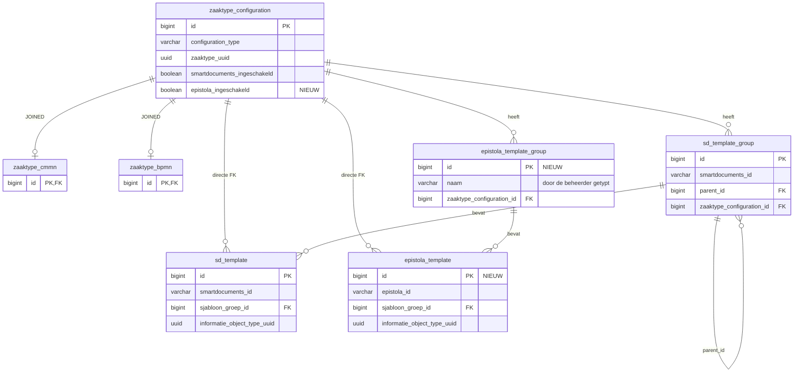

# Datamodel — Epistola

| | |
|---|---|
| Issue | [#14](https://github.com/infonl/zac-epistola-prototype/issues/14) · werkproces B1-K1-W2 |
| Stand | Bijgewerkt na het stakeholderoverleg van 21 september 2026, en gemigreerd in `V100` bij de bouw van #3 op 24 september |
| Schema | ZAC PostgreSQL · `zaakafhandelcomponent` |
| Raakt | #2, #3, #6 |

De zaaktypeconfiguratietabellen zoals ze er nu staan, en de drie wijzigingen die Epistola nodig heeft. Het
ontwerp **spiegelt de SmartDocuments-structuur in plaats van hem te generaliseren** — de twee providers
houden aparte tabellen, zodat een wijziging aan de één de ander niet kan breken.

## Datamodel

Eén diagram in plaats van twee, zodat de wijziging in zijn context zichtbaar is. Merk op dat nergens een
templatenaam wordt opgeslagen — alleen het id van de provider. Weergavenamen worden live opgehaald, en
daarom laat een template dat bovenstrooms verdwijnt een rij achter die nergens meer naar wijst.

Tabelnamen zijn hierboven ingekort: `sd_template_group` en `sd_template` heten in werkelijkheid
`zaaktype_smartdocuments_document_template_group_parameters` en
`zaaktype_smartdocuments_document_template_parameters`. De "directe FK"-relaties zijn een denormalisatie
die al bestaat: templaterijen dragen `zaaktype_configuration_id` rechtstreeks én bereiken het via hun
groep. De Epistola-tabellen doen dat na, voor de consistentie.

Let op het verschil tussen de twee groeptabellen. `sd_template_group` draagt een `smartdocuments_id` en een
`parent_id`, omdat SmartDocuments zijn groepen zelf bezit en ze willekeurig diep nest.
`epistola_template_group` draagt geen van beide: die groep bestaat alleen in ZAC.

## Nieuwe tabellen

Kolomtypen volgen de SmartDocuments-equivalenten, zodat de Flyway-migratie consistent blijft met de rest
van het schema.

### `zaaktype_epistola_document_template_group_parameters` *(nieuw)*

| Kolom | Type | Null | Toelichting |
|---|---|---|---|
| `id` | bigint | nee | PK, eigen sequence |
| `naam` | varchar | nee | De groepsnaam die de beheerder typt. Hier staat geen Epistola-identificatie: de groep bestaat alleen in ZAC |
| `aanmaakdatum` | timestamptz | nee | Wanneer de mapping in ZAC is geconfigureerd |
| `zaaktype_configuration_id` | bigint | nee | FK → `zaaktype_configuration` |

`(zaaktype_configuration_id, naam)` is uniek. De backend vergelijkt namen bovendien zonder op hoofdletters
en spaties te letten, zodat een behandelaar nooit twee groepen ziet die hij niet uit elkaar kan houden.

### `zaaktype_epistola_document_template_parameters` *(nieuw)*

| Kolom | Type | Null | Toelichting |
|---|---|---|---|
| `id` | bigint | nee | PK, eigen sequence |
| `epistola_id` | varchar | nee | Identificatie van het template in Epistola |
| `aanmaakdatum` | timestamptz | nee | |
| `sjabloon_groep_id` | bigint | nee | FK → Epistola-templategroep |
| `zaaktype_configuration_id` | bigint | nee | FK → `zaaktype_configuration` |
| `informatie_object_type_uuid` | uuid | nee | Als welk informatieobjecttype de gegenereerde PDF in Open Zaak wordt geregistreerd (#6) |

`(zaaktype_configuration_id, epistola_id)` is uniek: een sjabloon staat hoogstens één keer in een zaaktype
(zie de ontwerpbesluiten).

### `zaaktype_configuration` *(één nieuwe kolom)*

| Kolom | Type | Null | Toelichting |
|---|---|---|---|
| `epistola_ingeschakeld` | boolean | nee | Standaard `false`. Poort per zaaktype, spiegelt `smartdocuments_ingeschakeld`, dat sinds `V94` ook `NOT NULL DEFAULT FALSE` is |

## Ontwerpbesluiten

### Aparte tabellen per provider, niet één gegeneraliseerde tabel

Eén `document_template`-tabel met een `provider`-discriminator zou minder duplicatie zijn, maar het koppelt
de twee providers: elke kolom die Epistola nodig heeft zou ook op SmartDocuments-rijen landen, en een
migratie voor de één zou de ander kunnen breken.

Dupliceren omwille van onafhankelijkheid houdt de DoD-belofte overeind dat de bestaande
SmartDocuments-flow intact blijft.

### Twee booleans per zaaktype, eerlijk gehouden door de globale instelling

`epistola_ingeschakeld` naast `smartdocuments_ingeschakeld` zetten maakt het mogelijk beide in de database
op `true` te zetten, wat de wederzijdse uitsluiting uit #2 zou tegenspreken.

Ze kunnen niet allebei effect hebben: `DOCUMENT_CREATION_PROVIDER` bepaalt welke vlag ooit geraadpleegd
wordt, en het opstarten weigert een configuratie die twee providers noemt. Beide kolommen door één
vervangen zou schoner zijn, maar dwingt een datamigratie af op elke bestaande installatie zonder dat het
prototype er iets mee opschiet.

### Geen tabel voor gegenereerde documenten

Gegenereerde PDF's worden in Open Zaak geregistreerd als `EnkelvoudigInformatieObject` en gekoppeld met een
`ZaakInformatieObject`. ZAC bewaart er geen kopie en geen verwijzing van, en daarom is documentversionering
(#9) het `versie`-veld van Open Zaak en niet iets in dit schema.

Het documentcreatietoken in `DocumentCreationUserStore` staat in het geheugen met een vervaltijd en wordt
niet gepersisteerd — dus het staat hier ook niet.

### Templategroepen zijn van ZAC, omdat Epistola er geen heeft

Het gepubliceerde API-contract beslecht de eerste helft. Een template is **plat binnen een tenant** — een
id, een naam, een JSON Schema voor zijn variabelen, en *varianten*. Een variant is hetzelfde document in
een andere vorm, gekozen op attributen, wat taal en huisstijl is en geen archivering. `catalogs` bestaan,
maar zijn installeerbare, geversioneerde pakketten en geen groepering die een beheerder inricht.

De stakeholders beslechtten de tweede helft op 21 september: DoD-item 9 vereist het instellen van
*templategroepen én templates* per zaaktype, en omdat het product dat begrip niet kent, **maakt de
beheerder de groepen in ZAC** en hangt er platte Epistola-templates onder. Daarom draagt
`epistola_template_group` een `naam` en geen `epistola_id`, en is het een ZAC-eigen rij zonder iets
bovenstrooms om tegen af te stemmen. Een `parent_id` is niet nodig: de groepen zijn één niveau diep, wat
overeenkomt met wat het SmartDocuments-scherm in de praktijk aanbiedt.

### Een sjabloon staat hoogstens één keer in een zaaktype

Het datamodel liet eerst toe dat hetzelfde sjabloon in twee groepen van één zaaktype stond, elk met een
eigen informatieobjecttype. Dan zou de groep die de behandelaar opent bepalen hoe het document in Open Zaak
wordt opgeslagen, en dat is niet te voorspellen.

Een unieke sleutel op `(zaaktype_configuration_id, epistola_id)` sluit dat uit. De groep is daarmee alleen
een indeling, en #5 en #6 vinden het informatieobjecttype met het sjabloon-id alleen. Dat telt, omdat de
groeprijen bij elke keer opslaan opnieuw worden aangemaakt en hun id's dus niet stabiel zijn. Besloten bij
de bouw van #3.

### Geen opgeslagen naam: de richting die ZAC zelf koos

Deze vraag lag open bij de stakeholders (#21). Bij de bouw van #3 bleek dat het ZAC-team hem voor
SmartDocuments al beantwoord heeft: `V98__remove_smartdocuments_naam_column.sql` ([infonl/dimpact-zaakafhandelcomponent#6978](https://github.com/infonl/dimpact-zaakafhandelcomponent/pull/6978), 7 september 2026)
verwijderde de `naam`-kolommen, omdat de naam altijd live bij de provider wordt opgehaald en de kolom
"dead weight" was.

De Epistola-tabellen volgen die lijn en slaan alleen `epistola_id` op. De zwakte blijft zoals hij was: als
Epistola onbereikbaar is, toont het beheerscherm de sjablonen niet. Een sjabloon dat in Epistola verdwijnt
valt stil uit het scherm, en zijn rij verdwijnt pas bij de volgende keer opslaan. Een groep blijft wel
staan, ook leeg, omdat die van ZAC is. Een
`naam`-kolom toevoegen blijft een migratie van één kolom, mocht de bevestiging bij #21 anders uitvallen.

---

Datamodel voor het Epistola-prototype, afgeleid van de JPA-entiteiten in `nl.info.zac.admin.model` en
`nl.info.zac.smartdocuments.templates.model` op de examenfork. Bestaande structuren zijn tegen de code
geverifieerd. De nieuwe structuren staan in `V100__epistola_document_template_mapping.sql` en de entiteiten
in `nl.info.zac.epistola.templates.model` (#3).
