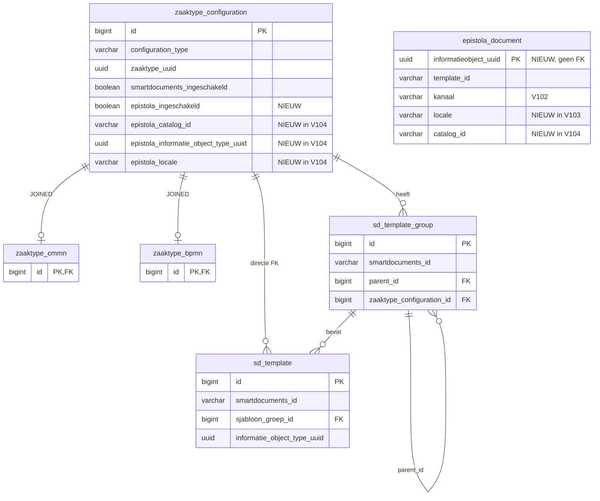

# Datamodel — Epistola

| | |
|---|---|
| Issue | [#14](https://github.com/infonl/zac-epistola-prototype/issues/14) · werkproces B1-K1-W2 |
| Stand | Bijgewerkt na het stakeholderoverleg van 21 september 2026, en gemigreerd in `V100` bij de bouw van #3 op 24 september. Op 30 september bijgewerkt naar de templatenamen uit het geheugen (#30) en *template* in plaats van *sjabloon* (#31), en met de tabel `epistola_document` in `V101` voor een nieuwe versie van een document (#9). Op 1 oktober uitgebreid met de kolom `kanaal` in `V102` (#47), en op 5 oktober bijgewerkt naar wat een lege `kanaal` betekent. Op 5 oktober uitgebreid met de kolom `locale` in `V103` (#52), en daarna bijgewerkt naar de catalog per zaaktype van #51: `V104` vervangt de templategroepen en de tabel per template van `V100` door twee kolommen op het zaaktype, en onthoudt bij een document de catalog |
| Schema | ZAC PostgreSQL · `zaakafhandelcomponent` |
| Raakt | #2, #3, #6, #9, #52, #51 |

De zaaktypeconfiguratietabellen zoals ze er nu staan, en ~~de vier wijzigingen die Epistola nodig heeft. Het
ontwerp **spiegelt de SmartDocuments-structuur in plaats van hem te generaliseren** — de twee providers
houden aparte tabellen, zodat een wijziging aan de één de ander niet kan breken.~~ wat Epistola eraan toevoegt.
*5 oktober:* sinds `V104` zijn dat ~~drie~~ *6 oktober:* vier kolommen op `zaaktype_configuration` en de tabel `epistola_document` (#51).
Epistola spiegelt de templatetabellen van SmartDocuments niet meer, want een zaaktype kiest een catalog en geen
templates. De twee providers delen nog steeds geen templatetabel, zodat een wijziging aan de één de ander niet kan
breken.

## Datamodel

Eén diagram in plaats van twee, zodat de wijziging in zijn context zichtbaar is. Merk op dat nergens een
templatenaam wordt opgeslagen — alleen het id van de provider. Weergavenamen worden live opgehaald, en
daarom laat een template dat bovenstrooms verdwijnt een rij achter die nergens meer naar wijst. *5 oktober:* voor
Epistola staat er per zaaktype alleen nog het id van een catalog, geen template-id (#51). Een template dat uit de catalog
verdwijnt, laat dan geen rij achter. Het diagram toont de stand na `V103` en `V104`.

```mermaid
erDiagram
    zaaktype_configuration ||--o| zaaktype_cmmn : "JOINED"
    zaaktype_configuration ||--o| zaaktype_bpmn : "JOINED"
    zaaktype_configuration ||--o{ sd_template_group : heeft
    zaaktype_configuration ||--o{ sd_template : "directe FK"
    sd_template_group ||--o{ sd_template : bevat
    sd_template_group ||--o{ sd_template_group : parent_id

    zaaktype_configuration {
        bigint id PK
        varchar configuration_type
        uuid zaaktype_uuid
        boolean smartdocuments_ingeschakeld
        boolean epistola_ingeschakeld "NIEUW"
        varchar epistola_catalog_id "NIEUW in V104"
        uuid epistola_informatie_object_type_uuid "NIEUW in V104"
        varchar epistola_locale "NIEUW in V104"
    }
    zaaktype_cmmn {
        bigint id PK,FK
    }
    zaaktype_bpmn {
        bigint id PK,FK
    }
    sd_template_group {
        bigint id PK
        varchar smartdocuments_id
        bigint parent_id FK
        bigint zaaktype_configuration_id FK
    }
    sd_template {
        bigint id PK
        varchar smartdocuments_id
        bigint sjabloon_groep_id FK
        uuid informatie_object_type_uuid
    }
    epistola_document {
        uuid informatieobject_uuid PK "NIEUW, geen FK"
        varchar template_id
        varchar kanaal "V102"
        varchar locale "NIEUW in V103"
        varchar catalog_id "NIEUW in V104"
    }
```

Tabelnamen zijn hierboven ingekort: `sd_template_group` en `sd_template` heten in werkelijkheid
`zaaktype_smartdocuments_document_template_group_parameters` en
`zaaktype_smartdocuments_document_template_parameters`. De "directe FK"-relaties zijn een denormalisatie
die al bestaat: templaterijen dragen `zaaktype_configuration_id` rechtstreeks én bereiken het via hun
groep. ~~De Epistola-tabellen doen dat na, voor de consistentie.~~

~~Let op het verschil tussen de twee groeptabellen. `sd_template_group` draagt een `smartdocuments_id` en een
`parent_id`, omdat SmartDocuments zijn groepen zelf bezit en ze willekeurig diep nest.
`epistola_template_group` draagt geen van beide: die groep bestaat alleen in ZAC.~~

*5 oktober:* tot `V104` stonden hier ook `epistola_template_group` en `epistola_template`, de twee tabellen van `V100`
hieronder. Voor Epistola staat de indeling nu in Epistola zelf, als catalog, en heeft ZAC geen groeptabel meer (#51).

## Nieuwe tabellen

Kolomtypen volgen de SmartDocuments-equivalenten, zodat de Flyway-migratie consistent blijft met de rest
van het schema.

### `zaaktype_epistola_document_template_group_parameters` *(nieuw)*

*5 oktober:* verwijderd in `V104`, met haar sequence (#51). ZAC houdt voor Epistola geen templategroepen meer bij. Wat
hieronder staat, is de tabel zoals `V100` haar maakte.

| Kolom | Type | Null | Toelichting |
|---|---|---|---|
| `id` | bigint | nee | PK, eigen sequence |
| `naam` | varchar | nee | De groepsnaam die de beheerder typt. Hier staat geen Epistola-identificatie: de groep bestaat alleen in ZAC |
| `aanmaakdatum` | timestamptz | nee | Wanneer de mapping in ZAC is geconfigureerd |
| `zaaktype_configuration_id` | bigint | nee | FK → `zaaktype_configuration` |

`(zaaktype_configuration_id, naam)` is uniek. De backend vergelijkt namen bovendien zonder op hoofdletters
en spaties te letten, zodat een behandelaar nooit twee groepen ziet die hij niet uit elkaar kan houden.

### `zaaktype_epistola_document_template_parameters` *(nieuw)*

*5 oktober:* verwijderd in `V104`, met haar sequence (#51). Een zaaktype biedt elk template van zijn catalog aan, dus
er is geen rij per template meer, en het informatieobjecttype staat één keer op het zaaktype. Wat hieronder staat, is
de tabel zoals `V100` haar maakte.

| Kolom | Type | Null | Toelichting |
|---|---|---|---|
| `id` | bigint | nee | PK, eigen sequence |
| `epistola_id` | varchar | nee | Identificatie van het template in Epistola |
| `aanmaakdatum` | timestamptz | nee | |
| `template_group_id` | bigint | nee | FK → Epistola-templategroep |
| `zaaktype_configuration_id` | bigint | nee | FK → `zaaktype_configuration` |
| `informatie_object_type_uuid` | uuid | nee | Als welk informatieobjecttype de gegenereerde PDF in Open Zaak wordt geregistreerd (#6) |

`(zaaktype_configuration_id, epistola_id)` is uniek: een template staat hoogstens één keer in een zaaktype
(zie de ontwerpbesluiten).

### `epistola_document` *(nieuw, `V101`, #9)*

| Kolom | Type | Null | Toelichting |
|---|---|---|---|
| `informatieobject_uuid` | uuid | nee | PK. Het informatieobject in Open Zaak dat met Epistola is gegenereerd. Geen FK: dat object staat in een ander systeem |
| `template_id` | varchar | nee | Identificatie van het template waarmee het document is gegenereerd |
| `aanmaakdatum` | timestamptz | nee | Wanneer het document is gegenereerd |
| `kanaal` | varchar | ja | ~~Het kanaal van de variant waarin het document is gegenereerd~~ *5 oktober:* het kanaal waar ZAC Epistola om vroeg, zoals `post` of `digitaal` (`V102`, #47), ook als dat het kanaal van de standaardvariant is dat de behandelaar in de keuzelijst liet staan. Leeg als ZAC om geen kanaal vroeg: bij een template zonder varianten per kanaal, en bij een standaardrender, waar de behandelaar geen kanaal kon kiezen en het communicatiekanaal van de zaak er geen voorstelde. Dan krijgt ook een nieuwe versie de standaardvariant, zolang het communicatiekanaal niets voorstelt. Ook leeg voor een document van vóór `V102`. Een nieuwe versie gebruikt een gevuld kanaal zolang het template dat kanaal nog heeft |
| `locale` | varchar | ja | De taal waar ZAC Epistola om vroeg, als BCP-47-tag van Epistola's attribuut `system.locale`, zoals `nl-NL` of `en-GB` (`V103`, #52). De kolom heet naar het attribuut, zoals `kanaal`. Leeg als ZAC om geen taal vroeg, omdat de varianten van het template geen taal hebben, en voor een document van vóór `V103`. Een nieuwe versie vraagt om de opgeslagen taal zolang het template die nog heeft. Is de kolom leeg terwijl het template nu wel talen heeft, of heeft het template de taal niet meer, dan vraagt ze om de taal die ZAC voor het template kiest (~~Nederlands als het template dat heeft, anders die van de standaardvariant; de behandelaar kiest geen taal~~ *6 oktober:* de taal van het zaaktype, `zaaktype_configuration.epistola_locale`, als het template die heeft, anders Nederlands als het template dat heeft, anders die van de standaardvariant; de behandelaar kiest geen taal), zodat een Nederlandse en een Engelse variant voor hetzelfde kanaal niet gelijk eindigen |
| `catalog_id` | varchar | ja | *5 oktober:* de catalog waaruit het template kwam (`V104`, #51). Een nieuwe versie leest het template daaruit, ook als het zaaktype inmiddels een andere catalog heeft. Leeg voor een document van vóór `V104`: dat kwam uit de catalog van `EPISTOLA_CATALOG_ID`, en die gebruikt ZAC dan |

Er staat één rij per gegenereerd document, geschreven nadat het in Open Zaak staat. Een document zonder rij, omdat het
ouder is of omdat het schrijven van de rij mislukte, heeft geen actie *Nieuwe versie genereren*. Een rij van een document
dat later is verwijderd blijft staan. Dat doet geen kwaad, want ze wordt alleen gelezen met de UUID van een bestaand
document.

### `zaaktype_configuration` *(~~één nieuwe kolom~~ ~~drie~~ vier nieuwe kolommen, sinds `V104`)*

| Kolom | Type | Null | Toelichting |
|---|---|---|---|
| `epistola_ingeschakeld` | boolean | nee | Standaard `false`. Poort per zaaktype, spiegelt `smartdocuments_ingeschakeld`, dat sinds `V94` ook `NOT NULL DEFAULT FALSE` is |
| `epistola_catalog_id` | varchar | ja | *5 oktober:* de catalog in Epistola waarvan het zaaktype elk template aanbiedt (`V104`, #51). Leeg tot de beheerder er een kiest; dan geldt de catalog van `EPISTOLA_CATALOG_ID` |
| `epistola_informatie_object_type_uuid` | uuid | ja | *5 oktober:* het informatieobjecttype waaronder elk Epistola-document van het zaaktype in Open Zaak komt (`V104`, #51). Zolang het leeg is, biedt het zaaktype geen Epistola-templates aan |
| `epistola_locale` | varchar | ja | *6 oktober:* de taal waarin ZAC Epistola om elk document van het zaaktype vraagt, als BCP-47-tag van Epistola's attribuut `system.locale`, zoals `nl-NL` of `en-GB` (`V104`, #51). De kolom heet naar het attribuut, zoals `epistola_document.locale`. De beheerder kiest de taal in de beheerkaart, uit de talen die elk template van de catalog heeft. Leeg tot hij er een kiest, en dan vraagt ZAC om Nederlands waar het template dat heeft. Heeft een template de taal niet, dan geldt dezelfde terugval. De behandelaar kiest geen taal |

Een nieuwe versie van een zaaktype neemt ~~beide kolommen~~ *6 oktober:* alle vier de kolommen over, zoals `epistola_ingeschakeld`.

### `V104` · van templategroepen naar een catalog per zaaktype *(5 oktober, #51)*

`V104__epistola_catalog_per_zaaktype.sql` doet vier dingen, in deze volgorde:

1. Het voegt `epistola_catalog_id`, `epistola_informatie_object_type_uuid` en *6 oktober:* `epistola_locale` toe aan `zaaktype_configuration`.
2. Het geeft elk zaaktype met Epistola-templates het informatieobjecttype dat de meeste van zijn templates hadden, zodat
   de minste documenten van type veranderen. Bij gelijke stand wint het type van het template dat het eerst is
   opgeslagen.
3. Het verwijdert de twee tabellen van `V100` en hun sequences.
4. Het voegt `catalog_id` toe aan `epistola_document`.

De catalog blijft overal leeg, omdat een Flyway-migratie `EPISTOLA_CATALOG_ID` niet kan lezen. ZAC gebruikt bij een lege
catalog die van `EPISTOLA_CATALOG_ID`, en daar kwam tot `V104` elk template uit, dus een bestaand zaaktype en een bestaand
document werken na de upgrade zoals ervoor. Eén verschil: een zaaktype dat templates had, biedt daarna elk template van
die catalog aan, niet alleen de templates die de beheerder had gekozen. Een zaaktype dat Epistola aan had maar geen
templates, krijgt geen informatieobjecttype, en biedt pas iets aan als de beheerder er een kiest. *6 oktober:* de taal blijft
ook leeg: een bestaand zaaktype vraagt dus om Nederlands waar het template dat heeft, zoals het deed.

## Ontwerpbesluiten

### Aparte tabellen per provider, niet één gegeneraliseerde tabel

Eén `document_template`-tabel met een `provider`-discriminator zou minder duplicatie zijn, maar het koppelt
de twee providers: elke kolom die Epistola nodig heeft zou ook op SmartDocuments-rijen landen, en een
migratie voor de één zou de ander kunnen breken.

Dupliceren omwille van onafhankelijkheid houdt de DoD-belofte overeind dat de bestaande
SmartDocuments-flow intact blijft.

### Twee booleans per zaaktype, eerlijk gehouden door de globale instelling

`epistola_ingeschakeld` naast `smartdocuments_ingeschakeld` zetten maakt het mogelijk beide in de database
op `true` te zetten, wat de wederzijdse uitsluiting uit #2 zou tegenspreken.

Ze kunnen niet allebei effect hebben: `DOCUMENT_CREATION_PROVIDER` bepaalt welke vlag ooit geraadpleegd
wordt, en het opstarten weigert een configuratie die twee providers noemt. Beide kolommen door één
vervangen zou schoner zijn, maar dwingt een datamigratie af op elke bestaande installatie zonder dat het
prototype er iets mee opschiet.

### Geen kopie van gegenereerde documenten, wel het template dat ze maakte

Gegenereerde PDF's worden in Open Zaak geregistreerd als `EnkelvoudigInformatieObject` en gekoppeld met een
`ZaakInformatieObject`. ZAC bewaart er geen kopie van, en documentversionering (#9) is het `versie`-veld van Open Zaak.

Tot #9 bewaarde ZAC ook geen verwijzing. Een nieuwe versie genereren heeft die wel nodig: ZAC moet weten *dat* Epistola
het document maakte, en met welk template. Open Zaak kent geen veld voor die herkomst, en `beschrijving` of `titel`
ervoor gebruiken zou een tekstveld dat een gebruiker kan wijzigen tot bron van waarheid maken. Daarom onthoudt
`epistola_document` alleen het template en het kanaal waar ZAC om vroeg (*5 oktober*), sinds `V103` de taal waar het om
vroeg (*5 oktober*, #52), en sinds `V104` de catalog van het template (*5 oktober*, #51), per informatieobject. Het is geen documentregistratie: er staat geen inhoud,
titel, status of zaak in, want die leest ZAC bij elke aanroep uit Open Zaak.

Het documentcreatietoken in `DocumentCreationUserStore` staat in het geheugen met een vervaltijd en wordt
niet gepersisteerd — dus het staat hier ook niet.

### Templategroepen zijn van ZAC, omdat Epistola er geen heeft

Het gepubliceerde API-contract beslecht de eerste helft. Een template is **plat binnen een tenant** — een
id, een naam, een JSON Schema voor zijn variabelen, en *varianten*. Een variant is hetzelfde document in
een andere vorm, gekozen op attributen, wat taal en huisstijl is en geen archivering. ~~`catalogs` bestaan,
maar zijn installeerbare, geversioneerde pakketten en geen groepering die een beheerder inricht.~~

~~De stakeholders beslechtten de tweede helft op 21 september: DoD-item 9 vereist het instellen van
*templategroepen én templates* per zaaktype, en omdat het product dat begrip niet kent, **maakt de
beheerder de groepen in ZAC** en hangt er platte Epistola-templates onder. Daarom draagt
`epistola_template_group` een `naam` en geen `epistola_id`, en is het een ZAC-eigen rij zonder iets
bovenstrooms om tegen af te stemmen. Een `parent_id` is niet nodig: de groepen zijn één niveau diep, wat
overeenkomt met wat het SmartDocuments-scherm in de praktijk aanbiedt.~~

*5 oktober:* herzien in het stakeholderoverleg van 5 oktober (#51). Een template staat in een catalog, en de
stakeholders willen de templates indelen waar ze gemaakt worden: in de catalogs van Epistola, niet in ZAC. Elk
zaaktype kiest één catalog en biedt elk template daarin aan. Daarom heeft ZAC voor Epistola geen groeptabel en geen
tabel per template meer, en staat de catalog als één kolom op het zaaktype. DoD-item 9 is zo ingevuld met de catalog
op de plaats van de templategroep.

### Een template staat hoogstens één keer in een zaaktype

Het datamodel liet eerst toe dat hetzelfde template in twee groepen van één zaaktype stond, elk met een
eigen informatieobjecttype. Dan zou de groep die de behandelaar opent bepalen hoe het document in Open Zaak
wordt opgeslagen, en dat is niet te voorspellen.

Een unieke sleutel op `(zaaktype_configuration_id, epistola_id)` sluit dat uit. De groep is daarmee alleen
een indeling, en #5 en #6 vinden het informatieobjecttype met het template-id alleen. Dat telt, omdat de
groeprijen bij elke keer opslaan opnieuw worden aangemaakt en hun id's dus niet stabiel zijn. Besloten bij
de bouw van #3.

*5 oktober:* vervallen met `V104` (#51). Er is geen rij per template meer, en het informatieobjecttype staat één keer op
het zaaktype, dus het hangt van geen groep en geen template meer af.

### Geen opgeslagen naam in de database, wel een geheugen van de laatste lijst

Deze vraag lag open bij de stakeholders (#21). Bij de bouw van #3 bleek dat het ZAC-team hem voor
SmartDocuments al beantwoord heeft: `V98__remove_smartdocuments_naam_column.sql` ([infonl/dimpact-zaakafhandelcomponent#6978](https://github.com/infonl/dimpact-zaakafhandelcomponent/pull/6978), 7 september 2026)
verwijderde de `naam`-kolommen, omdat de naam altijd live bij de provider wordt opgehaald en de kolom
"dead weight" was. De Epistola-tabellen volgden die lijn en slaan alleen `epistola_id` op. *5 oktober:* sinds `V104`
slaat ZAC per zaaktype alleen het id van de catalog op, en geen template (#51).

De zwakte was dat het beheerscherm zonder Epistola geen templates toonde. De stakeholders besloten op 28
september (B16, #30) dat de naam bewaard moet blijven, en dat het id het enige is waarop ZAC zoekt. Dat is
gebouwd **zonder kolom**: `EpistolaTemplatesService` onthoudt in het geheugen de namen van de laatste geslaagde
lijst uit de catalogus. Is Epistola daarna niet bereikbaar (geen verbinding, of een 5xx), dan leest ZAC de
mapping met die namen, zodat ~~de beheerkaart en~~ de dialoog de templates ~~blijven~~ blijft tonen. *5 oktober:* ZAC
onthoudt de namen per catalog, en *Document maken* toont dan de templates van de catalog van het zaaktype (#51). De
beheerkaart leest de catalogs en hun templates altijd live, zonder terugval.

Waarom geen kolom: die zou `V100` aanpassen en daarmee zes gestapelde pull requests herstapelen, en hij zou
bij het lezen moeten schrijven. De prijs is dat een herstart van ZAC het geheugen leegt. Is Epistola dan nog
onbereikbaar, dan geldt de melding uit #8 zoals voorheen.

De terugval is smal op twee manieren. Hij geldt alleen voor het lezen van de mapping, en alleen bij een
onbereikbaar Epistola. Geweigerde toegang en een rate limit gaan door, omdat de beheerder die moet zien, en
opslaan controleert altijd de live lijst. Elke geslaagde lijst vervangt de bewaarde namen, dus een template dat
Epistola verwijdert, komt niet terug uit het geheugen. ~~Een groep blijft ook zonder Epistola staan, omdat die
van ZAC is. Een `naam`-kolom blijft een migratie van één kolom, mocht het geheugen onvoldoende blijken.~~
*5 oktober:* opslaan controleert de catalog tegen de live lijst van catalogs (#51). Er is geen rij per template meer om
een `naam`-kolom aan toe te voegen; namen bewaren over een herstart heen vraagt nu een eigen tabel per catalog.

---

Datamodel voor het Epistola-prototype, afgeleid van de JPA-entiteiten in `nl.info.zac.admin.model` en
`nl.info.zac.smartdocuments.templates.model` op de examenfork. Bestaande structuren zijn tegen de code
geverifieerd. De nieuwe structuren staan in `V100__epistola_document_template_mapping.sql` met de entiteiten
in `nl.info.zac.epistola.templates.model` (#3), en in `V101__epistola_document.sql` met de entiteit in
`nl.info.zac.epistola.documents.model` (#9, PR #43), uitgebreid in `V102__epistola_document_kanaal.sql` (#47, PR #49).
*5 oktober:* `V103__epistola_document_locale.sql` (#52) voegt de taal toe aan `epistola_document`, en daarna
`V104__epistola_catalog_per_zaaktype.sql` (#51) verwijdert de tabellen van `V100` met hun entiteiten, en
zet de catalog en het informatieobjecttype op `ZaaktypeConfiguration` en de catalog op `EpistolaDocument`.
