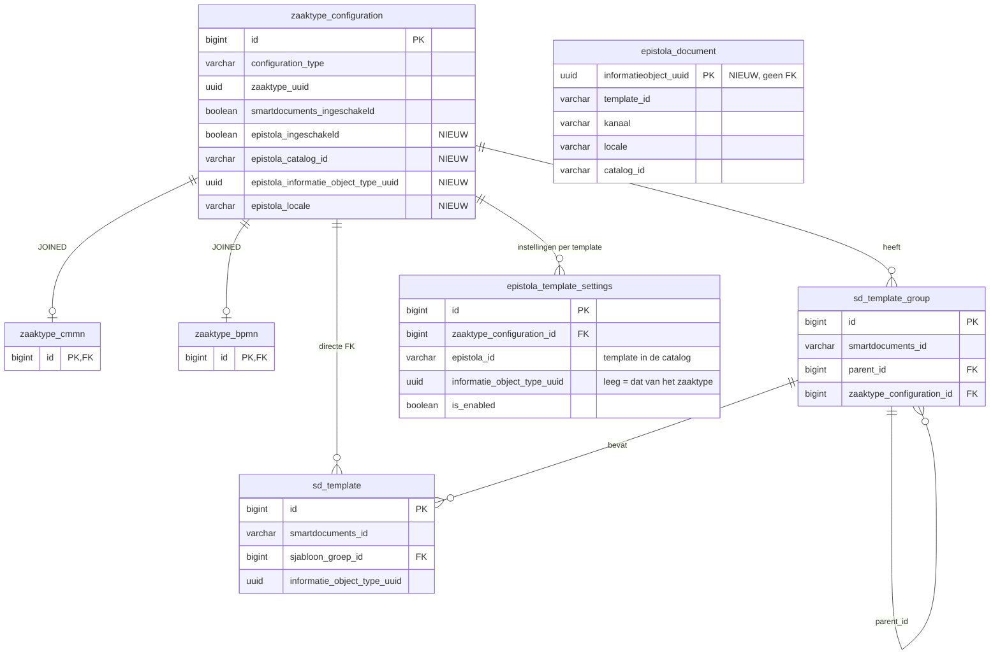

# Datamodel — Epistola

| | |
|---|---|
| Issue | [#14](https://github.com/infonl/zac-epistola-prototype/issues/14) · werkproces B1-K1-W2 |
| Stand | Bijgewerkt op 6 oktober 2026, na het stakeholderoverleg van 5 oktober. Alle Epistola-tabellen staan in `V100__epistola.sql` |
| Schema | ZAC PostgreSQL · `zaakafhandelcomponent` |
| Raakt | #2, #3, #6, #9, #52, #51 |

De zaaktypeconfiguratietabellen zoals ze er nu staan, en wat Epistola eraan toevoegt: vier kolommen op
`zaaktype_configuration`, een tabel met de instellingen per template en de tabel `epistola_document` (#51).
Epistola spiegelt de templatetabellen van SmartDocuments niet, want een zaaktype kiest een catalog en geen
templates. De twee providers delen geen templatetabel, zodat een wijziging aan de één de ander niet kan
breken.

## Datamodel

Eén diagram in plaats van twee, zodat de wijziging in zijn context zichtbaar is. Merk op dat nergens een
templatenaam wordt opgeslagen — alleen het id van de provider. Weergavenamen worden live opgehaald, en
daarom laat een SmartDocuments-template dat bovenstrooms verdwijnt een rij achter die nergens meer naar wijst. Voor
Epistola staat er per zaaktype het id van een catalog, geen template-id (#51), en een rij voor elk template met een eigen
instelling. Een template dat uit de catalog verdwijnt, laat hooguit zo'n instelling achter, en opslaan van de beheerkaart
laat die vallen. `epistola_template_settings` is in het diagram de tabel `zaaktype_epistola_template_settings`, ingekort.

```mermaid
erDiagram
    zaaktype_configuration ||--o| zaaktype_cmmn : "JOINED"
    zaaktype_configuration ||--o| zaaktype_bpmn : "JOINED"
    zaaktype_configuration ||--o{ sd_template_group : heeft
    zaaktype_configuration ||--o{ sd_template : "directe FK"
    zaaktype_configuration ||--o{ epistola_template_settings : "instellingen per template"
    sd_template_group ||--o{ sd_template : bevat
    sd_template_group ||--o{ sd_template_group : parent_id

    zaaktype_configuration {
        bigint id PK
        varchar configuration_type
        uuid zaaktype_uuid
        boolean smartdocuments_ingeschakeld
        boolean epistola_ingeschakeld "NIEUW"
        varchar epistola_catalog_id "NIEUW"
        uuid epistola_informatie_object_type_uuid "NIEUW"
        varchar epistola_locale "NIEUW"
    }
    zaaktype_cmmn {
        bigint id PK,FK
    }
    zaaktype_bpmn {
        bigint id PK,FK
    }
    sd_template_group {
        bigint id PK
        varchar smartdocuments_id
        bigint parent_id FK
        bigint zaaktype_configuration_id FK
    }
    sd_template {
        bigint id PK
        varchar smartdocuments_id
        bigint sjabloon_groep_id FK
        uuid informatie_object_type_uuid
    }
    epistola_template_settings {
        bigint id PK
        bigint zaaktype_configuration_id FK
        varchar epistola_id "template in de catalog"
        uuid informatie_object_type_uuid "leeg = dat van het zaaktype"
        boolean is_enabled
    }
    epistola_document {
        uuid informatieobject_uuid PK "NIEUW, geen FK"
        varchar template_id
        varchar kanaal
        varchar locale
        varchar catalog_id
    }
```

Tabelnamen zijn hierboven ingekort: `sd_template_group` en `sd_template` heten in werkelijkheid
`zaaktype_smartdocuments_document_template_group_parameters` en
`zaaktype_smartdocuments_document_template_parameters`. De "directe FK"-relaties zijn een denormalisatie
die al bestaat: templaterijen dragen `zaaktype_configuration_id` rechtstreeks én bereiken het via hun
groep.

Voor Epistola staat de indeling in Epistola zelf, als catalog, en heeft ZAC geen groeptabel (#51).

## Nieuwe tabellen

Kolomtypen volgen de SmartDocuments-equivalenten, zodat de Flyway-migratie consistent blijft met de rest
van het schema.

### `zaaktype_epistola_template_settings` *(nieuw, #51)*

Wat een zaaktype voor één template van zijn catalog anders instelt dan voor het zaaktype zelf. Er staat alleen een rij
als het template een eigen documenttype heeft of uit staat; een template zonder rij wordt aangeboden en gebruikt het
documenttype van het zaaktype, ook een template dat pas later in de catalog komt.

| Kolom | Type | Null | Toelichting |
|---|---|---|---|
| `id` | bigint | nee | PK, eigen sequence (`sq_zaaktype_epistola_template_settings`) |
| `zaaktype_configuration_id` | bigint | nee | FK → `zaaktype_configuration`, `ON DELETE CASCADE` |
| `epistola_id` | varchar | nee | Identificatie van het template in de catalog van het zaaktype |
| `informatie_object_type_uuid` | uuid | ja | Het informatieobjecttype waaronder een document uit dit template in Open Zaak komt, in plaats van dat van het zaaktype. Leeg: dat van het zaaktype |
| `is_enabled` | boolean | nee | Standaard `true`. Of *Document maken* het template aanbiedt. Uitzetten verbergt het alleen daar: een nieuwe versie van een document uit dit template blijft kunnen |
| `aanmaakdatum` | timestamptz | nee | Wanneer de instelling is opgeslagen |

`(zaaktype_configuration_id, epistola_id)` is uniek. De beheerkaart stuurt bij elke keer opslaan de hele lijst, en de
backend vervangt wat er stond. De instelling van een template dat niet in de gekozen catalog staat, slaat ze niet op. Een
nieuwe versie van het zaaktype in ZAC neemt de rijen over.

### `epistola_document` *(nieuw, #9)*

| Kolom | Type | Null | Toelichting |
|---|---|---|---|
| `informatieobject_uuid` | uuid | nee | PK. Het informatieobject in Open Zaak dat met Epistola is gegenereerd. Geen FK: dat object staat in een ander systeem |
| `template_id` | varchar | nee | Identificatie van het template waarmee het document is gegenereerd |
| `aanmaakdatum` | timestamptz | nee | Wanneer het document is gegenereerd |
| `kanaal` | varchar | ja | Het kanaal waar ZAC Epistola om vroeg, zoals `post` of `digitaal` (#47), ook als dat het kanaal van de standaardvariant is dat de behandelaar in de keuzelijst liet staan. Leeg als ZAC om geen kanaal vroeg: bij een template zonder varianten per kanaal, en bij een standaardrender, waar de behandelaar geen kanaal kon kiezen en het communicatiekanaal van de zaak er geen voorstelde. Dan krijgt ook een nieuwe versie de standaardvariant, zolang het communicatiekanaal niets voorstelt. Een nieuwe versie gebruikt een gevuld kanaal zolang het template dat kanaal nog heeft |
| `locale` | varchar | ja | De taal waar ZAC Epistola om vroeg, als BCP-47-tag van Epistola's attribuut `system.locale`, zoals `nl-NL` of `en-GB` (#52). De kolom heet naar het attribuut, zoals `kanaal`. Leeg als ZAC om geen taal vroeg, omdat de varianten van het template geen taal hebben. Een nieuwe versie vraagt om de opgeslagen taal zolang het template die nog heeft. Is de kolom leeg terwijl het template nu wel talen heeft, of heeft het template de taal niet meer, dan vraagt ze om de taal die ZAC voor het template kiest: de taal van het zaaktype, `zaaktype_configuration.epistola_locale`, als het template die heeft, anders Nederlands als het template dat heeft, anders die van de standaardvariant. De behandelaar kiest geen taal, zodat een Nederlandse en een Engelse variant voor hetzelfde kanaal niet gelijk eindigen |
| `catalog_id` | varchar | ja | De catalog waaruit het template kwam (#51). Een nieuwe versie leest het template daaruit, ook als het zaaktype inmiddels een andere catalog heeft. Leeg betekent de catalog van `EPISTOLA_CATALOG_ID` |

Er staat één rij per gegenereerd document, geschreven nadat het in Open Zaak staat. Een document zonder rij, omdat het
schrijven van de rij mislukte, heeft geen actie *Nieuwe versie genereren*. Een rij van een document
dat later is verwijderd blijft staan. Dat doet geen kwaad, want ze wordt alleen gelezen met de UUID van een bestaand
document.

### `zaaktype_configuration` *(vier nieuwe kolommen)*

| Kolom | Type | Null | Toelichting |
|---|---|---|---|
| `epistola_ingeschakeld` | boolean | nee | Standaard `false`. Poort per zaaktype, spiegelt `smartdocuments_ingeschakeld`, dat sinds `V94` ook `NOT NULL DEFAULT FALSE` is |
| `epistola_catalog_id` | varchar | ja | De catalog in Epistola waarvan het zaaktype elk template aanbiedt (#51). Zolang hij leeg is, geldt de catalog van `EPISTOLA_CATALOG_ID` |
| `epistola_informatie_object_type_uuid` | uuid | ja | Het informatieobjecttype waaronder elk Epistola-document van het zaaktype in Open Zaak komt (#51). Zolang het leeg is, biedt het zaaktype geen Epistola-templates aan |
| `epistola_locale` | varchar | ja | De taal waarin ZAC Epistola om elk document van het zaaktype vraagt, als BCP-47-tag van Epistola's attribuut `system.locale`, zoals `nl-NL` of `en-GB` (#51). De kolom heet naar het attribuut, zoals `epistola_document.locale`. De beheerder kiest de taal in de beheerkaart, uit de talen die elk template van de catalog heeft. Zolang hij leeg is, vraagt ZAC om Nederlands waar het template dat heeft. Heeft een template de taal niet, dan geldt dezelfde terugval. De behandelaar kiest geen taal |

Een nieuwe versie van een zaaktype neemt alle vier de kolommen over, zoals `epistola_ingeschakeld`.

## Ontwerpbesluiten

### Aparte tabellen per provider, niet één gegeneraliseerde tabel

Eén `document_template`-tabel met een `provider`-discriminator zou minder duplicatie zijn, maar het koppelt
de twee providers: elke kolom die Epistola nodig heeft zou ook op SmartDocuments-rijen landen, en een
migratie voor de één zou de ander kunnen breken.

Dupliceren omwille van onafhankelijkheid houdt de DoD-belofte overeind dat de bestaande
SmartDocuments-flow intact blijft.

### Twee booleans per zaaktype, eerlijk gehouden door de globale instelling

`epistola_ingeschakeld` naast `smartdocuments_ingeschakeld` zetten maakt het mogelijk beide in de database
op `true` te zetten, wat de wederzijdse uitsluiting uit #2 zou tegenspreken.

Ze kunnen niet allebei effect hebben: `DOCUMENT_CREATION_PROVIDER` bepaalt welke vlag ooit geraadpleegd
wordt, en het opstarten weigert een configuratie die twee providers noemt. Beide kolommen door één
vervangen zou schoner zijn, maar dwingt een datamigratie af op elke bestaande installatie zonder dat het
prototype er iets mee opschiet.

### Geen kopie van gegenereerde documenten, wel het template dat ze maakte

Gegenereerde PDF's worden in Open Zaak geregistreerd als `EnkelvoudigInformatieObject` en gekoppeld met een
`ZaakInformatieObject`. ZAC bewaart er geen kopie van, en documentversionering (#9) is het `versie`-veld van Open Zaak.

Tot #9 bewaarde ZAC ook geen verwijzing. Een nieuwe versie genereren heeft die wel nodig: ZAC moet weten *dat* Epistola
het document maakte, en met welk template. Open Zaak kent geen veld voor die herkomst, en `beschrijving` of `titel`
ervoor gebruiken zou een tekstveld dat een gebruiker kan wijzigen tot bron van waarheid maken. Daarom onthoudt
`epistola_document` per informatieobject alleen het template en de catalog ervan (#51), en het kanaal (#47) en de taal
(#52) waar ZAC Epistola om vroeg. Het is geen documentregistratie: er staat geen inhoud,
titel, status of zaak in, want die leest ZAC bij elke aanroep uit Open Zaak.

Het documentcreatietoken in `DocumentCreationUserStore` staat in het geheugen met een vervaltijd en wordt
niet gepersisteerd — dus het staat hier ook niet.

### Een zaaktype kiest een catalog, geen templates

Een template is **plat binnen een tenant** — een id, een naam, een JSON Schema voor zijn variabelen, en
*varianten*. Een variant is hetzelfde document in een andere vorm, gekozen op attributen, wat taal en huisstijl is en
geen archivering. Epistola deelt zijn templates in catalogs in. De stakeholders willen de templates indelen waar ze
gemaakt worden, in de catalogs van Epistola, en niet in ZAC (#51). Elk zaaktype kiest daarom één catalog en biedt elk
template daarin aan. ZAC heeft voor Epistola geen groeptabel en geen tabel die elk template van de catalog bijhoudt: alleen een template met
een eigen instelling heeft een rij (`zaaktype_epistola_template_settings`), en de catalog staat als één kolom op het zaaktype. DoD-item 9 is zo ingevuld met de catalog op de plaats van de templategroep.

### Een template heeft hoogstens één instelling per zaaktype

Een unieke sleutel op `(zaaktype_configuration_id, epistola_id)` sluit uit dat hetzelfde template twee instellingen heeft,
elk met een eigen informatieobjecttype. Dan zou de instelling die de behandelaar tegenkomt bepalen hoe het document in
Open Zaak wordt opgeslagen, en dat is niet te voorspellen. #5 en #6 vinden het informatieobjecttype zo met het
template-id alleen: het eigen documenttype van het template, en anders dat van het zaaktype.

### Geen opgeslagen naam in de database, wel een geheugen van de laatste lijst

Deze vraag lag open bij de stakeholders (#21). Bij de bouw van #3 bleek dat het ZAC-team hem voor
SmartDocuments al beantwoord heeft: `V98__remove_smartdocuments_naam_column.sql` ([infonl/dimpact-zaakafhandelcomponent#6978](https://github.com/infonl/dimpact-zaakafhandelcomponent/pull/6978), 7 september 2026)
verwijderde de `naam`-kolommen, omdat de naam altijd live bij de provider wordt opgehaald en de kolom
"dead weight" was. De Epistola-tabellen volgden die lijn en slaan alleen `epistola_id` op, en per zaaktype alleen het id
van de catalog (#51).

De zwakte was dat het beheerscherm zonder Epistola geen templates toonde. De stakeholders besloten op 28
september (B16, #30) dat de naam bewaard moet blijven, en dat het id het enige is waarop ZAC zoekt. Dat is
gebouwd **zonder kolom**: `EpistolaTemplatesService` onthoudt in het geheugen, per catalog, de namen van de laatste
geslaagde lijst uit de catalogus. Is Epistola daarna niet bereikbaar (geen verbinding, of een 5xx), dan leest ZAC de
mapping met die namen, zodat de dialoog de templates blijft tonen. *Document maken* toont dan de templates van de catalog
van het zaaktype (#51). De beheerkaart leest de catalogs altijd live, en de templates van een catalog, als Epistola niet
bereikbaar is, met de onthouden namen en zonder talen en varianten.

Waarom geen kolom: die zou bij het lezen moeten schrijven. De prijs is dat een herstart van ZAC het geheugen leegt. Is
Epistola dan nog onbereikbaar, dan geldt de melding uit #8 zoals voorheen.

De terugval is smal op twee manieren. Hij geldt alleen voor het lezen van de mapping, en alleen bij een
onbereikbaar Epistola. Geweigerde toegang en een rate limit gaan door, omdat de beheerder die moet zien, en
opslaan controleert altijd de live lijst. Elke geslaagde lijst vervangt de bewaarde namen, dus een template dat
Epistola verwijdert, komt niet terug uit het geheugen. Opslaan controleert de catalog tegen de live lijst van catalogs
(#51). Namen bewaren over een herstart heen vraagt een eigen tabel per catalog.

---

Datamodel voor het Epistola-prototype, afgeleid van de JPA-entiteiten in `nl.info.zac.admin.model` en
`nl.info.zac.smartdocuments.templates.model` op de examenfork. Bestaande structuren zijn tegen de code
geverifieerd. De nieuwe structuren staan in `V100__epistola.sql`: de kolommen op `ZaaktypeConfiguration` en de
entiteit `ZaaktypeEpistolaTemplateSettings` in `nl.info.zac.admin.model` (#3, #51), en de entiteit `EpistolaDocument` in
`nl.info.zac.epistola.documents.model` (#9, #47, #52).
