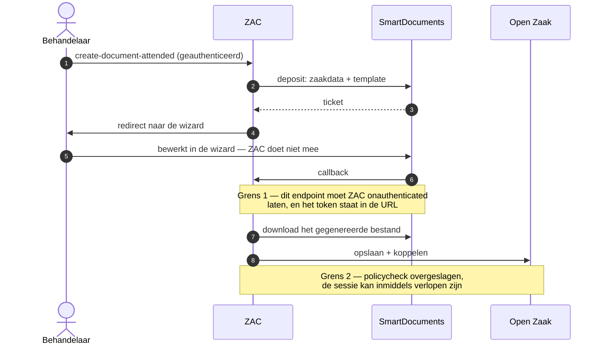
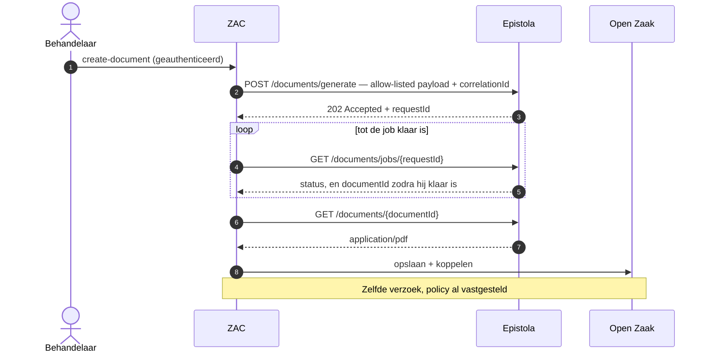
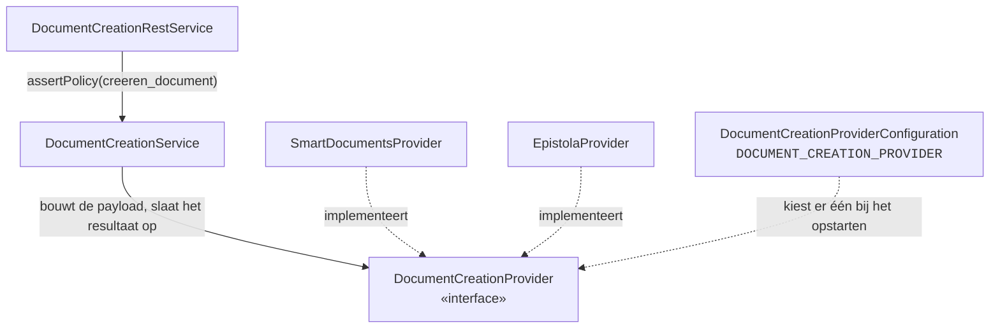

# Technisch en functioneel ontwerp — Epistola

| | |
|---|---|
| Bron | [Epistola Integration Design](https://claude.ai/artifact/6EWJFfafVnHZqobPqsmYQ6) — het artifact is leidend, dit is de kopie |
| Issue | [#14](https://github.com/infonl/zac-epistola-prototype/issues/14) · werkproces B1-K1-W2 |
| Stand | v4 — na het stakeholderoverleg van 21 september 2026 |
| Scope | Prototype, alleen CMMN |
| Bouwt op | #2 provider-configuratie · #15 wireframes · #16 ontwerpverantwoording |
| Blokkeert | #4 · #5 · #6 · #11 |

Hoe Epistola achter ZAC's documentcreatie past: de flow, de interface die de twee providers delen, de
data die oversteekt, en wie op de knop mag drukken.

## Dekking van de acceptatiecriteria

| § | Onderwerp | Dekking |
|---|---|---|
| [§1](#1--functioneel-ontwerp) | Functioneel ontwerp | Zes stappen van zaaktypeconfiguratie tot preview, elk met wat er waar wordt vastgelegd |
| [§2](#2--provider-abstractie) | Provider-abstractie | Eén interface, twee interactievormen, en een sealed outcome in plaats van een geforceerd uniform retourtype |
| [§3](#3--datamapping) | Datamapping | De ZAC-kant is exact; Epistola krijgt templatevariabelen plus een correlatie-id |
| [§4](#4--autorisatiemodel) | Autorisatiemodel | Hergebruik van `creeren_document`, dat al samenvalt met zaaktype- en zaakautorisatie |
| [§5](#5--api-integratie) | API-integratie | Endpoints, contracten en foutsemantiek, uit Epistola's gepubliceerde OpenAPI-contract |
| [§6](#6--wat-dit-ontwerp-vastlegt-en-wat-het-openlaat) | Besluiten en openstaande punten | Wat het overleg van 21 september heeft beslist, en wat nog open is |

---

## 1 · Functioneel ontwerp

De flow hergebruikt bewust de schermen die ZAC al heeft. Volgens #15 krijgt een behandelaar nooit te zien
welke documentengine de installatie draait — dat is een beslissing van de beheerder, en het tonen ervan
zou elke behandelaar een onderscheid laten leren dat niets aan hun werk verandert.

1. **Zaaktypeconfiguratie** — een functioneel beheerder opent het zaaktype in ZAC Admin, ordent Epistola's
   templates in templategroepen en koppelt elk template aan een informatieobjecttype. De groepen zijn van
   ZAC zelf — Epistola houdt zijn templates plat binnen een tenant ([§6](#6--wat-dit-ontwerp-vastlegt-en-wat-het-openlaat))
   — dus beide staan in ZAC's eigen database, als de twee mappingtabellen uit het
   [datamodel](datamodel.md): configuratie, nooit zaakdata.
2. **Actie** — op een CMMN-zaak gebruikt de behandelaar de bestaande actie *Document maken*
   (`actie.document.maken`). Die verschijnt alleen wanneer de policy `creeren_document` toestaat
   ([§4](#4--autorisatiemodel)), en is op BPMN-zaken uitgeschakeld met een toelichtende tooltip (#7).
3. **Templatekeuze** — de dialoog toont de templates die aan dit zaaktype gekoppeld zijn. Het
   uitvoerformaat is statische tekst "PDF" in plaats van een keuzelijst met één optie; documenttype en
   vertrouwelijkheid zijn read-only en komen uit de beheermapping, zodat een behandelaar een document niet
   onder het verkeerde informatieobjecttype kan wegschrijven.
4. **Generatie** — ZAC leest de zaak uit Open Zaak en de initiator uit de BRP of KvK *op dat moment*, bouwt
   de payload ([§3](#3--datamapping)) en dient hem in bij Epistola. Generatie is **asynchroon**: het
   indienen levert een job op, ZAC pollt die tot hij klaar is en downloadt dan de PDF
   ([§5](#5--api-integratie)). De dialoog blokkeert met een laadstatus in plaats van te sluiten, zodat een
   gedeeltelijke mislukking in context gemeld kan worden en niet als een losse toast.
5. **Opslag en koppeling** — de teruggekregen PDF wordt in de Documenten API van Open Zaak opgeslagen als
   `EnkelvoudigInformatieObject` en aan de zaak gekoppeld als `ZaakInformatieObject` — binnen hetzelfde
   geauthenticeerde verzoek ([§2](#2--provider-abstractie)). ZAC houdt geen documentregistratie bij.
6. **Preview** — Solr-herindexering en de WebSocket-notificatie laten het document verschijnen op het
   tabblad Documenten van de zaak, waar het met metadata en een in-browserpreview opent zoals elk ander
   document.

---

## 2 · Provider-abstractie

#2 heeft de abstractie op configuratieniveau opgeleverd: `DOCUMENT_CREATION_PROVIDER` kiest één provider en
de applicatie weigert bij het opstarten een tegenstrijdige opzet. Het codepad is nog niet abstract —
`DocumentCreationService` injecteert `SmartDocumentsService` rechtstreeks, en het REST-endpoint kijkt nog
naar `isSmartDocumentsEnabled(zaaktypeUuid)`. Dat is het werk van dit ontwerp.

De moeilijkheid zit niet in het injecteren van twee implementaties. Die zit erin dat de twee providers
werkelijk verschillende *interactievormen* hebben, en een interface die dat ontkent gaat lekken.

### Figuur 1 — dezelfde taak onder beide providers

SmartDocuments doet acht hops en kruist daarbij twee vertrouwensgrenzen. Beide zijn hieronder als notitie
gemarkeerd: het zijn de enige twee stappen waarin iets ZAC binnenkomt in plaats van eruit te vertrekken, en
ze bestaan alleen omdat SmartDocuments de gebruiker aan een wizard van een derde partij overdraagt.



Epistola doet er niet minder stappen over — generatie is asynchroon, dus ZAC dient in, pollt en downloadt —
maar *elke* hop vertrekt vanuit ZAC en valt binnen het verzoek dat al geautoriseerd was. Er komt niets
terug naar binnen, dus geen van beide grenzen bestaat.



### De interface

Door dat verschil kan `createDocument` niet voor beide hetzelfde teruggeven. Een uniform retourtype
afdwingen zou betekenen dat je ofwel doet alsof Epistola asynchroon is naar de aanroeper toe, ofwel alsof
SmartDocuments bytes teruggeeft. Het ontwerp gebruikt één interface met een **sealed outcome**, zodat de
REST-laag één keer expliciet vertakt en de compiler afdwingt dat beide gevallen afgehandeld worden.

| Interface-operatie | SmartDocuments | Epistola |
|---|---|---|
| `listTemplateGroups()` | `GET sdapi/structure`, geneste boom | `GET /tenants/{tenantId}/templates` — een platte lijst; de groepering is van ZAC ([§6](#6--wat-dit-ontwerp-vastlegt-en-wat-het-openlaat)) |
| `createDocument(zaak, taskId, templateId, metadata)` | `Outcome.RedirectToWizard(uri)` | `Outcome.Generated(pdf)` — na indienen, pollen en downloaden binnen de aanroep |
| `downloadDocument(fileId)` | Nodig — de wizard levert het bestand later op | Intern aan de implementatie, niet op de interface |
| `informatieobjecttypeFor(zaaktype, template)` | Identiek: opgelost uit ZAC's eigen mappingtabel, niet bij de provider | Idem |

Dat `downloadDocument` maar aan één kant staat, is het eerlijke signaal dat dit twee vormen zijn en geen
één. Het hoort thuis op de SmartDocuments-implementatie, bereikbaar vanuit de callbackroute, en niet op de
gedeelde interface.

### Besluit — de asynchrone generatie blijft binnen de aanroep

Epistola biedt drie manieren om aan een gegenereerd document te komen, en de keuze doet er meer toe dan ze
lijkt.

- `POST /documents/preview` is synchroon en geeft de PDF direct terug — maar het contract stelt dat het
  alleen voor preview is: **niet PDF/A-compliant**, rate-limited, resultaten worden niet bewaard, en
  expliciet "do not use for production document generation". Daarmee valt het af voor het artefact dat het
  dossier in gaat.
- `POST /generation/collect` is een node-gebaseerde verdeelwachtrij: een client pollt continu, bevestigt een
  cursor en krijgt de resultaten voor zijn partitie. Dat is het juiste antwoord op batchvolume, en het
  vraagt een langlopende collector in ZAC die herstarts overleeft.
- **Gekozen:** indienen met `POST /documents/generate`, `GET /documents/jobs/{requestId}` pollen tot hij
  klaar is, dan `GET /documents/{documentId}`. Eén behandelaar die één knop indrukt is geen
  doorvoerprobleem, en juist door de hele uitwisseling binnen het geauthenticeerde verzoek te houden blijft
  de eigenschap uit figuur 1 overeind.

Het pollen is begrensd: voorbij een timeout faalt de aanroep met een herhaalbare melding in plaats van een
requestthread onbeperkt vast te houden. Het collectormodel is het gedocumenteerde pad voor
productieschaal en bulkgeneratie, en hoort bij de verbetervoorstellen (#20) en niet bij het prototype.

### Besluit — de officiële Jakarta-client wordt overgenomen

Epistola publiceert een Jakarta EE-client die uit hetzelfde contract gegenereerd is, geschreven voor
"WildFly, Open Liberty, Payara, Quarkus — where Spring is not on the classpath and never will be". Hij
gebruikt JAX-RS, JSON-B, MicroProfile Rest Client en MicroProfile Config, allemaal geleverd door de
applicatieserver, en declareert **helemaal geen runtime-dependencies** — een buildtest in dat project
bewijst dat. Hij implementeert ook de API-key-authenticatie en het ophalen van resultaten die dit ontwerp
nodig heeft.

ZAC genereert zijn andere zeven clients zelf uit OpenAPI-specificaties. Hier heeft de leverancier dat al
gedaan, op precies ZAC's stack, inclusief de handgeschreven delen — authenticatie, problem-detail
foutafhandeling, poll-backoff — die een gegenereerde client je niet geeft. Zelf bouwen zou dat werk
overdoen en er daarna van af gaan wijken. De omgevingsvariabelen in #2 zijn al naar de
configuratieproperties van deze client vernoemd, dus overnemen kost geen hernoeming.

### Figuur 2 — waar de naad komt te liggen



Alleen de interfacebox is nieuw werk; de twee services erboven bestaan al en houden hun
verantwoordelijkheden. De poort die nu `isSmartDocumentsEnabled` vraagt, vraagt het voortaan aan de actieve
provider.

---

## 3 · Datamapping

De ZAC-kant is geen ontwerpkwestie — die bestaat al, in `DocumentCreationDataService.createData`, en #16
heeft hem veld voor veld opgesomd. Epistola krijgt dezelfde payload als SmartDocuments, plus twee eigen
velden, met één regel erbij.

Pariteit wordt structureel vastgehouden en niet door onderstaande tabel: #4 bouwt de Epistola-payload door
hetzelfde model te serialiseren via dezelfde JSON-B-annotaties die de SmartDocuments-deposit opleveren, en
een test toetst dat tegen de eigen properties van het model. Een veld dat aan het model wordt toegevoegd
bereikt daarmee beide providers, en er één vergeten te mappen laat de build falen.

| Groep | Velden | Bron, opgehaald tijdens generatie |
|---|---|---|
| `zaakData` | `identificatie`, `zaaktype`, `omschrijving`, `toelichting`, `startdatum`, `einddatum`, `einddatumGepland`, `uiterlijkeEinddatumAfdoening`, `registratiedatum`, `status`, `resultaat`, `behandelaar`, `groep`, `communicatiekanaal`, `vertrouwelijkheidaanduiding`, `opschortingReden`, `verlengingReden` | Open Zaak ZRC + ZTC |
| `zaakData` — alleen Epistola | `zaakgeometrie` (`type`, `latitude`, `longitude`), `eigenschappen` (naam → waarde) | Open Zaak ZRC. Toegevoegd in #4 en apart verzameld, zodat de payload die SmartDocuments krijgt onveranderd blijft. ZAC ondersteunt alleen POINT-geometrieën; al het andere draagt zijn type en geen coördinaten, omdat een template geen polygoon kan renderen. Eigenschappen die een naam delen, of die er niet zijn, worden weggelaten en gelogd — een template kan ze niet eenduidig aanspreken |
| `aanvragerData` | `naam`, `straat`, `huisnummer`, `postcode`, `woonplaats` | BRP via het BSN van de initiator, of KvK voor een vestiging / rechtspersoon. **Het BSN zelf is de zoeksleutel en wordt nooit doorgestuurd** |
| `gebruikerData` | `id`, `naam` | De ingelogde ZAC-gebruiker |
| `taskData` | `naam`, `behandelaar` | Flowable, alleen bij genereren vanuit een taak |
| `startformulierData` | `productAanvraagtype`, `data` | Objecten API — een ongefilterde map van het door de burger ingediende formulier |

### Ontwerpregel — afwijking van de SmartDocuments-mapping

`startformulierData.data` is wat het formulier ook maar verzameld heeft, platgeslagen en ongefilterd. Het
in zijn geheel versturen betekent dat velden die geen enkel template gebruikt naar een derde partij gaan —
mogelijk een BSN, een telefoonnummer, een medische omstandigheid. Epistola valideert invoer tegen een JSON
Schema per template, dus **dat schema is de allow-list**: stuur alleen de variabelen die het gekozen
template declareert, en laat de rest vallen voordat het verzoek wordt opgebouwd.

Dit is de ene plek waar het Epistola-pad bewust hoort af te wijken van het SmartDocuments-pad dat het
verder spiegelt, en het is wat van #4's pariteitscriterium een ondergrens maakt in plaats van een bovengrens.

**Gebouwd in #4**, met één grens die het benoemen waard is: het filter versmalt een sectie tot de velden
die haar schema declareert, dus een template dat een sectie als vrijvormig object declareert
(`type: object`, zonder `properties`) heeft niets om naar te versmallen en krijgt hem heel. Dat is de
templateauteur die om de hele zak vraagt en geen gat in het filter, maar het is wel de enige overgebleven
route waarlangs ongereviewde startformulierdata een document bereikt. Het is in een test vastgelegd en
vraagt een besluit van de stakeholders.

### Ontbrekende optionele velden

De meeste velden hierboven zijn nullable in Open Zaak: een zaak zonder resultaat, een initiator die de BRP
niet kan vinden, een zaak zonder taak. De regel is om een ontbrekend veld *weg te laten* in plaats van een
lege string te sturen, zodat een template "niet van toepassing" van "leeg" kan onderscheiden, en om het
schema te laten bepalen of die afwezigheid een fout is. Een veld dat het template als verplicht declareert
en dat ZAC niet kan leveren is een configuratiefout die het waard is om hard op te falen, geen witregel in
een besluit.

Epistola neemt deze als templatevariabelen aan, naast een `correlationId`; de precieze variabelenamen zijn
een eigenschap van elk template, dus de binding is configuratie in het beheerscherm en geen code. De
allow-list hierboven bepaalt welke ervan überhaupt verstuurd mogen worden.

---

## 4 · Autorisatiemodel

#11 vraagt of Epistola een nieuw recht nodig heeft of het SmartDocuments-recht kan hergebruiken. De premisse
klopt niet helemaal: het bestaande recht is niet SmartDocuments-specifiek. `creeren_document` is een
generiek zaakrecht in `zaak-rechten.rego`, en het luidt:

```rego
default creeren_document := false
creeren_document if {
    zaaktype_allowed   # het zaaktype van de zaak zit in de geautoriseerde set van de gebruiker
    zaak.open          # een gesloten zaak levert geen nieuwe documenten op
    zaak_allowed       # zaakspecifiek geautoriseerde zaken vereisen die applicatierol
    some role in {behandelaar, coordinator, recordmanager, beheerder}
    role.rol in user.rollen
}
```

**Het ontwerp hergebruikt het.** Een apart Epistola-recht zou het mogelijk maken een installatie zo in te
richten dat documentcreatie is toegestaan maar Epistola verboden — een toestand zonder betekenis, want er
is precies één provider tegelijk actief. Het recht drukt uit "mag een document voor deze zaak
voortbrengen", en dat is de vraag die werkelijk gesteld wordt, los van welke engine hem beantwoordt.

### Samenhang met zaakautorisatie — bewijsbaar, niet aangenomen

Het vijfde criterium van #11 vraagt dat een gebruiker die de zaak niet mag lezen er ook geen document voor
kan genereren. Dat geldt door constructie en niet door een aparte controle. Vergelijk de twee regels:
`lezen` vereist `zaaktype_allowed` en `zaak_allowed` met een rol uit {raadpleger, behandelaar, coordinator,
recordmanager, beheerder}; `creeren_document` vereist dezelfde twee guards, een *deelverzameling* van die
rollen (raadpleger uitgesloten), en daarbovenop `zaak.open`. Elke gebruiker die een document kan aanmaken
voldoet daarmee aan elke voorwaarde om het te lezen. De implicatie is eenrichtingsverkeer en kan niet uit
elkaar gaan lopen, omdat beide regels dezelfde twee guards lezen.

### Correctie op de aanname in #11

#11 noemt *vertrouwelijkheidaanduiding* als een bestaande toegangsregel op zaakniveau om rekening mee te
houden. Dat is het niet. Niets in `zaak-rechten.rego` leest het; ZAC's zaakautorisatie is zaaktype plus
applicatierol plus de zaakspecifiek-geautoriseerd-guard. Vertrouwelijkheidaanduiding is een classificatie
die op de zaak en op documenten meereist, gebruikt door Open Zaak en getoond aan gebruikers — geen invoer
voor ZAC's policy. Het criterium moet herschreven worden, en het echte vertrouwelijkheidsdefect is het
defect dat #16 als R6 heeft vastgelegd: gegenereerde documenten worden met een hardcoded `OPENBAAR`
weggeschreven.

### Handhaving

- Server-side, in `DocumentCreationRestService`, via
  `assertPolicy(policyService.readZaakRechten(zaak, user).creerenDocument)` — al aanwezig en onveranderd
  door dit ontwerp. Genereren vanuit een taak toetst daarnaast het taakniveau-`creeren_document`, dat ook
  `taak.open` vereist.
- De frontend verbergt de actie wanneer het recht ontbreekt. Dat is presentatie, geen handhaving; het
  endpoint moet zelfstandig weigeren, en de negatieve test van #11 — geauthenticeerd maar niet
  geautoriseerd, met 403 als verwachting — is wat dat bewijst.
- Epistola's eigen credential benoemt een geregistreerde consumer en geen persoon — één API key voor de
  hele ZAC-installatie ([#16](ontwerpverantwoording.md), R1) — dus *ZAC is de enige plek waar dit
  afgedwongen kan worden*. Dat is een beperking om in het productieadvies helder te benoemen, geen gat in
  dit ontwerp.

---

## 5 · API-integratie

Epistola is open source en publiceert zijn contract op
[epistola-app/epistola-contract](https://github.com/epistola-app/epistola-contract): een
OpenAPI-specificatie, gegenereerde clients voor meerdere stacks, en een mockserver. Alles hieronder is uit
dat contract gelezen en niet voorgesteld.

### Endpoints

| Endpoint | Gebruikt | Rol in deze integratie |
|---|---|---|
| `POST /tenants/{tenantId}/documents/generate` | Ja | Dient één document in. Geeft `202` terug met een request-id |
| `GET /tenants/{tenantId}/documents/jobs/{requestId}` | Ja | Jobstatus en items; levert bij afronding het document-id. `DELETE` annuleert |
| `GET /tenants/{tenantId}/documents/{documentId}` | Ja | Downloadt de PDF — `application/pdf` met een bestandsnaam en grootte |
| `GET /tenants/{tenantId}/templates` | Ja | De templates die het beheerscherm per zaaktype aanbiedt (#3) |
| `POST /tenants/{tenantId}/documents/preview` | Nee | Synchroon, maar alleen preview: geen PDF/A, rate-limited, niet bewaard |
| `POST /tenants/{tenantId}/documents/generate/batch` | Nee | Batchgeneratie — buiten scope; een verbetervoorstel (#20) |
| `POST /tenants/{tenantId}/generation/collect` | Nee | Cursorgebaseerde verdeelwachtrij voor continue afname. Het pad voor productieschaal |

Verzoeken gebruiken het geversioneerde mediatype `application/vnd.epistola.v1+json`. Genereren vereist het
recht `DOCUMENT_GENERATE` op de consumerregistratie; rechten en toegestane tenants worden bij goedkeuring
door een Epistola-beheerder gezet en niet door de aanroeper.

### Authenticatie

**Een statische API key**, per consumer uitgegeven door een Epistola-beheerder en bij elke aanroep
meegestuurd. ZAC krijgt hem als `EPISTOLA_CLIENT_API_KEY` naast `EPISTOLA_TENANT_ID`, beide gevalideerd bij
het opstarten. De sleutel identificeert de geregistreerde consumer wiens rechten en toegestane tenants die
beheerder bij goedkeuring heeft vastgelegd; hij benoemt geen persoon, en daarom blijft handhaving bij ZAC
([§4](#4--autorisatiemodel)). Volledig vastgelegd op #2.

Het contract biedt twee alternatieven, en #2 vraagt de afgewezen alternatieven vast te leggen in plaats van
ze alleen niet te kiezen. Een **self-signed JWT** — `iss`, `exp` en een `jti`-nonce, ondertekend met een
geregistreerd sleutelpaar, 60 seconden geldig — is op papier het sterkere mechanisme. Wat het oplevert is
verval en replaybescherming op een aanroep die toch al alleen uitgaand is vanuit ZAC over TLS, en wat het
kost is een sleutelpaar om te genereren, te registreren, te mounten en te roteren. **OAuth 2.0 client
credentials** tegen een IdP is het productieadvies en de richting waarin Epistola beweegt, maar de
Jakarta-client implementeert geen tokenverwerving, dus ZAC zou een eigen filter en tokencache moeten
leveren.

`apiKeyAuth` draagt `x-deprecated: true` in het contract. Dat markeert de reisrichting naar OAuth; het is
geen intrekking, en er is geen plan om het schema te verwijderen op enige horizon die dit prototype raakt.
Voor een prototype waarvan de vraag over templates en datamapping gaat, is de sleutel de optie die stabiel
blijft terwijl die vraag beantwoord wordt, en OAuth het gedocumenteerde productiepad (#20).

### Verzoek

Een generatieverzoek benoemt het template en ofwel een expliciete `variantId` ofwel `attributes` voor
automatische variantkeuze — nooit allebei. Het draagt de templatevariabelen uit [§3](#3--datamapping) en
een `correlationId`, die ZAC op de **UUID** van de zaak zet. Epistola echoot die terug en bewaart hem, dus
de waarde belandt in het audittrail van een derde partij en in elke supportuitwisseling. Beide
identificeren de zaak vanuit ZAC even goed en terugzoeken kost in geen van beide gevallen extra, maar de
UUID draagt buiten ZAC geen betekenis waar een zaaknummer een bedrijfsidentificatie is. Degene die minder
deelt wint.

### Foutafhandeling

Fouten zijn RFC 7807 problem details met getypeerde URI's, wat beter is dan statuscodes alleen: de
clientbibliotheek vertaalt ze naar getypeerde excepties. De regel uit #16 geldt overal — log een
correlatie-id, het template-id, de zaakidentificatie en de status; nooit de payload, nooit de response body.

| Situatie | Gedrag van ZAC | Wat de behandelaar ziet |
|---|---|---|
| 400 validation failed | De payload voldoet niet aan het template. Een mapping- of configuratiefout, niet herhaalbaar | Een melding die het template noemt, met de hint contact op te nemen met de beheerder |
| 401 / 403 | De API key is afgewezen, of de consumer mist `DOCUMENT_GENERATE` voor deze tenant | Een generieke fout; het detail hoort in de log |
| 404 | Onbekend template of onbekende tenant — meestal een verouderde zaaktypemapping | Een melding dat het geconfigureerde template niet meer bestaat |
| 429 rate limited | Herhaalbaar na wachten | Een herhaalbare fout, geen mislukking |
| Job faalt of verloopt | Er is niets opgeslagen. Het begrensde pollen geeft op en meldt dat | De dialoog blijft open met een herhaalbare fout |
| PDF gedownload, opslag in DRC mislukt | Gooi het artefact weg en meld het — geen stil verlies (#8) | "Document gegenereerd, maar opslag in Open Zaak is mislukt" |
| Opgeslagen in DRC, koppeling in ZRC mislukt | Een verweesd `EnkelvoudigInformatieObject`. Opruimen of zichtbaar maken | Een expliciete melding; het mag niet onzichtbaar uit het dossier verdwijnen |

### Testomgeving

De contractrepository levert een mockserver mee, en dat is wat de examenafspraken met "Epistola API
mock/testomgeving" bedoelen. Daarmee vervalt de afhankelijkheid van een live tenant voor de
integratietests in #10 en #18, en het is de manier waarop de negatieve paden hierboven bewust uitgevoerd
kunnen worden in plaats van erop te hopen.

---

## 6 · Wat dit ontwerp vastlegt en wat het openlaat

### Beslist in het stakeholderoverleg van 21 september

- **Templategroepen bestaan in ZAC, niet in Epistola.** Epistola's templates zijn plat binnen een tenant —
  varianten zijn dezelfde brief in een andere vorm, catalogi zijn distributiepakketten, en geen van beide is
  een groep die een beheerder zou herkennen. DoD-item 9 wordt daarom aan ZAC's kant ingevuld: de beheerder
  maakt de groepen zelf en hangt platte Epistola-templates eronder. Dat kost één kolom op de bestaande
  per-zaaktypetabel, en het beslist de vorm van het beheerscherm en de `parent_id` in het datamodel
  (#3, [datamodel](datamodel.md)).
- **Geen echte Epistola-tenant.** Het prototype en de einddemo draaien tegen de testserver en een lokale
  Epistola, dus er is geen externe tenant en geen goedgekeurde consumer nodig, en er hoeft geen
  toegangsverzoek verstuurd te worden. De mockserver uit de contractrepository dekt de geautomatiseerde
  tests (#10, #18).

### Nog open

- **Wordt de templatenaam in ZAC opgeslagen?** SmartDocuments slaat alleen het id op, waardoor ZAC geen
  lijst kan tonen als de provider onbereikbaar is en verweesde mappings onzichtbaar blijven. Dat getrouw
  spiegelen reproduceert de zwakte; de naam opslaan kost een waarde die kan verouderen.
- **De formulering van #11 over vertrouwelijkheidaanduiding** moet gecorrigeerd worden, zie
  [§4](#4--autorisatiemodel).
- **Een template dat een sectie als vrijvormig object declareert** krijgt die sectie heel, en de allow-list
  uit [§3](#3--datamapping) kan daar niets aan versmallen. Vastgelegd in een test; vraagt een besluit van de
  stakeholders.

---

## Verantwoording

Gegrond in de fork op `60b9cd82d`: `zaak-rechten.rego`, `taak-rechten.rego`,
`DocumentCreationDataService.kt`, `DocumentCreationService.kt`, `DocumentCreationRestService.kt`,
`SmartDocumentsService.kt`, `SmartDocumentsTemplatesService.kt`, `DocumentCreationProviderConfiguration.kt`
en `ZaaktypeConfigurationService.kt`. Functionele besluiten komen uit #15; privacy- en securitybevindingen
uit #16. De Epistola-kant is gelezen uit
[epistola-app/epistola-contract](https://github.com/epistola-app/epistola-contract) —
`contracts/api/openapi.yaml`, `paths/generation.yaml`, `components/schemas/generation.yaml` en
`EpistolaConfig.java` van de Jakarta-client.
