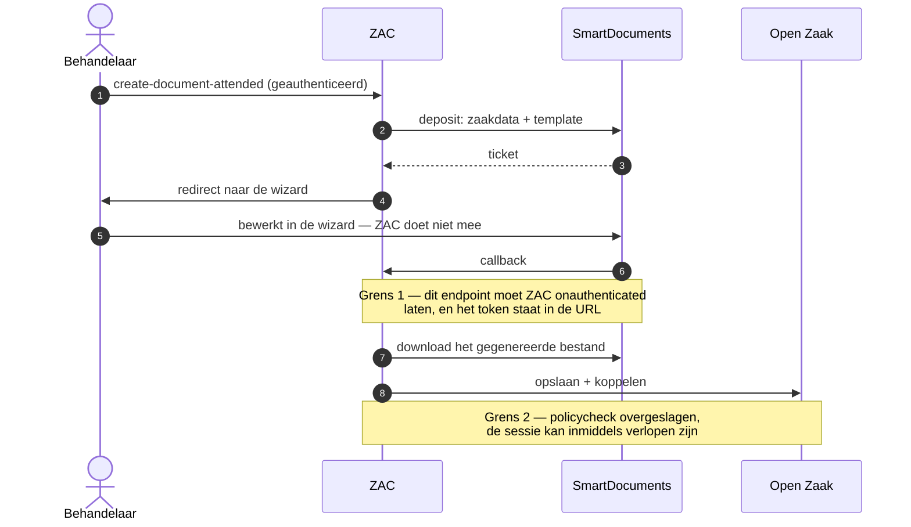
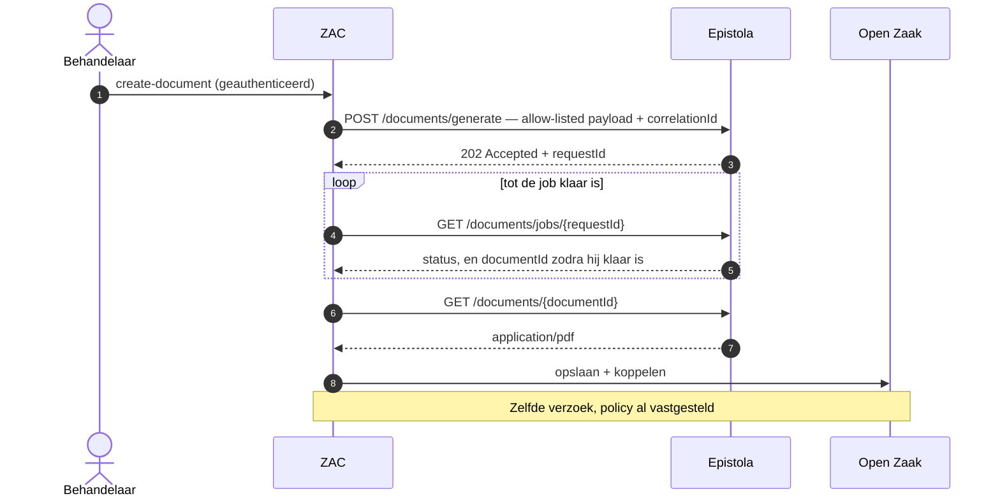
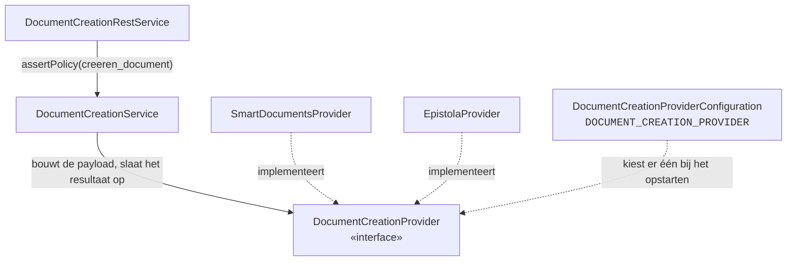

# Technisch en functioneel ontwerp — Epistola

| | |
|---|---|
| Issue | [#14](https://github.com/infonl/zac-epistola-prototype/issues/14) · werkproces B1-K1-W2 |
| Stand | 25 september 2026 — bijgewerkt naar wat #4 ([PR #24](https://github.com/infonl/zac-epistola-prototype/pull/24)), #3, #6 ([PR #27](https://github.com/infonl/zac-epistola-prototype/pull/27)) en #5 ([PR #29](https://github.com/infonl/zac-epistola-prototype/pull/29)) hebben gebouwd, en naar de review op #24: contract 1.3.1, en live nagegaan op de testtenant. Op 30 september bijgewerkt naar de foutafhandeling van #8 (§5), de besluiten van 28 september en wat #7 en #30 hebben gebouwd (§6), en naar contract en client 1.4.0 (§3), en met een nieuwe versie van een Epistola-document (#9, §1 en §6). De vraag over de herkomsttabel van #9 is daarna een vraag voor opname in ZAC geworden (§6). Op 1 oktober bijgewerkt naar de variantkeuze per kanaal (#47, §5 en §6), en op 5 oktober naar de keuzelijst in de dialoog, het endpoint dat die vult en de regel voor het opgeslagen kanaal (#47, §1, §5 en §6), en naar de naam *Variant* voor die keuzelijst (#53, §1 en §5) |
| Scope | Prototype, alleen CMMN |
| Bouwt op | #2 provider-configuratie · #15 wireframes · #16 ontwerpverantwoording |
| Blokkeert | #4 · #5 · #6 · #11 |

Hoe Epistola achter ZAC's documentcreatie past: de flow, hoe ZAC tussen de twee providers kiest, de data
die oversteekt, en wie op de knop mag drukken.

## Dekking van de acceptatiecriteria

| § | Onderwerp | Dekking |
|---|---|---|
| [§1](#1--functioneel-ontwerp) | Functioneel ontwerp | Zeven stappen van zaaktypeconfiguratie tot een nieuwe versie, elk met wat er waar wordt vastgelegd |
| [§2](#2--provider-abstractie) | Provider-abstractie | Gebouwd: twee endpoints achter één dialoog, zonder gedeelde interface (#5, R7). Beschreven voor een derde provider: één interface, twee interactievormen en een sealed outcome in plaats van een geforceerd uniform retourtype |
| [§3](#3--datamapping) | Datamapping | De ZAC-kant is exact; Epistola krijgt templatevariabelen plus een correlatie-id |
| [§4](#4--autorisatiemodel) | Autorisatiemodel | Hergebruik van `creeren_document`, dat al samenvalt met zaaktype- en zaakautorisatie |
| [§5](#5--api-integratie) | API-integratie | Endpoints, contracten en foutsemantiek, uit Epistola's gepubliceerde OpenAPI-contract |
| [§6](#6--wat-dit-ontwerp-vastlegt-en-wat-het-openlaat) | Besluiten en openstaande punten | Wat de overleggen van 21 en 28 september hebben beslist, wat bij de bouw van #8 is besloten, en wat nog open is |

---

## 1 · Functioneel ontwerp

De flow hergebruikt bewust de schermen die ZAC al heeft. Volgens #15 verraden de actie, het label en de dialoog niet
welke documentengine de installatie draait — dat is een beslissing van de beheerder, en het tonen ervan
zou elke behandelaar een onderscheid laten leren dat niets aan hun werk verandert. De foutmeldingen van de
gebouwde versie noemen Epistola wel (§5).

1. **Zaaktypeconfiguratie** — een functioneel beheerder opent het zaaktype in ZAC Admin, ordent Epistola's
   templates in templategroepen en koppelt elk template aan een informatieobjecttype. De groepen zijn van
   ZAC zelf — Epistola houdt zijn templates plat binnen een tenant ([§6](#6--wat-dit-ontwerp-vastlegt-en-wat-het-openlaat))
   — dus beide staan in ZAC's eigen database, als de twee mappingtabellen uit het
   [datamodel](datamodel.md): configuratie, nooit zaakdata.
2. **Actie** — op een CMMN-zaak gebruikt de behandelaar de bestaande actie *Document maken*
   (`actie.document.maken`). Die verschijnt alleen wanneer de policy `creeren_document` toestaat
   ([§4](#4--autorisatiemodel)), en is op BPMN-zaken uitgeschakeld met een toelichtende tooltip (#7).
3. **Templatekeuze** — de dialoog toont de templates die aan dit zaaktype gekoppeld zijn. Het
   uitvoerformaat is statische tekst "PDF" in plaats van een keuzelijst met één optie; documenttype en
   vertrouwelijkheid zijn read-only en komen uit de beheermapping, zodat een behandelaar een document niet
   onder het verkeerde informatieobjecttype kan wegschrijven.
   *5 oktober:* heeft het gekozen template varianten voor twee of meer kanalen, dan toont de dialoog ook een keuzelijst
   **Variant** (#53; eerst *Kanaal*) met *Per post* en *Digitaal* (#47). Die staat op het kanaal dat het communicatiekanaal van de zaak
   voorstelt, en de hint noemt dat communicatiekanaal; stelt het niets voor, dan op het kanaal van de standaardvariant.
   Het gekozen kanaal, ook het voorgeselecteerde, is het kanaal waar ZAC Epistola om vraagt. Heeft het template minder
   dan twee kanalen, dan ontbreekt de keuzelijst en vraagt ZAC om het kanaal dat het communicatiekanaal voorstelt, of om
   geen ([§5](#verzoek)).
   *5 oktober:* heeft het template varianten in twee of meer talen, dan staat daarboven de keuzelijst **Taal** (#52), op
   Nederlands als het template dat heeft en anders op de taal van de standaardvariant. *Variant* biedt dan alleen de
   varianten in de gekozen taal ([§5](#verzoek)).
4. **Generatie** — ZAC leest de zaak uit Open Zaak en de initiator uit de BRP of KvK *op dat moment*, bouwt
   de payload ([§3](#3--datamapping)) en dient hem in bij Epistola. Generatie is **asynchroon**: het
   indienen levert een job op, ZAC pollt die tot hij klaar is en downloadt dan de PDF
   ([§5](#5--api-integratie)). De dialoog blokkeert met een laadstatus in plaats van te sluiten, zodat een
   gedeeltelijke mislukking in context gemeld kan worden en niet als een losse toast.
5. **Opslag en koppeling** — de teruggekregen PDF wordt in de Documenten API van Open Zaak opgeslagen als
   `EnkelvoudigInformatieObject` en aan de zaak gekoppeld als `ZaakInformatieObject` — binnen hetzelfde
   geauthenticeerde verzoek ([§2](#2--provider-abstractie)). ZAC houdt geen documentregistratie bij. Het onthoudt alleen welk
   template het document maakte, voor stap 7 ([datamodel](datamodel.md)). *5 oktober:* en het kanaal waar ZAC Epistola
   om vroeg, of geen als het om geen vroeg (#47).
6. **Preview** — Solr-herindexering en de WebSocket-notificatie laten het document verschijnen op het
   tabblad Documenten van de zaak, waar het met metadata en een in-browserpreview opent zoals elk ander
   document.
7. **Nieuwe versie** *(optioneel, DoD 11, #9)* — op de pagina van een document dat Epistola maakte, genereert de actie
   *Nieuwe versie genereren* het opnieuw uit hetzelfde template, met de zaakgegevens zoals ze dan zijn. Het
   resultaat is de volgende versie van hetzelfde informatieobject (`versie + 1`). De eerdere versies blijven staan,
   en mislukt het opslaan, dan blijft de huidige versie zoals ze was. De zaak is de zaak waaraan het document hangt,
   niet een zaak die de aanroeper noemt, zodat de gegevens van de ene zaak niet in het document van een andere
   terechtkomen. De aanroeper heeft het recht nodig om voor die zaak documenten te maken én om aan het document een
   versie toe te voegen (`creeren_document` en `toevoegen_nieuwe_versie`), en het zaaktype moet het template nog
   aanbieden. De actie staat alleen bij een document waarvan ZAC het template kent, zolang Epistola de provider is.
   *5 oktober:* de nieuwe versie vraagt om het kanaal dat bij het document is opgeslagen, zolang het template dat
   kanaal nog heeft, en anders om het kanaal dat het communicatiekanaal nu voorstelt (#47). Is er bij het document geen
   kanaal opgeslagen, omdat er bij stap 3 niets te vragen was, dan kreeg het de standaardvariant, en vraagt ook de
   nieuwe versie om geen kanaal: ze krijgt dezelfde standaardvariant, zolang het communicatiekanaal niets voorstelt.
   Om het kanaal van de standaardvariant vragen zou een andere variant van dat kanaal kunnen geven, bijvoorbeeld een
   Nederlandse naast een Engelse standaardvariant.

---

## 2 · Provider-abstractie

#2 heeft de abstractie op configuratieniveau opgeleverd: `DOCUMENT_CREATION_PROVIDER` kiest één provider en
de applicatie weigert bij het opstarten een tegenstrijdige opzet. Het codepad is nog niet abstract —
`DocumentCreationService` injecteert `SmartDocumentsService` rechtstreeks, en het REST-endpoint kijkt nog
naar `isSmartDocumentsEnabled(zaaktypeUuid)`. Dat is het werk van dit ontwerp. #4 heeft de Epistola-kant
gebouwd als een losse `EpistolaDocumentCreationService`.

**Gebouwd in #5 is een eenvoudiger vorm dan de interface hieronder.** Er zijn twee endpoints. Het bestaande
`create-document-attended` blijft voor SmartDocuments en geeft de redirect naar de wizard. Het nieuwe
`epistola/create-document` genereert en slaat op in één verzoek, en geeft het opgeslagen document terug. De
behandelaar merkt daar niets van, want één dialoog kiest het endpoint van de actieve provider. De vertakking
die de sealed outcome hieronder in de REST-laag legt, ligt daarmee in de dialoog. Het voordeel is dat het
SmartDocuments-pad onaangeroerd blijft (DoD-item 1). De prijs is dat er geen gedeelde interface is om een
derde provider achter te hangen. Die staat daarom op #20 (R7).

De moeilijkheid zit niet in het injecteren van twee implementaties. Die zit erin dat de twee providers
werkelijk verschillende *interactievormen* hebben, en een interface die dat ontkent gaat lekken.

### Figuur 1 — dezelfde taak onder beide providers

SmartDocuments doet acht hops en kruist daarbij twee vertrouwensgrenzen. Beide zijn hieronder als notitie
gemarkeerd: het zijn de enige twee stappen waarin iets ZAC binnenkomt in plaats van eruit te vertrekken, en
ze bestaan alleen omdat SmartDocuments de gebruiker aan een wizard van een derde partij overdraagt.


```mermaid
sequenceDiagram
    autonumber
    actor Behandelaar
    participant ZAC
    participant SmartDocuments
    participant OpenZaak as Open Zaak

    Behandelaar->>ZAC: create-document-attended (geauthenticeerd)
    ZAC->>SmartDocuments: deposit: zaakdata + template
    SmartDocuments-->>ZAC: ticket
    ZAC->>Behandelaar: redirect naar de wizard
    Behandelaar->>SmartDocuments: bewerkt in de wizard — ZAC doet niet mee
    SmartDocuments->>ZAC: callback
    Note over SmartDocuments,ZAC: Grens 1 — dit endpoint moet ZAC onauthenticated<br/>laten, en het token staat in de URL
    ZAC->>SmartDocuments: download het gegenereerde bestand
    ZAC->>OpenZaak: opslaan + koppelen
    Note over ZAC,OpenZaak: Grens 2 — policycheck overgeslagen,<br/>de sessie kan inmiddels verlopen zijn
```

Epistola doet er niet minder stappen over — generatie is asynchroon, dus ZAC dient in, pollt en downloadt —
maar *elke* hop vertrekt vanuit ZAC en valt binnen het verzoek dat al geautoriseerd was. Er komt niets
terug naar binnen, dus geen van beide grenzen bestaat.


```mermaid
sequenceDiagram
    autonumber
    actor Behandelaar
    participant ZAC
    participant Epistola
    participant OpenZaak as Open Zaak

    Behandelaar->>ZAC: create-document (geauthenticeerd)
    ZAC->>Epistola: POST /documents/generate — allow-listed payload + correlationId
    Epistola-->>ZAC: 202 Accepted + requestId
    loop tot de job klaar is
        ZAC->>Epistola: GET /documents/jobs/{requestId}
        Epistola-->>ZAC: status, en documentId zodra hij klaar is
    end
    ZAC->>Epistola: GET /documents/{documentId}
    Epistola-->>ZAC: application/pdf
    ZAC->>OpenZaak: opslaan + koppelen
    Note over ZAC,OpenZaak: Zelfde verzoek, policy al vastgesteld
```

### De interface

Door dat verschil kan `createDocument` niet voor beide hetzelfde teruggeven. Een uniform retourtype
afdwingen zou betekenen dat je ofwel doet alsof Epistola asynchroon is naar de aanroeper toe, ofwel alsof
SmartDocuments bytes teruggeeft. Het ontwerp gebruikt één interface met een **sealed outcome**, zodat de
REST-laag één keer expliciet vertakt en de compiler afdwingt dat beide gevallen afgehandeld worden.

| Interface-operatie | SmartDocuments | Epistola |
|---|---|---|
| `listTemplateGroups()` | `GET sdapi/structure`, geneste boom | `GET /tenants/{tenantId}/catalogs/{catalogId}/templates` — een platte lijst; de groepering is van ZAC ([§6](#6--wat-dit-ontwerp-vastlegt-en-wat-het-openlaat)) |
| `createDocument(zaak, taskId, templateId, metadata)` | `Outcome.RedirectToWizard(uri)` | `Outcome.Generated(pdf)` — na indienen, pollen en downloaden binnen de aanroep |
| `downloadDocument(fileId)` | Nodig — de wizard levert het bestand later op | Intern aan de implementatie, niet op de interface |
| `informatieobjecttypeFor(zaaktype, template)` | Identiek: opgelost uit ZAC's eigen mappingtabel, niet bij de provider | Idem |

Dat `downloadDocument` maar aan één kant staat, is het eerlijke signaal dat dit twee vormen zijn en geen
één. Het hoort thuis op de SmartDocuments-implementatie, bereikbaar vanuit de callbackroute, en niet op de
gedeelde interface.

### Besluit — de asynchrone generatie blijft binnen de aanroep

Epistola biedt drie manieren om aan een gegenereerd document te komen, en de keuze doet er meer toe dan ze
lijkt.

- `POST /documents/preview` is synchroon en geeft de PDF direct terug — maar het contract stelt dat het
  alleen voor preview is: **niet PDF/A-compliant**, rate-limited, resultaten worden niet bewaard, en
  expliciet "do not use for production document generation". Daarmee valt het af voor het artefact dat het
  dossier in gaat.
- `POST /generation/collect` is een node-gebaseerde verdeelwachtrij: een client pollt continu, bevestigt een
  cursor en krijgt de resultaten voor zijn partitie. Dat is het juiste antwoord op batchvolume, en het
  vraagt een langlopende collector in ZAC die herstarts overleeft.
- **Gekozen:** indienen met `POST /documents/generate`, `GET /documents/jobs/{requestId}` pollen tot hij
  klaar is, dan `GET /documents/{documentId}`. Eén behandelaar die één knop indrukt is geen
  doorvoerprobleem, en juist door de hele uitwisseling binnen het geauthenticeerde verzoek te houden blijft
  de eigenschap uit figuur 1 overeind.

Het pollen is begrensd: voorbij een timeout faalt de aanroep met een herhaalbare melding, in plaats van een
requestthread onbeperkt vast te houden. Zodra ZAC stopt met wachten zonder document, bij de timeout maar ook
bij een fout tijdens het pollen, annuleert het de job. Dat is nodig: een job die blijft lopen, rendert alsnog
een document dat niemand ophaalt, en elke nieuwe poging zou er één bij zetten. De requestthread blijft zo lang
wel bezet. Het endpoint in #5 geeft hem niet vrij: de thread blijft bezet tot Epistola klaar is, en VV-05 in de [verbetervoorstellen](verbetervoorstellen.md) meet wat dat onder belasting kost. Het collectormodel is het gedocumenteerde pad voor
productieschaal en bulkgeneratie, en hoort bij de verbetervoorstellen (#20) en niet bij het prototype.

### Besluit — de officiële Jakarta-client wordt overgenomen

Epistola publiceert een Jakarta EE-client die uit hetzelfde contract gegenereerd is, geschreven voor
"WildFly, Open Liberty, Payara, Quarkus — where Spring is not on the classpath and never will be". Hij
gebruikt JAX-RS, JSON-B, MicroProfile Rest Client en MicroProfile Config, allemaal geleverd door de
applicatieserver, en declareert **helemaal geen runtime-dependencies** — een buildtest in dat project
bewijst dat. Hij implementeert ook de API-key-authenticatie en het ophalen van resultaten die dit ontwerp
nodig heeft.

ZAC genereert zijn andere zeven clients zelf uit OpenAPI-specificaties. Hier heeft de leverancier dat al
gedaan, op precies ZAC's stack, inclusief de handgeschreven delen — authenticatie, problem-detail
foutafhandeling, poll-backoff — die een gegenereerde client je niet geeft. Zelf bouwen zou dat werk
overdoen en er daarna van af gaan wijken. De omgevingsvariabelen in #2 zijn al naar de
configuratieproperties van deze client vernoemd, dus overnemen kost geen hernoeming.

Eén gevolg bleek pas binnen WildFly. De interfaces van de client dragen `@RegisterRestClient`, dus WildFly's
MicroProfile Rest Client registreert er ook zelf een bean voor, zonder ZAC's configuratie. Naast de producer
van ZAC is dat een dubbelzinnige afhankelijkheid (`WELD-001409`). Daarom kiest de qualifier
`@EpistolaClient` expliciet de client die ZAC zelf bouwt.

### Figuur 2 — waar de naad komt te liggen


```mermaid
flowchart TD
    REST["DocumentCreationRestService"]
    SVC["DocumentCreationService"]
    IFACE["DocumentCreationProvider<br/>«interface»"]
    SD["SmartDocumentsProvider"]
    EP["EpistolaProvider"]
    CFG["DocumentCreationProviderConfiguration<br/><code>DOCUMENT_CREATION_PROVIDER</code>"]

    REST -->|"assertPolicy(creeren_document)"| SVC
    SVC -->|"bouwt de payload, slaat het resultaat op"| IFACE
    SD -.->|implementeert| IFACE
    EP -.->|implementeert| IFACE
    CFG -.->|"kiest er één bij het opstarten"| IFACE
```

Alleen de interfacebox is nieuw werk; de twee services erboven bestaan al en houden hun
verantwoordelijkheden. De poort die nu `isSmartDocumentsEnabled` vraagt, vraagt het voortaan aan de actieve
provider. *Niet zo gebouwd; zie het besluit bovenaan deze paragraaf.* Elk endpoint toetst nu zijn eigen
provider: het SmartDocuments-endpoint `isSmartDocumentsEnabled`, het Epistola-endpoint of Epistola actief is,
voor het zaaktype aanstaat en het gekozen template aanbiedt.

---

## 3 · Datamapping

De ZAC-kant is geen ontwerpkwestie — die bestaat al, in `DocumentCreationDataService.createData`, en #16
heeft hem veld voor veld opgesomd. Epistola krijgt dezelfde payload als SmartDocuments, plus twee eigen
velden en met datums in een ander formaat, en er komt één regel bij.

Pariteit wordt structureel vastgehouden en niet door onderstaande tabel: #4 bouwt de Epistola-payload door
hetzelfde model te serialiseren via dezelfde JSON-B-annotaties die de SmartDocuments-deposit opleveren, en
een test toetst dat tegen de eigen properties van het model. Een veld dat aan het model wordt toegevoegd
bereikt daarmee beide providers, en er één vergeten te mappen laat de build falen.

**Datums zijn de uitzondering.** SmartDocuments krijgt `dd-MM-yyyy`, Epistola ISO 8601 (`2026-09-24`).
Epistola's eigen contracteditor declareert een datum als `{"type": "string", "format": "date"}` in een
draft-07-schema, en voor draft-07 dwingt Epistola `format` af. Live nagegaan op 24 september: met zo'n contract
mislukt een job voor `24-09-2026` met *must be a valid RFC 3339 full-date*, en dezelfde job met `2026-09-24`
rendert. Een template maakt er met `$formatDate(zaak.startdatum, 'dd-MM-yyyy')` weer een Nederlandse datum van.
Die functie leest alleen ISO en drukt al het andere ongewijzigd af. Tot de review op #24 kreeg Epistola het
SmartDocuments-formaat, en daarmee faalde elk document voor een template dat op de manier van Epistola was
geschreven.

| Groep | Velden | Bron, opgehaald tijdens generatie |
|---|---|---|
| `zaakData` | `identificatie`, `zaaktype`, `omschrijving`, `toelichting`, `startdatum`, `einddatum`, `einddatumGepland`, `uiterlijkeEinddatumAfdoening`, `registratiedatum`, `status`, `resultaat`, `behandelaar`, `groep`, `communicatiekanaal`, `vertrouwelijkheidaanduiding`, `opschortingReden`, `verlengingReden`, `besluit` | Open Zaak ZRC + ZTC. `besluit` staat in het model maar wordt nooit gevuld, ook niet voor SmartDocuments (zie #4) |
| `zaakData` — alleen Epistola | `zaakgeometrie` (`type`, `latitude`, `longitude`), `eigenschappen` (naam → waarde) | Open Zaak ZRC. Toegevoegd in #4 en apart verzameld, zodat de payload die SmartDocuments krijgt onveranderd blijft. ZAC ondersteunt alleen POINT-geometrieën; al het andere draagt zijn type en geen coördinaten, omdat een template geen polygoon kan renderen. Eigenschappen die een naam delen, of die er niet zijn, worden weggelaten en gelogd — een template kan ze niet eenduidig aanspreken |
| `aanvragerData` | `naam`, `straat`, `huisnummer`, `postcode`, `woonplaats` | BRP via het BSN van de initiator, of KvK voor een vestiging / rechtspersoon. **Het BSN zelf is de zoeksleutel en wordt nooit doorgestuurd** |
| `gebruikerData` | `id`, `naam` | De ingelogde ZAC-gebruiker |
| `taskData` | `naam`, `behandelaar` | Flowable, alleen bij genereren vanuit een taak |
| `startformulierData` | `productAanvraagtype`, `data` | Objecten API — een ongefilterde map van het door de burger ingediende formulier |

### Ontwerpregel — afwijking van de SmartDocuments-mapping

`startformulierData.data` is wat het formulier ook maar verzameld heeft, platgeslagen en ongefilterd. Het
in zijn geheel versturen betekent dat velden die geen enkel template gebruikt naar een derde partij gaan —
mogelijk een BSN, een telefoonnummer, een medische omstandigheid. Epistola valideert invoer tegen een JSON
Schema per template, dus **dat schema is de allow-list**: stuur alleen de variabelen die het gekozen
template declareert, en laat de rest vallen voordat het verzoek wordt opgebouwd.

Dit is de ene plek waar het Epistola-pad bewust hoort af te wijken van het SmartDocuments-pad dat het
verder spiegelt, en het is wat van #4's pariteitscriterium een ondergrens maakt in plaats van een bovengrens.

**Gebouwd in #4**, in `TemplateSchemaAllowList`. Het schema komt uit het veld `dataModel` van het template:
Epistola laat het oudere `schema` leeg. De regels:

- Geneste objecten en de items van een lijst worden elk tegen hun eigen schema gefilterd. Een lijst gaat
  alleen mee als elk item te versmallen is, want een brief die stilletjes één regel uit een opsomming mist,
  leest als compleet.
- Lokale `$ref`s worden gevolgd. Bij `allOf`, `anyOf` en `oneOf` is de allow-list de vereniging van de
  gedeclareerde velden, omdat ZAC niet kan weten welk alternatief een template rendert. Epistola's eigen
  data-editor gebruikt al deze constructies.
- Een object of lijst achter een verwijzing die ZAC niet kan oplossen, of onder een schema dat iets anders
  declareert (bijvoorbeeld `type: string`), blijft weg. Een enkele waarde gaat wel mee.
- Een template zonder schema wordt geweigerd.

**Welk contract de allow-list leest.** Datacontracten zijn geversioneerd. `GET …/templates/{templateId}` geeft
het laatst *gepubliceerde* contract, nooit een concept. Genereren rendert de laatst gepubliceerde
templateversie, en valideert tegen het contract dat díe versie heeft vastgelegd. Meestal is dat hetzelfde
contract. Ze lopen uiteen wanneer een auteur een brekende contractwijziging publiceert zonder de template
opnieuw te publiceren: de oude templateversie houdt dan haar oude contract. Live nagegaan, en zo staat het in
`PublishContractVersion` van Epistola Suite. De allow-list volgt in dat geval het nieuwe contract. Een veld dat
erbij kwam, gaat mee maar wordt niet gerenderd. Een veld dat eruit ging, houdt ZAC tegen terwijl de template het
nog leest. ZAC kan dat niet zelf oplossen. Een `versionId` meesturen kan wel, maar geen endpoint vertelt welk
contract bij een templateversie hoort. Het ligt als vraag bij Epistola ([§6](#6--wat-dit-ontwerp-vastlegt-en-wat-het-openlaat)).

Eén grens is bewust open en staat in een test: een template dat een sectie uitdrukkelijk als
`type: object` of `type: array` declareert, zonder velden, krijgt hem heel. Dat is de templateauteur die om
de hele zak vraagt en geen gat in het filter, maar het is wel de enige overgebleven route waarlangs
ongereviewde startformulierdata een document bereikt. De stakeholders hebben dit op 28 september geaccepteerd (B17), en een waarschuwing in de beheerkaart is het vervolg (#39).

### Ontbrekende optionele velden

De meeste velden hierboven zijn nullable in Open Zaak: een zaak zonder resultaat, een initiator die de BRP
niet kan vinden, een zaak zonder taak. De regel is om een ontbrekend veld *weg te laten* in plaats van een
lege string te sturen, zodat een template "niet van toepassing" van "leeg" kan onderscheiden, en om het
schema te laten bepalen of die afwezigheid een fout is. Een veld dat het template als verplicht declareert
en dat ZAC niet kan leveren is een configuratiefout die het waard is om hard op te falen, geen witregel in
een besluit.

**Dat harde falen doet Epistola zelf.** Voordat een job rendert, toetst Epistola de data aan het contract van
de gerenderde templateversie. Breekt de data dat contract, dan mislukt de job met de JSON Pointer van het veld,
bijvoorbeeld `Data validation failed: /zaak: required property 'identificatie' not found`, en ZAC geeft die
reden door ([§5](#foutafhandeling)). Live nagegaan voor een ontbrekend verplicht veld, een verkeerd type en
een datum in het verkeerde formaat.

ZAC roept `POST …/templates/{templateId}/validate` daarom niet vooraf aan. Dat endpoint toetst tegen het
nieuwste contract, en dat is een *concept* zodra een auteur er een heeft aangemaakt. Live nagegaan: met een
ongepubliceerd concept dat een nieuw verplicht veld vraagt, keurt `validate` de data af, terwijl de job met
dezelfde data gewoon rendert. Een toets vooraf zou dus goede documenten weigeren zolang een auteur aan een
wijziging werkt, en niets vangen wat de job zelf niet vangt. De client-kant `ValidatingGenerationApi` helpt
evenmin. Die leest het oude veld `schema`, dat Epistola altijd leeg laat, en valideert dus niets. Contract 1.4.0
(30 september) geeft `validate` een `variantId`, `versionId` en `environmentId` en per veld `missingFields` en
`invalidFields`. Tegen de versie die gerenderd wordt, is het dan wel bruikbaar, als bron voor de melding uit #8. De
server doet dat voor `validate` nog niet. Op 30 september gaf de testserver op data met vier fouten alleen de velden
`errors` en `valid` terug, en [epistola-suite#978](https://github.com/epistola-app/epistola-suite/issues/978)
laat dat onderdeel wachten op deze contractrelease. ZAC gaat met [PR #42](https://github.com/infonl/zac-epistola-prototype/pull/42) naar de 1.4.0-client, die de velden al
kent.

Epistola neemt deze als templatevariabelen aan, naast een `correlationId`. De variabelenamen zijn de
JSON-B-namen van `DocumentCreationData` (`zaak.identificatie`, `aanvrager.naam`, …), dezelfde die een
SmartDocuments-sjabloon gebruikt. Een templateauteur schrijft daartegen, dus er is geen binding in het
beheerscherm. De allow-list hierboven bepaalt welke ervan überhaupt verstuurd mogen worden.

---

## 4 · Autorisatiemodel

#11 vraagt of Epistola een nieuw recht nodig heeft of het SmartDocuments-recht kan hergebruiken. De premisse
klopt niet helemaal: het bestaande recht is niet SmartDocuments-specifiek. `creeren_document` is een
generiek zaakrecht in `zaak-rechten.rego`, en het luidt:

```rego
default creeren_document := false
creeren_document if {
    zaaktype_allowed   # het zaaktype van de zaak zit in de geautoriseerde set van de gebruiker
    zaak.open          # een gesloten zaak levert geen nieuwe documenten op
    zaak_allowed       # zaakspecifiek geautoriseerde zaken vereisen die applicatierol
    some role in {behandelaar, coordinator, recordmanager, beheerder}
    role.rol in user.rollen
}
```

**Het ontwerp hergebruikt het.** Een apart Epistola-recht zou het mogelijk maken een installatie zo in te
richten dat documentcreatie is toegestaan maar Epistola verboden — een toestand zonder betekenis, want er
is precies één provider tegelijk actief. Het recht drukt uit "mag een document voor deze zaak
voortbrengen", en dat is de vraag die werkelijk gesteld wordt, los van welke engine hem beantwoordt.

### Samenhang met zaakautorisatie — bewijsbaar, niet aangenomen

Het vijfde criterium van #11 vraagt dat een gebruiker die de zaak niet mag lezen er ook geen document voor
kan genereren. Dat geldt door constructie en niet door een aparte controle. Vergelijk de twee regels:
`lezen` vereist `zaaktype_allowed` en `zaak_allowed` met een rol uit {raadpleger, behandelaar, coordinator,
recordmanager, beheerder}; `creeren_document` vereist dezelfde twee guards, een *deelverzameling* van die
rollen (raadpleger uitgesloten), en daarbovenop `zaak.open`. Elke gebruiker die een document kan aanmaken
voldoet daarmee aan elke voorwaarde om het te lezen. De implicatie is eenrichtingsverkeer en kan niet uit
elkaar gaan lopen, omdat beide regels dezelfde twee guards lezen.

### Correctie op de aanname in #11

#11 noemt *vertrouwelijkheidaanduiding* als een bestaande toegangsregel op zaakniveau om rekening mee te
houden. Dat is het niet. Niets in `zaak-rechten.rego` leest het; ZAC's zaakautorisatie is zaaktype plus
applicatierol plus de zaakspecifiek-geautoriseerd-guard. Vertrouwelijkheidaanduiding is een classificatie
die op de zaak en op documenten meereist, gebruikt door Open Zaak en getoond aan gebruikers — geen invoer
voor ZAC's policy. Het criterium moet herschreven worden, en het echte vertrouwelijkheidsdefect is het
defect dat #16 als R6 heeft vastgelegd: gegenereerde documenten worden met een hardcoded `OPENBAAR`
weggeschreven.

### Handhaving

- Server-side, in `DocumentCreationRestService`, via
  `assertPolicy(policyService.readZaakRechten(zaak, user).creerenDocument)`. Die controle stond er al voor
  SmartDocuments, en #5 heeft haar in één helper gezet die beide endpoints aanroepen. Genereren vanuit een
  taak toetst daarnaast het taakniveau-`creeren_document`, dat ook `taak.open` vereist. Een weigering is een
  `PolicyException`, die `RestExceptionMapper` met 403 beantwoordt, voordat er iets naar Epistola gaat.
- De frontend verbergt de actie wanneer het recht ontbreekt. Dat is presentatie, geen handhaving; het
  endpoint moet zelfstandig weigeren, en de negatieve test van #11 — geauthenticeerd maar niet
  geautoriseerd, met 403 als verwachting — is wat dat bewijst. *Gebouwd in #5, als unit tests: geweigerd
  zonder het zaakrecht, zonder het taakrecht, en voor een taak die niet meer open is.*
- Epistola's eigen credential benoemt de installatie en geen persoon — één API key voor de hele
  ZAC-installatie ([#16](https://github.com/infonl/zac-epistola-prototype/issues/16), R1) — dus *ZAC is de
  enige plek waar dit afgedwongen kan worden*. Dat is een beperking om in het productieadvies helder te
  benoemen, geen gat in dit ontwerp.

---

## 5 · API-integratie

Epistola is open source en publiceert zijn contract op
[epistola-app/epistola-contract](https://github.com/epistola-app/epistola-contract): een
OpenAPI-specificatie, gegenereerde clients voor meerdere stacks, en een mockserver. Alles hieronder is uit
dat contract gelezen en niet voorgesteld.

### Endpoints

| Endpoint | Gebruikt | Recht | Rol in deze integratie |
|---|---|---|---|
| `POST /tenants/{tenantId}/documents/generate` | Ja | `DOCUMENT_GENERATE` | Dient één document in. Geeft `202` terug met een request-id |
| `GET /tenants/{tenantId}/documents/jobs/{requestId}` | Ja | `DOCUMENT_VIEW` | Jobstatus en items; levert bij afronding het document-id |
| `DELETE /tenants/{tenantId}/documents/jobs/{requestId}` | Ja | `DOCUMENT_GENERATE` | Annuleert een job die de timeout overschrijdt. Een job die al klaar is, weigert dat met `409` |
| `GET /tenants/{tenantId}/documents/{documentId}` | Ja | `DOCUMENT_VIEW` | Downloadt de PDF — `application/pdf` met een bestandsnaam en grootte |
| `DELETE /tenants/{tenantId}/documents/{documentId}` | Ja, sinds #6 | `DOCUMENT_GENERATE` | Verwijdert de PDF bij Epistola zodra hij in Open Zaak staat, en ook als het opslaan mislukt (B20), in plaats van hem daar maanden te laten staan ([bewaartermijn](#bewaartermijn-bij-epistola)). Live nagegaan: `204`, daarna `404` |
| `GET /tenants/{tenantId}/catalogs/{catalogId}/templates/{templateId}` | Ja | `TEMPLATE_VIEW` | Leest het JSON Schema (`dataModel`) van het gekozen template: de allow-list uit [§3](#3--datamapping). *5 oktober:* in dezelfde aanroep ook de varianten met hun attributen, waaruit ZAC de kanalen van het template leest (#47), en de talen uit `system.locale` (#52) |
| `GET /tenants/{tenantId}/catalogs/{catalogId}/templates` | Ja | `TEMPLATE_VIEW` | De templates die het beheerscherm per zaaktype aanbiedt (#3) |
| `POST /tenants/{tenantId}/catalogs/{catalogId}/templates/{templateId}/validate` | Nee | `TEMPLATE_VIEW` | Toetst data tegen het contract zonder te genereren. Waarom ZAC het niet vooraf aanroept, staat in [§3](#ontbrekende-optionele-velden) |
| `POST /tenants/{tenantId}/documents/preview` | Nee | `DOCUMENT_GENERATE` | Synchroon, maar alleen preview: geen PDF/A, rate-limited, niet bewaard |
| `POST /tenants/{tenantId}/documents/generate/batch` | Nee | `DOCUMENT_GENERATE` | Batchgeneratie — buiten scope; een verbetervoorstel (#20) |
| `POST /tenants/{tenantId}/generation/collect` | Nee | `DOCUMENT_GENERATE` | Cursorgebaseerde verdeelwachtrij voor continue afname. Het pad voor productieschaal |

Elke templateaanroep draagt de catalogus als padsegment, en ook een generatieverzoek vereist hem
(`catalogId`). ZAC heeft er precies één, uit `EPISTOLA_CATALOG_ID`. Verzoeken gebruiken het geversioneerde
mediatype `application/vnd.epistola.v1+json`.

De rechten in de tabel staan per operatie in het contract (`x-required-permissions`). ZAC heeft er dus drie
nodig, niet alleen `DOCUMENT_GENERATE`. Ontbreekt `DOCUMENT_VIEW`, dan wordt de job wel ingediend, maar krijgt
de eerste poll een `403`. ZAC annuleert de job dan ([§5](#foutafhandeling)), maar een job die al aan het renderen was, kan zijn inhoud laten staan ([bewaartermijn](#bewaartermijn-bij-epistola)). Een API key krijgt
de drie rechten via twee rollen: `DOCUMENT_GENERATOR` geeft `DOCUMENT_GENERATE`, en `CONTENT_VIEWER` geeft onder
meer `TEMPLATE_VIEW` en `DOCUMENT_VIEW`. Die twee rollen staan ook bij de sleutel in `.env.example` en in de
Helm-chart.

*5 oktober:* **ZAC's eigen endpoint voor de keuzelijst *Variant*** (#47, #53). Zodra de behandelaar in *Document maken* een
template kiest, vraagt de dialoog
`GET /rest/document-creation/epistola/create-document/{zaakUuid}/template/{templateId}/varianten`. Het antwoord heeft
drie velden, en sinds #52 vijf:

| Veld | Inhoud |
|---|---|
| `varianten` | De varianten, elk aangeduid met het kanaal waarvoor ze gemaakt zijn: de kanalen waarvoor de varianten van het template gemaakt zijn, uit het attribuut `kanaal` in ZAC's catalogus, elk één keer. Leeg voor een template zonder varianten per kanaal |
| `voorgesteldeVariant` | Het kanaal dat het communicatiekanaal van de zaak voorstelt, en anders dat van de standaardvariant. De keuzelijst staat erop |
| `communicatiekanaal` | De naam van het communicatiekanaal van de zaak, alleen als dat het voorstel deed. De hint noemt het |
| `talen` | *5 oktober (#52):* de talen van het template, elk als BCP-47-tag uit `system.locale`, met de varianten die het template in die taal heeft en de variant die daarin wordt voorgesteld. Leeg voor een template waarvan de varianten geen taal hebben. De keuzelijst *Taal* verschijnt bij twee of meer |
| `voorgesteldeTaal` | *5 oktober (#52):* de taal waar de keuzelijst *Taal* op staat: Nederlands als het template dat heeft, anders de taal van de standaardvariant, en leeg als die geen taal heeft |

Het endpoint toetst dezelfde policy als het genereren, `creeren_document` op de zaak ([§4](#4--autorisatiemodel)), en
weigert een template dat het zaaktype niet aanbiedt, allebei vóór het Epistola iets vraagt. Daarna leest het het
template met de aanroep `GET …/templates/{templateId}` uit de tabel. Het antwoord wordt niet bewaard, omdat het
communicatiekanaal van de zaak kan veranderen terwijl de pagina openstaat. Mislukt de aanroep, dan meldt de frontend
niets: de keuzelijst blijft weg, en bij het genereren vraagt ZAC om het kanaal dat het communicatiekanaal voorstelt,
of om geen. Ook *Taal* blijft dan weg, en ZAC vraagt om de taal die de keuzelijst zou voorselecteren.

### Authenticatie

**Een API key**, uitgegeven door een tenant manager van Epistola en bij elke aanroep meegestuurd als
`Authorization: ApiKey …`. Sinds contract 1.3.1 (21 september) is dat Epistola's ondersteunde methode, ook
voor productie. Een sleutel hoort bij één tenant en draagt de rollen waarmee hij is uitgegeven, hierboven
`DOCUMENT_GENERATOR` en `CONTENT_VIEWER`. Hij kan een vervaldatum krijgen en kan worden ingetrokken. Zelf
roteren kan ZAC niet: de tenant manager geeft een nieuwe sleutel uit, die komt in het Kubernetes-secret, en
daarna trekt hij de oude in.

ZAC krijgt hem als `EPISTOLA_CLIENT_API_KEY` naast `EPISTOLA_TENANT_ID` en `EPISTOLA_CATALOG_ID`. Bij het
opstarten controleert ZAC dat alle drie gezet zijn, en dat de tenant en de catalogus slugs zijn die Epistola
accepteert. De sleutel benoemt de installatie en geen persoon, en daarom blijft handhaving bij ZAC
([§4](#4--autorisatiemodel)). Volledig vastgelegd op #2.

Het contract kent daarnaast een **self-signed JWT** en **OAuth 2.0 client credentials**. Sinds 1.3.1 zijn
beide *experimenteel*: Epistola Suite implementeert het consumermodel waar ze op steunen mogelijk nog niet.
Ze zijn daarom geen alternatief meer, en ook geen productiepad.

Tot 1.3.1 droeg `apiKeyAuth` `x-deprecated: true`, met JWT als opvolger. Op die markering is de keuze in
september twee keer gedraaid (#2). Nu geldt de markering alleen nog de oude header `X-API-Key`, en de
Jakarta-client van ZAC stuurt de sleutel in `Authorization`, dus die raakt het niet. De les staat op #2: een
markering in een contract zegt wat er verandert, niet waarom, en dat laatste moest bij Epistola gevraagd worden.

### Verzoek

Een generatieverzoek benoemt het template en ofwel een expliciete `variantId` ofwel `attributes` voor
automatische variantkeuze — nooit allebei. Voor een template waarvan de varianten het attribuut `kanaal` in ZAC's
catalogus dragen (`post` of `digitaal`), stuurt ZAC `attributes` met het kanaal als vereiste (#47). De behandelaar kiest
de variant in *Document maken*, met de kiezer *Variant* (#53), voorgesteld door het communicatiekanaal van de zaak; een
nieuwe versie krijgt het kanaal van het document. *5 oktober:* ZAC slaat bij het document het kanaal op waar het om
vroeg, ook het kanaal van de standaardvariant als de behandelaar dat in de keuzelijst liet staan. Vroeg het om geen
kanaal, omdat de behandelaar er geen kon kiezen en het communicatiekanaal er geen voorstelde, dan slaat het geen kanaal
op, en vraagt ook een nieuwe versie om geen ([§1](#1--functioneel-ontwerp), stap 7).

*5 oktober:* naast het kanaal stuurt ZAC de taal als vereist `system.locale`, voor een template waarvan de varianten een
taal hebben (#52). Dat vervangt de voorkeur voor `nl-NL` die ZAC sinds #47 meestuurde, zodat een Nederlandse en een
Engelse variant voor hetzelfde kanaal niet gelijk eindigden: de taal is nu een keuze. De behandelaar kiest de taal in
*Document maken* met de kiezer *Taal*, die alleen verschijnt bij twee of meer talen en op Nederlands staat, anders op de
taal van de standaardvariant. *Variant* biedt alleen de varianten die het template in de gekozen taal heeft, zodat
Epistola nooit ongemerkt terugvalt op de standaardvariant in een andere taal. ZAC leest de talen uit de varianten en houdt
zelf geen talenlijst bij; de naam van een taal geeft de browser, in de taal waarin ZAC wordt getoond. Het informatieobject
in Open Zaak krijgt de gevraagde taal als ISO 639-2/B-code, zoals `eng`, en `dut` als ZAC om geen taal vroeg. ZAC slaat
de gevraagde taal bij het document op, en een nieuwe versie vraagt erom zolang het template die taal nog heeft; zonder
opgeslagen taal, of met een taal die het template niet meer heeft, vraagt ze om de taal die *Document maken* zou
voorselecteren. Zonder kanaal en zonder taal stuurt ZAC geen `attributes` en kiest Epistola de standaardvariant.

Het verzoek draagt de catalogus, de templatevariabelen uit [§3](#3--datamapping) en
een `correlationId`, die ZAC op de **UUID** van de zaak zet. Epistola echoot die terug en bewaart hem, dus
de waarde belandt in het audittrail van een derde partij en in elke supportuitwisseling. Beide
identificeren de zaak vanuit ZAC even goed en terugzoeken kost in geen van beide gevallen extra, maar de
UUID draagt buiten ZAC geen betekenis waar een zaaknummer een bedrijfsidentificatie is. Degene die minder
deelt wint.

### Foutafhandeling

Fouten zijn RFC 7807 problem details met getypeerde URI's, wat beter is dan statuscodes alleen: de
clientbibliotheek vertaalt ze naar getypeerde excepties. De regel uit #16 geldt overal — log een
correlatie-id, het template-id, de zaakidentificatie en de status; nooit de payload, nooit de response body.

Elke fout krijgt een eigen foutcode, en de frontend vertaalt die naar een melding die zegt wat er mis is en of
opnieuw proberen helpt. Zonder deze vertaling zag de behandelaar overal dezelfde algemene fout (HTTP 500). De
vertaling is gebouwd in #8; de laatste kolom zegt in welke testcase van het [testrapport](testrapport.md) ze is
nagegaan.

| Situatie | Gedrag van ZAC | Wat de behandelaar ziet | Nagegaan in |
|---|---|---|---|
| Data breekt het contract van het template: een verplicht veld ontbreekt, of een waarde heeft het verkeerde type | Epistola neemt de job aan en laat hem mislukken, met de JSON Pointer van het veld: `Data validation failed: /zaak: required property 'identificatie' not found`. ZAC geeft die reden door aan de dialoog en logt haar niet | "Het template vraagt zaakgegevens die deze zaak niet heeft, of in een andere vorm. Opnieuw proberen helpt niet. Geef de melding hieronder door aan de beheerder." Eronder staat Epistola's reden | TS-32 |
| Template zonder schema | ZAC weigert het vóór het indienen ([§3](#3--datamapping)) | "Het gekozen template geeft niet aan welke zaakgegevens het kan gebruiken. Neem contact op met de beheerder." | TS-21 |
| Job loopt niet af binnen de timeout | ZAC annuleert de job. Weigert Epistola dat, dan logt ZAC het request-id. De melding hangt af van wat de job op dat moment deed | In de wachtrij: "Het document stond te lang in de wachtrij bij Epistola en is geannuleerd. Epistola is waarschijnlijk druk. Probeer het later opnieuw." Tijdens het renderen: "Epistola deed te lang over het maken van het document, en het is geannuleerd. …" Status onbekend: "Het aanmaken van het document duurde te lang en is afgebroken. Probeer het opnieuw." | TS-33 |
| Pollen mislukt, bijvoorbeeld een 503 of een verbroken verbinding | ZAC annuleert de job en geeft de fout door | "Epistola is op dit moment niet bereikbaar. Probeer het later opnieuw." | TS-33 |
| Job mislukt bij het renderen, om een andere reden | Er is niets opgeslagen. ZAC geeft Epistola's reden door | "Het document kon niet worden aangemaakt. Probeer het opnieuw of neem contact op met de beheerder." | TS-32 |
| 400 bij het indienen | Een verzoek dat ZAC verkeerd opbouwt, bijvoorbeeld zonder `catalogId` | "Epistola kon het verzoek van ZAC niet verwerken. Neem contact op met de beheerder." | `EpistolaRequestFailedExceptionTest` |
| 401 / 403 | De API key is afgewezen, verlopen of ingetrokken, of mist een van de twee rollen | "ZAC heeft geen toegang tot Epistola. Neem contact op met de beheerder." | `EpistolaRequestFailedExceptionTest` |
| 404 op een template | Onbekend template of onbekende tenant — meestal een verouderde zaaktypemapping | "Het gekozen template bestaat niet meer in Epistola. Neem contact op met de beheerder." | TS-34 |
| 429 rate limited | Herhaalbaar na wachten | "Epistola krijgt op dit moment te veel verzoeken. Probeer het over een paar minuten opnieuw." | `EpistolaRequestFailedExceptionTest` |
| 5xx of Epistola onbereikbaar | Geen document, geen halve toestand. Het lezen van de mapping valt terug op de namen van de laatste geslaagde lijst ([datamodel](datamodel.md)) | Bij het genereren: "Epistola is op dit moment niet bereikbaar. Probeer het later opnieuw." Bij het openen van de dialoog: "De templates kunnen nu niet worden geladen." | TS-31 |
| PDF gedownload, opslag in DRC mislukt | De PDF wordt niet bewaard en de kopie bij Epistola wordt verwijderd (B20). De reden van Open Zaak staat niet in het log | "Het document is gemaakt, maar het opslaan in Open Zaak is mislukt. Er is niets aan de zaak toegevoegd. Probeer het later opnieuw." | TS-26 |
| Opgeslagen in DRC, koppeling in ZRC mislukt | Het informatieobject wordt verwijderd, in de gedeelde `ZgwApiService` en dus voor alle vijf aanroepers (B21). Lukt dat niet, dan een SEVERE-logregel met de URL | Dezelfde melding als hierboven | TS-35 |

Terwijl Epistola de job verwerkt, pollt de dialoog zijn status en toont *in de wachtrij*, *Epistola maakt het
document*, of dat het langer duurt dan gebruikelijk. ZAC pollt Epistola zelf minstens één keer per seconde, zodat
de getoonde status niet achterloopt.

### Bewaartermijn bij Epistola

In het overleg van 21 september is de bewaartermijn op ongeveer 30 dagen gezet, en zo staat hij in #16 en in
R4 op #20. De broncode van Epistola Suite zegt iets anders. `epistola.generation.documents.retention-days: 30`
staat wel in de configuratie, maar geen code leest die instelling. Wat wel werkt, is het onderhoud van de
maandpartities: `documents` en `document_content` worden verwijderd zodra ze ouder zijn dan
`partitions.retention-months: 3`. Een document staat er daardoor drie tot vier maanden. Een job die ZAC
annuleert terwijl hij al rendert, laat bovendien zijn inhoud achter zonder documentregel. Epistola slaat de
inhoud op vóór het de annulering ziet, dus die is niet via de API te verwijderen.

Daarom verwijdert ZAC een document bij Epistola zodra het in Open Zaak staat (#6), en ligt de termijn als
vraag bij Epistola ([§6](#6--wat-dit-ontwerp-vastlegt-en-wat-het-openlaat)).

### Testomgeving

Er zijn drie, elk voor iets anders:

- **De testserver van Epistola** (`demo.epistola.app`, met een eigen tenant en de catalogus `default`), bereikt met `./start-docker-compose.sh -l -E`. Hiertegen is
  op 24 september de hele keten binnen WildFly doorlopen, via de geïnjecteerde beans: template lezen,
  allow-list, genereren, downloaden.
- **Een WireMock-stand-in** (`-W`), voor werken zonder Epistola. Die spiegelt wat de echte server teruggeeft,
  niet wat het contract toestaat: het schema staat in `dataModel`, `catalogId` is verplicht. Een mock die meer
  accepteert dan Epistola, verbergt defects.
- **De mockserver uit de contractrepository**. Die is gebruikt om ZAC's aanroepvolgorde tegen het contract
  na te lopen, en is bruikbaar om de negatieve paden hierboven bewust uit te voeren.

---

## 6 · Wat dit ontwerp vastlegt en wat het openlaat

### Beslist in het stakeholderoverleg van 21 september

- **Templategroepen bestaan in ZAC, niet in Epistola.** Epistola's templates zijn plat binnen een tenant —
  varianten zijn dezelfde brief in een andere vorm, catalogi zijn distributiepakketten, en geen van beide is
  een groep die een beheerder zou herkennen. DoD-item 9 wordt daarom aan ZAC's kant ingevuld: de beheerder
  maakt de groepen zelf en hangt platte Epistola-templates eronder. Dat kost één kolom op de bestaande
  per-zaaktypetabel, en het beslist de vorm van het beheerscherm en de `parent_id` in het datamodel
  (#3, [datamodel](datamodel.md)).
- **Geen echte Epistola-tenant.** Het prototype en de einddemo draaien tegen ~~de testserver en een lokale
  Epistola~~ Epistola's gehoste testserver (`demo.epistola.app`), dus er is geen echte tenant en geen goedgekeurde
  consumer nodig, en er hoeft geen toegangsverzoek verstuurd te worden. Er gaan alleen testgegevens heen. ~~De
  mockserver uit de contractrepository dekt de geautomatiseerde tests (#10, #18).~~ *Rechtgezet op 1 oktober: de
  integratietests draaien met SmartDocuments en dekken Epistola niet; de Epistola-paden zijn gedekt door unittests,
  de live-check en de handmatige testcases. Een stand-in in de integratietests is voorstel VV-06 (#38).*

### Beslist in het stakeholderoverleg van 28 september

- **De templatenaam wordt niet in de database bewaard, maar wel onthouden** (B16, #30). Het id blijft de sleutel
  en Epistola de bron. ZAC onthoudt de namen van de laatste geslaagde lijst in het geheugen, en toont ze als
  Epistola niet bereikbaar is ([datamodel](datamodel.md)). Dit herziet "geen opgeslagen naam" uit #3.
- **Een template dat een sectie uitdrukkelijk als `type: object` declareert** krijgt die sectie heel (B17). Dat is
  een bewuste keuze van de templatebouwer, en de allow-list uit [§3](#3--datamapping) versmalt daar niets. Een
  waarschuwing in de beheerkaart is een verbetervoorstel (#39).
- **Namen en variabelen volgen Epistola** (B18, #31): *template*, *templategroep* en *catalog*, ook in het Nederlands.
- **Het testplan is goedgekeurd zoals het was** (B14), en de volgorde tot de einddemo is eerst #8, dan #7, dan
  opnieuw testen (B15). De einddemo is op maandag 12 oktober (B19).

### Beslist bij de bouw van #8, met Symon

- **Mislukt de opslag in Open Zaak, dan wordt het document niet bewaard** en ook bij Epistola verwijderd (B20). De
  behandelaar genereert opnieuw. Dit herziet #6, dat de kopie bij Epistola liet staan, terwijl ZAC geen verwijzing
  ernaar houdt en niemand hem dus kon ophalen.
- **Een informatieobject dat niet aan de zaak gekoppeld kon worden, wordt verwijderd** in de gedeelde
  `ZgwApiService` (B21), dus ook voor de andere aanroepers.

### Gekozen bij de bouw van #9

- **ZAC onthoudt per Epistola-document welk template het maakte**, in `epistola_document` (`V101`). Een nieuwe versie
  genereren heeft dat nodig, en Open Zaak heeft er geen veld voor: `titel` en `beschrijving` zijn tekst die een
  gebruiker kan wijzigen. Dit wijkt af van de formulering van 21 september dat ZAC geen documentregistratie bijhoudt.
  Er staat geen inhoud, titel, status of zaak in, alleen het informatieobject en het template ([datamodel](datamodel.md)).
  Een document van vóór `V101` heeft geen rij en dus geen actie. Of de tabel mag blijven, staat onder *Nog open*.
  Sinds #47 staat er ook het kanaal in waar ZAC Epistola om vroeg (`V102`), en geen als het om geen vroeg
  ([§1](#1--functioneel-ontwerp), stap 7), zodat een nieuwe versie in hetzelfde kanaal komt, ook als de behandelaar
  dat kanaal tegen het communicatiekanaal in koos.
- **De actie staat niet bij een document dat de gebruiker niet mag wijzigen**, want `toevoegen_nieuwe_versie` geldt
  hier net als bij een geüpload document: de zaak moet open zijn en het document niet *Definitief*.

### Nog open

- **Mag documenten maken alleen vanuit de zaak, niet vanuit een taakformulier, een bekende beperking blijven?** Het
  endpoint ondersteunt een taak wel (TS-28); de dialoog opent alleen vanuit de zaak. Geagendeerd op 28 september,
  niet beantwoord.
- **Bij opname in ZAC: mag ZAC een tabel met de herkomst van documenten bijhouden (`epistola_document`)?** Het ontwerp
  van 21 september zei dat ZAC geen documentregistratie bijhoudt. De tabel is klein en bewaart geen inhoud, maar het is
  wel een wijziging ten opzichte van wat de stakeholders hebben gezien. Een alternatief is het template in een veld van
  Open Zaak zetten, en dat is een tekstveld dat een gebruiker kan wijzigen. Dit besluiten de stakeholders als ze het
  prototype in ZAC willen opnemen; voor het prototype zelf hoeft het niet beslist te worden (30 september).
- **Dekt de bestaande BRP-doelbinding per zaaktype ook documentcreatie?** Een vraag voor de privacy officer. Niet
  blokkerend voor het prototype, niet beantwoord.
- **BPMN-zaken.** Epistola werkt alleen voor CMMN-zaken (DoD 2). Wat ondersteuning voor BPMN kost, staat als
  verbetervoorstel in #40.

### Vragen aan Epistola

Uit de review op #24, en elk nagegaan tegen de testtenant of de broncode van Epistola Suite:

- **Welk contract hoort bij de templateversie die gerenderd wordt?** De allow-list leest het laatst
  gepubliceerde contract, maar een oudere templateversie kan een ouder contract houden ([§3](#3--datamapping)).
  Beter nog dan dat contract: laat `validate` de velden noemen die de gerenderde versie werkelijk leest. Dat
  geeft een strakkere allow-list dan wat een contract declareert, en het beslist de versievraag meteen.
- **Een schema met de verwijzingen al opgelost.** Realistisch, want Epistola's nog niet uitgebrachte
  veldanalyse lost lokale `$ref`s al op. Het maakt `TemplateSchemaAllowList` wel minder klein dan eerder op #24
  gezegd. Rich-text-`$ref`s blijven URL's, recursieve verwijzingen zijn niet op te lossen, en alleen `allOf` laat
  zich zonder verlies samenvoegen. Dat ZAC elk `anyOf`- en `oneOf`-alternatief toelaat, is ZAC's eigen beleid, en
  dat blijft.
- **Een rendertimeout en een maximum aantal pogingen.** Na onderzoek van de broncode van Epistola Suite (`e2484c7`) en
  het contract (`257770d`): één Postgres-wachtrij voor alle tenants, 20 renderplekken per node (50 in productie), dus
  één hangend document bezet één plek. Er is geen rendertimeout en geen maximum aantal pogingen. `StaleJobRecovery`
  zet een job na 10 minuten (15 in productie) terug op `PENDING` zonder de thread te stoppen, en annuleren markeert
  alleen. Het contract kent geen status "vastgelopen", geen wachtrijdiepte en geen webhook. Een geannuleerde job wordt
  nooit opnieuw opgepakt, dus ZAC's annulering bij de timeout helpt wel ([§5](#foutafhandeling)).
- **De bewaartermijn.** Dertig dagen genoemd, drie tot vier maanden in de code, en inhoud van een geannuleerde
  job die achterblijft ([§5](#bewaartermijn-bij-epistola)).

De formulering van #11 over vertrouwelijkheidaanduiding ([§4](#4--autorisatiemodel)) is op 18 september
gecorrigeerd en staat hier daarom niet meer open.

---

## Verantwoording

Oorspronkelijk gegrond in de fork op `60b9cd82d`, en op 24 september nagelopen tegen de gebouwde code van #4
op `437c46fa1`: `zaak-rechten.rego`, `taak-rechten.rego`,
`DocumentCreationDataService.kt`, `DocumentCreationService.kt`, `DocumentCreationRestService.kt`,
`SmartDocumentsService.kt`, `SmartDocumentsTemplatesService.kt`, `DocumentCreationProviderConfiguration.kt`
en `ZaaktypeConfigurationService.kt`. Functionele besluiten komen uit #15; privacy- en securitybevindingen
uit #16. De Epistola-kant is gelezen uit
[epistola-app/epistola-contract](https://github.com/epistola-app/epistola-contract) —
`contracts/api/openapi.yaml`, `paths/generation.yaml`, `components/schemas/generation.yaml` en
`EpistolaConfig.java` van de Jakarta-client. Op 24 september nagelopen tegen contract 1.3.1, met
`docs/auth.md`, en tegen de broncode van Epistola Suite (`main` op `3c92193`, na release 1.2.0). Wat §3 en §5 over
datumformaat, validatie, contractversies, annuleren en verwijderen zeggen, is die dag ook met losse
testtemplates op de testtenant nagegaan, en de templates zijn daarna weer verwijderd. Contract 1.4.0 van
30 september is daarna nagelopen op wat het voor ZAC verandert: niets in de operaties die ZAC aanroept, en de
validatievelden uit §3 zitten nog niet in de server.
