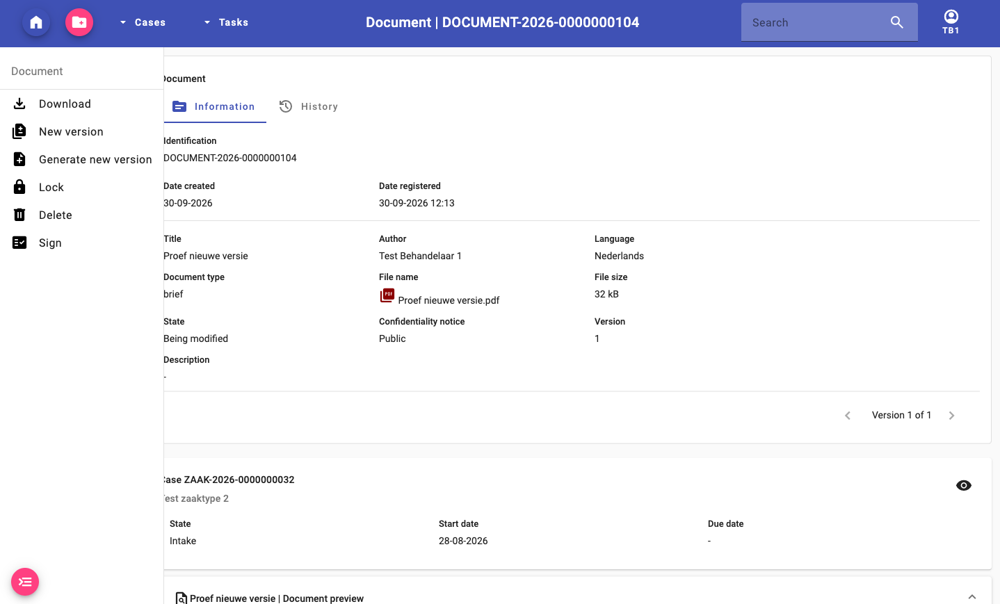
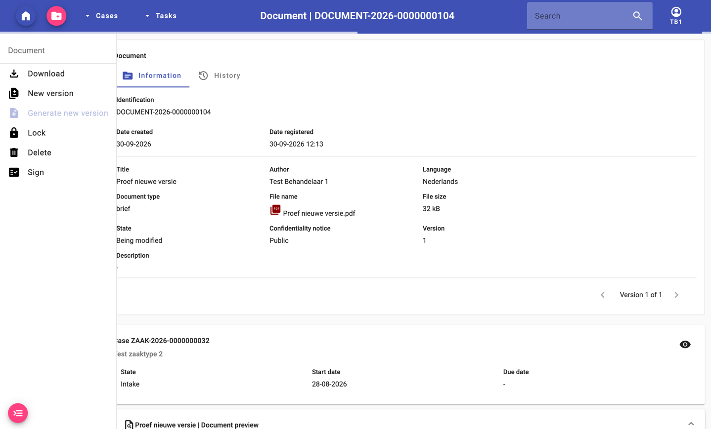
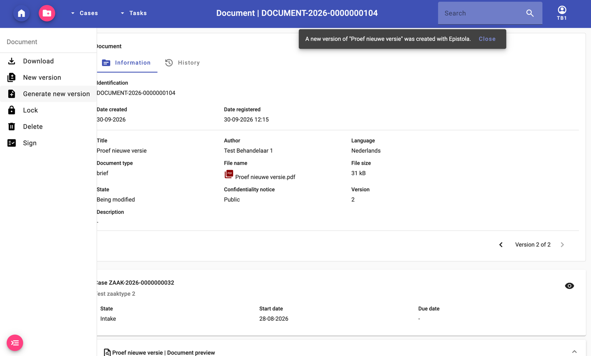
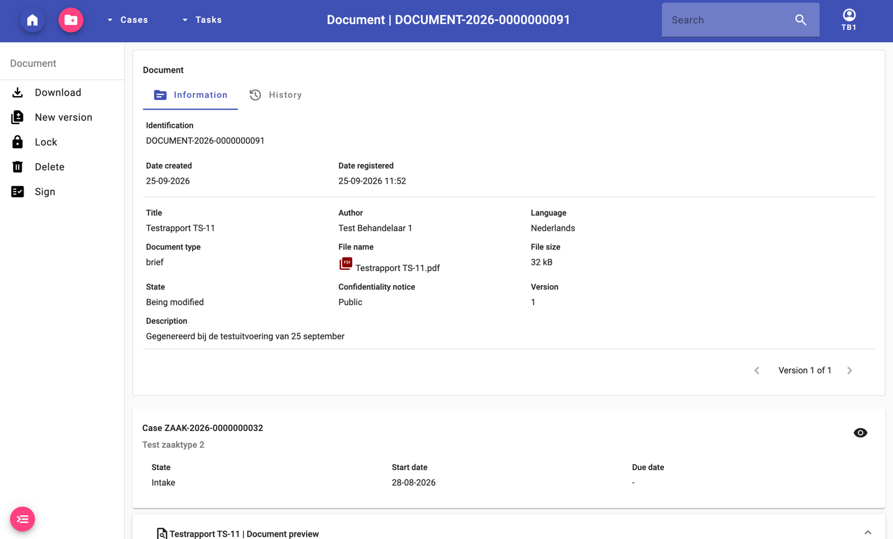
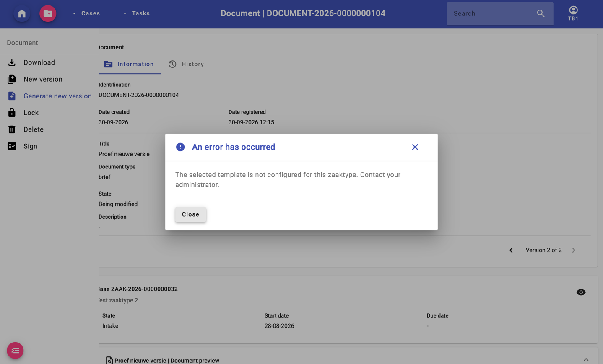
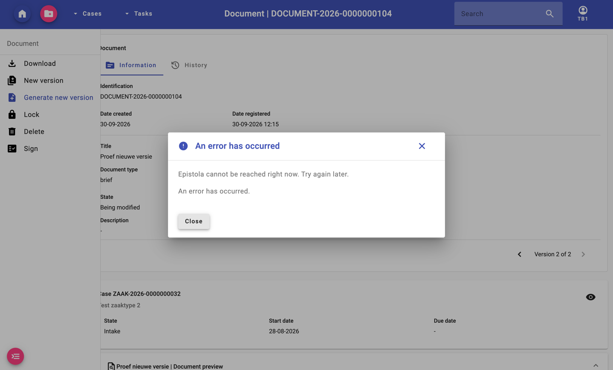
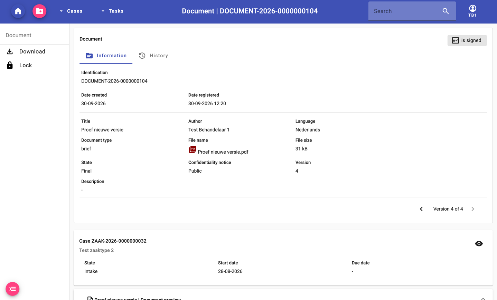

# Testrapport — Epistola-integratie in ZAC

| | |
|---|---|
| Opdracht | Opdracht 3 – B1-K1-W4 Test software |
| Issue | [#19](https://github.com/infonl/zac-epistola-prototype/issues/19) · uitgevoerd volgens [het testplan](testplan.md) v1.2, en v1.3 voor ronde 3 (#18); in v1.4 is de gebruikerstest vervallen, met de stappen uit [de testscenario's](testscenarios.md) |
| Projectnaam | Epistola-integratie in ZAC (zaakafhandelcomponent) |
| Student | Symon Vleeshouwers (198462) |
| Klas | ZWSD24 |
| Datum | 25 september 2026 (ronde 1) en 30 september 2026 (ronde 2 en 3), bijgewerkt op 1 oktober 2026 |

> **Beoordelingscriterium – T3 Testrapport:** testresultaten van alle functionaliteiten, met juiste
> conclusies. Elke functionaliteit uit §3 van het testplan staat in [§2](#2-testresultaten-per-functionaliteit),
> elke testcase met zijn bewijs in [bijlage A](#bijlage-a--testuitvoering-per-testcase).

## 1. Samenvatting

| | |
|---|---|
| Projectnaam | Epistola-integratie in ZAC |
| Geteste versie | **Ronde 1:** `6a91d8da2` op branch `feat/epistola-document-dialog` ([PR #29](https://github.com/infonl/zac-epistola-prototype/pull/29)), met daaronder #27, #25 en #24. ZAC-image `0290677afd13`, gebouwd van die commit. **Ronde 2:** `main` van de fork op `c4dbdcca1`, waarin alle pull requests #24 t/m #34 zijn gemerged. ZAC-image `814c2e22a459`, gebouwd door `./gradlew itest` van die commit |
| Testperiode | 25 september 2026 (ronde 1, het hele plan) en 30 september 2026 (ronde 2, de testcases die op #7 en #8 wachtten, met een controle van de rest na #30) |
| Geteste functionaliteiten | 10 — de acht gebieden uit de examenafspraken en de twee randvoorwaarden uit de DoD |
| Aantal testcases uitgevoerd | 36 van de 36, verdeeld over testscenario 1 t/m 10 (TS-09 is bij de uitvoering gesplitst in TS-09a en TS-09b). TS-35 was in ronde 1 niet uitvoerbaar en is in ronde 2 uitgevoerd |
| Totaal geslaagd | 36 van de 36 (100 %). In ronde 1 waren dat 32 van de 35 (91 %). Daarnaast slagen de 8 testcases voor het optionele #9 (ronde 3, hieronder apart) |
| Totaal mislukt | 0. In ronde 1 mislukten TS-06, TS-31 en TS-32. Alle drie slaagden in ronde 2, en TS-35 slaagde bij de eerste uitvoering |
| Gevonden bugs | 8 bugs, alle opgelost. B-01 t/m B-03 zijn opgelost door #7, #8 en #30 en in ronde 2 nagegaan. B-08, een kleine opmerking over een algemene regel in het foutvenster, is na ronde 2 opgelost in #55 |
| Geautomatiseerde tests | Ronde 2, op `c4dbdcca1`: 2729 backend-unittests, 2980 frontend-unittests (257 suites), 386 integratietests en de live-check (7 van 7 controles). Alle geslaagd |
| Ronde 3 (#9) | Op 30 september, op de branch `feat/epistola-new-document-version` ([PR #43](https://github.com/infonl/zac-epistola-prototype/pull/43)): de 8 testcases TS-36 t/m TS-43 voor het optionele DoD-item 11, *een nieuwe versie van een Epistola-document*. Ze staan in testplan 1.3, dat de stakeholders niet hebben goedgekeurd, en tellen daarom niet mee in de 36 |
| Na ronde 2 | Op 30 september gaat ZAC's Epistola-client van 1.3.1 naar 1.4.0 ([PR #42](https://github.com/infonl/zac-epistola-prototype/pull/42)). De unittests, de integratietests en de live-check zijn daarop herhaald en geslaagd (Bijlage B). De 36 testcases zijn niet opnieuw doorlopen, want de operaties die ZAC aanroept zijn in beide versies gelijk |

## 2. Testresultaten per functionaliteit

Het nummer in de eerste kolom is het nummer van het testscenario in [de testscenario's](testscenarios.md).

| # | Functionaliteit | Testcases | Uitkomst | Bugs gevonden | Conclusie |
|---|---|---|---|---|---|
| 1 | Configuratie: providerkeuze en instellingen (#2) | TS-01, TS-02 | ✅ Geslaagd | Nee | ZAC start met Epistola en weigert een onjuiste configuratie |
| 2 | Configuratie: templategroepen en templates per zaaktype (#3) | TS-03, TS-04, TS-05, TS-07 | ✅ Geslaagd | Nee | De beheerder richt groepen in, en een ongeldige mapping wordt geweigerd. Epistola uitzetten haalt de actie weg en bewaart de mapping |
| 3 | Autorisatie (#11) | TS-08, TS-09a, TS-09b, TS-10 | ✅ Geslaagd | Nee | Alleen wie `creeren_document` heeft en de zaak mag lezen, kan een document maken. Het endpoint dwingt dat af met 403 |
| 4 | Documentcreatie (#5) | TS-11 t/m TS-16 | ✅ Geslaagd | Ja, B-04 (opgelost) | Genereren werkt vanuit de zaak, alleen als PDF, met voortgang, in 3 tot 10 seconden |
| 5 | Datamapping (#4) | TS-17 t/m TS-21 | ✅ Geslaagd | Ja, B-05 (opgelost) | Het document toont de zaakgegevens, en alleen gedeclareerde velden verlaten ZAC. Datums gaan als ISO en worden als `dd-MM-yyyy` getoond |
| 6 | Open Zaak-opslag (#6) | TS-23 t/m TS-26 | ✅ Geslaagd | Nee | Opgeslagen als PDF met alle verplichte velden. Vertrouwelijkheid uit het documenttype, en de kopie bij Epistola is weg |
| 7 | Zaakkoppeling (#6) | TS-27, TS-28 | ✅ Geslaagd | Nee | Het document staat direct in het tabblad Documenten van de zaak |
| 8 | Preview (#6) | TS-29, TS-30 | ✅ Geslaagd | Nee | De PDF opent in de browser, met alle metadata |
| 9 | Foutafhandeling (#8) | TS-31 t/m TS-35 | ✅ Geslaagd in ronde 2 (ronde 1: ❌ 2 van de 4 uitgevoerde testcases) | Ja: B-02 en B-03 (opgelost, ronde 2), B-06 (opgelost), B-08 (laag, opgelost na ronde 2 in #55) | Elke fout geeft een melding die zegt wat er mis is en of opnieuw proberen helpt. Er gaat niets verloren en er blijft niets half achter |
| 10 | Randvoorwaarden: SmartDocuments ongewijzigd, alleen CMMN (DoD 1 en 2) | TS-22, TS-06 | ✅ Geslaagd in ronde 2 (ronde 1: ❌ TS-06) | Ja: B-01 (opgelost, ronde 2) | SmartDocuments werkt ongewijzigd. Bij een BPMN-zaak staat *Create document* uitgeschakeld, met een uitleg |
| 11 | Nieuwe versie van een Epistola-document (DoD 11, optioneel, #9) | TS-36 t/m TS-43 | ✅ Geslaagd (ronde 3) | Nee | De actie verschijnt bij een document dat Epistola maakte, genereert de volgende versie met de zaakgegevens van dat moment, en laat de eerdere versies en de huidige versie ongemoeid bij een fout |

## 3. Conclusies per functionaliteit

### Functionaliteit 1 – Configuratie: providerkeuze en instellingen

ZAC start met `DOCUMENT_CREATION_PROVIDER=EPISTOLA` en zegt dat in het log (TS-01). Een tegenstrijdige of
onvolledige configuratie laat ZAC niet starten, met een melding die de instelling noemt. Voorbeelden zijn
SmartDocuments en Epistola tegelijk, een ontbrekende API key, of een tenant- of catalogus-id die Epistola niet
accepteert (TS-02, twintig geautomatiseerde tests). Werkt correct.

### Functionaliteit 2 – Configuratie: templategroepen en templates per zaaktype

De beheerder voegde een tweede template aan een groep toe, sloeg op en zag het na het herladen terug, met zijn
eigen documenttype (TS-03). Een tweede groep met dezelfde naam gaf direct de melding *A template group with
this name already exists*, en *Save* bleef uitgeschakeld (TS-04). Met Epistola uit bij een zaaktype verdween
*Create document* van de zaak, en weigerde het endpoint met 400. Na het weer aanzetten kwam de oude mapping
terug (TS-05). De mapping gaat mee naar een nieuwe zaaktypeversie (TS-07, geautomatiseerd). Werkt correct.

### Functionaliteit 3 – Autorisatie

De behandelaar ziet de actie en kan genereren (TS-08). Twee negatieve gevallen zijn met de hand bevestigd:
- een gebruiker die de zaak niet mag lezen, krijgt 403 op het endpoint (TS-09a);
- een raadpleger ziet de zaak zonder één actie, en krijgt 403 als hij het verzoek toch stuurt (TS-09b).

In beide gevallen kwam er geen document bij. De taakrechten zijn geautomatiseerd getest (TS-10). De controle
zit aan de serverkant en gebeurt voordat er iets naar Epistola gaat. Werkt correct.

### Functionaliteit 4 – Documentcreatie

De behandelaar genereert vanuit de zaak een PDF, en de melding *Document "Testrapport TS-11" has been added to
the case* verschijnt (TS-11). De dialoog biedt alleen PDF, vraagt geen datum en zet de ingelogde gebruiker vast
als auteur (TS-12). Tijdens het genereren draait een spinner, zijn beide knoppen uitgeschakeld en staat er dat
het even kan duren (TS-13). Zonder titel kan er niet gegenereerd worden (TS-14). Een template dat het zaaktype
niet aanbiedt, wordt geweigerd (TS-15). Het genereren duurde 5,8 en 8,9 seconden, ruim binnen de timeout van 60
seconden (TS-16). Tijdens de voorbereiding bleek het Engelse label *format* niet met een hoofdletter te
beginnen. Dat is opgelost (B-04), en TS-12 heeft het nagegaan. Werkt correct.

### Functionaliteit 5 – Datamapping

De gerenderde brief toont zaaknummer, zaaktype, status, groep, communicatiekanaal en de naam van de initiator
uit de BRP. Datums staan er als `28-08-2026` en `27-09-2026` (TS-17). Gegevens die de zaak niet heeft, zoals de
behandelaar, blijven leeg, zonder "null" en zonder fout (TS-20). De live-check bevestigt twee dingen rechtstreeks
bij Epistola. Van tien geplante, niet-gedeclareerde waarden haalde er geen enkele de payload of de PDF (TS-18).
En een datum gaat als `2026-09-01` naar een contract met `format: date`, en verschijnt als `01-09-2026` (TS-19).
Die datumvorm was een bug uit de review van #24 (B-05): Epistola's editor had elke brief met een datum laten
mislukken. De SmartDocuments-deposit houdt `dd-MM-yyyy` (TS-22). Werkt correct.

### Functionaliteit 6 – Open Zaak-opslag

Het document staat in de Documenten API met `formaat` `application/pdf`, bestandsnaam `Testrapport
TS-11.pdf`, grootte, status *in bewerking*, taal, auteur en versie 1 (TS-23). De vertrouwelijkheid volgt het
documenttype: *zaakvertrouwelijk* bij *e-mail*, *openbaar* bij *brief* (TS-24). Het vaste *openbaar* van de
SmartDocuments-flow geldt hier dus niet. Na het opslaan heeft Epistola geen document meer voor de zaak (TS-25).
Mislukt het opslaan, dan meldt ZAC dat het document is gemaakt maar niet is opgeslagen, en verwijdert het de kopie bij Epistola (TS-26, geautomatiseerd, en live in ronde 2 via TS-35). Werkt correct.

### Functionaliteit 7 – Zaakkoppeling

Het document stond direct na het genereren in het tabblad Documenten, zonder de pagina te verversen. De
documentpagina noemt de zaak (TS-27). De koppeling aan een taak is alleen geautomatiseerd getest (TS-28),
omdat de dialoog nog niet vanuit een taak te openen is. Werkt correct, met die beperking.

### Functionaliteit 8 – Preview

Een klik op de titel opent de PDF in de browser (TS-29). De documentpagina toont alle metadata en de preview
(TS-30). Werkt correct.

### Functionaliteit 9 – Foutafhandeling

In elk foutgeval gaat er niets verloren en blijft er niets half achter: geen document in Open Zaak, geen
halve koppeling, en het genereerscherm blijft open. In ronde 1 zei de melding nergens wat er mis was. Na #8 en
#30 doet ze dat, en ronde 2 heeft het nagegaan:

- **Epistola onbereikbaar (TS-31):** genereren geeft binnen een seconde *Epistola cannot be reached right now.
  Try again later.* (HTTP 500, `msg.error.epistola.unavailable`). Het genereerscherm en de beheerkaart blijven de
  templates bij naam tonen, uit de lijst die ZAC het laatst van Epistola kreeg (#30). Zodra Epistola weer
  bereikbaar is, genereert ZAC weer: in ronde 2 meteen, bij TS-40 in ronde 3 pas na ongeveer een halve minuut, omdat
  Java het adres zolang bewaart.
- **Data die het contract van het template breekt (TS-32):** de melding zegt dat het template gegevens vraagt die
  de zaak niet heeft, dat opnieuw proberen niet helpt, en toont Epistola's reden (`required property 'aanvrager'
  not found`). De reden staat niet in het log.
- **Timeout (TS-33, geautomatiseerd):** ZAC annuleert de job en meldt of hij in de wachtrij stond of aan het
  renderen was.
- **Verdwenen template (TS-34):** een template dat bij Epistola verdwijnt, wordt niet meer aangeboden, ook niet uit
  het geheugen van #30. De mapping-rij blijft bewaard.
- **Gedeeltelijke mislukking (TS-35):** Open Zaak nam het bestand aan en weigerde de koppeling aan de zaak. ZAC
  verwijderde het bestand weer, meldde *The document was created, but storing it in Open Zaak failed. Nothing was
  added to the case*, en verwijderde ook de kopie bij Epistola.

Eén kleine opmerking (B-08): onder de melding bij een onbereikbaar Epistola stond in ZAC's foutvenster nog een
algemene regel, *An error has occurred.* Het antwoord droeg dan geen detail, en `fout-afhandeling.service.ts`
viel terug op die regel. De melding erboven was juist en er ging niets verloren. *Opgelost op 5 oktober in #55: het venster herhaalt zijn titel niet meer.*

### Functionaliteit 10 – Randvoorwaarden

SmartDocuments blijft werken. De deposit is ongewijzigd, en de SmartDocuments-integratietests slagen (TS-22,
DoD 1). Een BPMN-zaaktype heeft geen Epistola-kaart, en het endpoint weigert een BPMN-zaak met
`msg.error.epistola.cmmn-only` (TS-06). In ronde 1 zei een BPMN-zaak nergens dat documenten maken daar niet kan
(B-01). Sinds #7 staat *Create document* er uitgeschakeld, met een uitleg die met de muis en met het toetsenbord
te bereiken is, dus DoD 2 is ook in de UI gehaald.

### Functionaliteit 11 – Nieuwe versie van een Epistola-document (optioneel, #9)

Dit onderdeel staat in testplan 1.3 en is niet door de stakeholders goedgekeurd. Het is het optionele DoD-item 11. Op de
pagina van een document dat Epistola maakte staat de actie *Generate new version*. Ze genereert het document opnieuw uit
hetzelfde template, met de zaakgegevens zoals ze dan zijn, en slaat het op als de volgende versie van hetzelfde
informatieobject (TS-36, TS-37). Na het wijzigen van de beschrijving van de zaak stond die nieuwe beschrijving in de
regel *Betreft* van versie 2, terwijl versie 1 nog de oude had. Epistola bewaarde daarna niets meer van de zaak.

Elke weigering liet de huidige versie ongemoeid. Een document van vóór de migratie heeft geen herkomst en dus geen
actie, en het verzoek geeft 400 (TS-38). Een template dat het zaaktype niet meer aanbiedt, geeft 400 zonder dat er iets
naar Epistola gaat (TS-39). Is Epistola onbereikbaar, dan zegt de melding dat, en de versie blijft staan (TS-40).
Een ondertekend document is *Definitief*: dan verdwijnt de actie, en het verzoek geeft 403 (TS-41). TS-42 en TS-43 zijn
alleen met unittests gedekt: het weigeren van Open Zaak, en een document zonder zaak.

Twee dingen zijn opgevallen die geen bug van de integratie zijn. Na het herstellen van de verbinding naar Epistola
slaagde de actie pas na ongeveer een halve minuut, omdat Java het adres zolang bewaart, en het testplan zegt dat nu. En
onder de melding van TS-40 staat dezelfde algemene regel *An error has occurred.* als bij B-08.

## 4. Gevonden bugs en status

| Bug # | Testcase | Beschrijving | Ernst | Opgelost? | Toelichting |
|---|---|---|---|---|---|
| B-01 | TS-06 | Een BPMN-zaak toont nergens dat documenten maken met Epistola alleen voor CMMN-zaken kan. De actie ontbreekt zonder uitleg | Midden | Ja | Opgelost in #7 ([PR #33](https://github.com/infonl/zac-epistola-prototype/pull/33), `36ebb0251`): de actie staat uitgeschakeld met een uitleg, en het endpoint weigert met `msg.error.epistola.cmmn-only`. Nagegaan in TS-06, ronde 2 |
| B-02 | TS-31 | Als Epistola onbereikbaar is, blijft de lijst met templategroepen leeg zonder melding. Het mapping-endpoint en het genereer-endpoint geven een algemene 500 | Hoog | Ja | Opgelost in #8 ([PR #32](https://github.com/infonl/zac-epistola-prototype/pull/32), `2fd9595f1`) en #30 ([PR #34](https://github.com/infonl/zac-epistola-prototype/pull/34), `c4dbdcca1`): een onbereikbaar Epistola geeft een melding die dat zegt, en het genereerscherm en de beheerkaart houden de templatenamen. Nagegaan in TS-31, ronde 2 |
| B-03 | TS-32 | Data die het contract van het template breekt, geeft de algemene melding *probeer het opnieuw*, terwijl opnieuw proberen niet helpt. De reden staat alleen in het log | Midden | Ja | Opgelost in #8 (PR #32): de melding zegt dat opnieuw proberen niet helpt en toont Epistola's reden. Nagegaan in TS-32, ronde 2. De reden is Epistola's eigen tekst; `missingFields` per veld uit een volgende contractrelease zou hem nauwkeuriger kunnen maken |
| B-04 | TS-12 | Het Engelse label van het formaatveld was *format* met een kleine letter, tussen labels die met een hoofdletter beginnen | Laag | Ja | Gevonden bij de eind-tot-eindproef van 25 september. Opgelost in `6a91d8da2` (*File format*), en nagegaan in TS-12 |
| B-05 | TS-19 | Datums gingen als `dd-MM-yyyy` naar Epistola. Een template dat Epistola's editor maakt (`format: date`, draft-07) liet elke job daardoor mislukken | Hoog | Ja | Gevonden bij de review van #24 en bevestigd met een proef op de testserver. Opgelost in `a56fc2401`, nagegaan in TS-19 |
| B-06 | TS-33 | Bij een timeout bleef de job bij Epistola lopen, en de melding zei "controleer later" terwijl niets het document later toevoegt. Een fout tijdens het pollen annuleerde de job ook niet | Midden | Ja | Gevonden bij de review van #24 en de tweede Copilot-review. Opgelost in `0d3aa6ca7` en `b440d8f53`, nagegaan met unittests (TS-33) |
| B-07 | TS-05 | Een template dat het zaaktype aanbood, werd niet geweigerd terwijl de beheerder Epistola voor het zaaktype had uitgezet. De controle uit #27 keek alleen naar de mapping | Midden | Ja | Gevonden bij de bouw van #5. Opgelost in `ce1c8d806`, nagegaan in TS-05 |
| B-08 | TS-31 | Bij een onbereikbaar Epistola toont ZAC's foutvenster onder de melding nog een algemene regel, *An error has occurred.* Het antwoord draagt geen `exception`-detail, en `fout-afhandeling.service.ts` valt dan terug op die regel | Laag | Ja, na ronde 2 | Gevonden in ronde 2. Geen gevolgen voor de gegevens, en de melding erboven is juist. Opgelost op 5 oktober in #55 ([PR #55](https://github.com/infonl/zac-epistola-prototype/pull/55), `da303e035`, in het gedeelde `FoutAfhandelingService`): het venster herhaalt zijn eigen titel niet meer. Live nagegaan met een geblokkeerd Epistola, niet als testcase herhaald |

**Aantekening bij TS-31 en B-08.** Volgens [het testplan](testplan.md) (§5.1 en §5.2) slaagt een test alleen zonder onverwachte foutmelding in het
scherm. TS-31 is als **geslaagd** beoordeeld, en dat is een oordeel dat hier uitdrukkelijk staat. Het verwachte resultaat is volledig bereikt: een
begrijpelijke melding die zegt dat Epistola niet bereikbaar is, een genereerscherm dat open blijft, niets dat is opgeslagen, en de templates die bij naam
zichtbaar blijven. De algemene regel *An error has occurred.* onder die melding komt uit ZAC's gedeelde foutvenster (`fout-afhandeling.service.ts`), dat
hem toont bij elk antwoord zonder detailtekst. Hij is dus geen aparte foutmelding van de Epistola-integratie. Hij is wel vastgelegd als B-08 (laag, sindsdien opgelost in #55).
Wie het plan strenger leest, telt TS-31 als mislukt. Dan zijn 35 van de 36 testcases geslaagd, en blijft de rest van de uitkomsten gelijk.

### Bekende beperkingen

Deze staan niet als bug in de lijst, omdat ze bewust buiten de scope van het prototype vallen of buiten ZAC
liggen:

- **Document maken vanuit een taak:** de dialoog is alleen vanuit de zaak te openen. Het endpoint ondersteunt
  een taak wel (TS-28).
- **De integratietests draaien met SmartDocuments.** Ze kunnen de Epistola-endpoints niet aanroepen. Die zijn
  getest met unittests, de live-check en de handmatige testcases.
- **Epistola's testtenant wordt dagelijks gereset.** Een template dat verdwijnt, handelt ZAC netjes af (TS-34),
  maar vóór elke demo moeten de testtemplates opnieuw worden aangemaakt. Dat was op 30 september weer nodig.
- **De templatenamen uit het geheugen (#30)** gaan verloren bij een herstart van ZAC. Is Epistola dan nog
  onbereikbaar, dan geldt de melding uit #8 zoals voorheen. Voor een nieuw template is Epistola altijd nodig, en
  opslaan controleert altijd de live lijst.
- **Buiten ZAC**, vastgelegd in het ontwerp (§3 en §5): Epistola's `validate` toetst tegen een conceptcontract,
  de allow-list kan een nieuwer contract volgen dan de gerenderde templateversie, en Epistola's bewaartermijn is
  drie tot vier maanden in plaats van de genoemde dertig dagen.

## 5. Eindconclusie

Het prototype voldoet aan de acceptatiecriteria. Ronde 1 (25 september) liet de hoofdstroom slagen: van de
configuratie door de beheerder, via de autorisatie, het genereren en de datamapping, tot de opslag in Open Zaak,
de koppeling aan de zaak en de preview. Drie testcases mislukten, omdat de meldingen voor de gebruiker (#8) en de
melding voor BPMN-zaken (#7) nog niet gebouwd waren.

Die zijn daarna gebouwd en gemerged. Ronde 2 (30 september) heeft de testcases die erop wachtten opnieuw
uitgevoerd op de gemergede versie: TS-06, TS-31 en TS-32 slagen nu, en TS-35 slaagt bij de eerste uitvoering.
Daarmee zijn alle 36 testcases uitgevoerd en geslaagd. De geautomatiseerde tests zijn op die versie allemaal
groen: 2729 backend-, 2980 frontend- en 386 integratietests, en de live-check (7 van 7 controles).
SmartDocuments werkt ongewijzigd, dus de eerste randvoorwaarde uit de DoD is gehaald. Epistola is beperkt tot
CMMN-zaken, met een uitleg in de UI, dus de tweede ook.

Het optionele DoD-item 11, een nieuwe versie van een Epistola-document (#9), is in ronde 3 getest met acht
testcases (TS-36 t/m TS-43), die alle slagen. Dat blok staat in testplan 1.3, dat de stakeholders nog niet hebben
goedgekeurd, en telt daarom niet mee in de 36.

Zeven van de acht gevonden bugs waren bij ronde 2 opgelost en nagegaan. B-08, een algemene regel in het foutvenster zonder
gevolgen voor de gegevens, is daarna opgelost in #55 (5 oktober) en live nagegaan.

De stakeholders hebben versie 1.1 van het testplan op 28 september goedgekeurd (B14). Het prototype is daarmee
klaar voor oplevering aan de opdrachtgever. De gebruikerstest uit het plan is vervallen (testplan 1.4): Team Geneva
heeft er naast het werk aan ZAC geen ruimte voor. Alle testcases zijn dus uitgevoerd door de ontwikkelaar, en niet
door een eindgebruiker. Op de einddemo van 12 oktober wordt het prototype gedemonstreerd, met hoe je het gebruikt,
en moet de acceptatietest met de stakeholders de oplevering bevestigen.

## 6. Aanbevelingen

- **Neem een Epistola-stand-in op in de integratietests** ([#38](https://github.com/infonl/zac-epistola-prototype/issues/38)).
  De WireMock-mappings uit `-W` bestaan al, en ermee worden het endpoint en de dialoog ook in de pipeline getest,
  niet alleen met de hand. Zonder stand-in kunnen de integratietests de Epistola-endpoints niet aanroepen.
- **Test met meerdere gelijktijdige gebruikers** ([#37](https://github.com/infonl/zac-epistola-prototype/issues/37)).
  Het verzoek wacht op Epistola en houdt zolang een thread vast. Bij één behandelaar is dat 3 tot 10 seconden, maar
  niemand heeft het onder belasting gemeten.
- **Test in meer browsers dan Chrome, en laat eindgebruikers het testen.** Alle testcases zijn door de ontwikkelaar
  uitgevoerd, in Chrome met Engelse schermtekst. De Nederlandse schermen zijn op 1 oktober in een Nederlandstalige Chrome
  doorlopen, maar niet als testcases en niet in andere browsers. De gebruikerstest is vervallen (testplan 1.4). Een behandelaar en een beheerder die het prototype zelf gebruiken, zien
  wat een ontwikkelaar mist, zoals een onduidelijke tekst of een stap die ze niet vinden.

## 7. Zelfbeoordeling rubric

*In te vullen door de kandidaat.* Vul voor jezelf in hoe je denkt te scoren (0 = niet/nauwelijks,
3 = volledig).

| Criterium | 0 | 1 | 2 | 3 (volledig) |
|---|---|---|---|---|
| T1 Testplan – testcases sluiten aan op alle functionaliteiten | ☐ | ☐ | ☐ | ☐ |
| T1 Testscenario – voor alle functionaliteiten gemaakt | ☐ | ☐ | ☐ | ☐ |
| T2 Testen – correct uitgevoerd volgens testplan | ☐ | ☐ | ☐ | ☐ |
| T3 Testrapport – resultaten en conclusies volledig | ☐ | ☐ | ☐ | ☐ |

**Toelichting op de zelfbeoordeling:** *in te vullen door de kandidaat.*

---

## Bijlage A — Testuitvoering per testcase

Dit is ronde 1, uitgevoerd in de ochtend van 25 september 2026. De testcases die daarna opnieuw zijn uitgevoerd, staan in
[ronde 2](#ronde-2--30-september-2026). De stack is gestart met `./start-docker-compose.sh -l
-E`, met de ZAC-image van de geteste versie, in Google Chrome 153.0.8010.53, bestuurd door Playwright. Beide
testtemplates waren die ochtend opnieuw aangemaakt. Bij *Handmatig* staat het werkelijke resultaat en het
bewijs. Bij *Automatisch* staan de tests uit de testrun van [bijlage B](#bijlage-b--geautomatiseerde-tests).

| # | Gebruiker | Werkelijk resultaat | Uitkomst | Bewijs |
|---|---|---|---|---|
| TS-01 | — | Log: `Active document creation provider: 'EPISTOLA' (DOCUMENT_CREATION_PROVIDER='EPISTOLA', SMARTDOCUMENTS_ENABLED='false')`. WildFly gestart, 0 regels met `ERROR` | ✅ | ZAC-log; `DocumentCreationProviderConfigurationTest` (20 tests) |
| TS-02 | — | Tegenstrijdige providers, een ontbrekende API key, en een tenant- of catalogus-id die geen slug is (te kort, met spaties, verkeerd patroon): alle geweigerd bij het opstarten, met de naam van de instelling in de melding | ✅ | `DocumentCreationProviderConfigurationTest` |
| TS-03 | beheerder1 | *ZAC Verplichte aanvrager* toegevoegd aan *Brieven* met documenttype *bijlage*. Opslaan gaf `PUT /rest/zaakafhandelparameters` 200 en `POST …/epistola-templates-mapping` 204. Na het herladen stonden beide templates in de groep. In de dialoog (TS-24) bood *Brieven* daarna beide aan | ✅ | [voor](testrapport/ts-03-voor.png) · [na opslaan en herladen](testrapport/ts-03-na-opslaan.png) |
| TS-04 | beheerder1 | Tweede groep *Brieven*: melding *A template group with this name already exists*, *Save* uitgeschakeld. De groep weggehaald, niets opgeslagen | ✅ | [screenshot](testrapport/ts-04-dubbele-groepsnaam.png); `RestEpistolaTemplateMappingValidatorTest` |
| TS-05 | beheerder1 | Epistola uit bij *Test zaaktype 2*: kaart meldt *switched off*, database `epistola_ingeschakeld = f`, groep bewaard. ZAAK-2026-0000000032 zonder *Create document*, direct verzoek 400 `msg.error.epistola.template.not-configured`. Weer aan: oude mapping terug, *Create document* terug | ✅ | [Epistola uit](testrapport/ts-05-epistola-uit-geen-actie.png) · [weer aan](testrapport/ts-05-epistola-weer-aan.png) |
| TS-06 | beheerder1 | *BPMN test zaaktype 1* heeft geen Epistola-kaart. ZAAK-2026-0000000035 heeft geen *Create document* en het endpoint weigert (400). Maar nergens staat dat documenten maken voor BPMN-zaken niet kan | ❌ ronde 1 (B-01) → ✅ ronde 2 | [beheer](testrapport/ts-06-bpmn-geen-epistola-kaart.png) · [BPMN-zaak](testrapport/ts-06-bpmn-zaak-geen-melding.png) · ronde 2: zie [bijlage A, ronde 2](#ronde-2--30-september-2026) |
| TS-07 | — | De mapping gaat mee naar een nieuwe zaaktypeversie, ook zonder Epistola | ✅ | `ZaaktypeCmmnConfigurationBeheerServiceTest` (19 tests), `EpistolaTemplatesServiceTest` |
| TS-08 | behandelaar1 | ZAAK-2026-0000000032 toont *Create document* | ✅ | [screenshot](testrapport/ts-08-behandelaar-ziet-document-maken.png) |
| TS-09a | behandelaar1 | ZAAK-2026-0000000001 is niet leesbaar voor deze gebruiker (403 op de zaak). Het verzoek naar het endpoint gaf 403 `msg.error.server.forbidden` | ✅ | Netwerkverzoek; `DocumentCreationRestServiceTest` |
| TS-09b | raadpleger1 | ZAAK-2026-0000000032 zichtbaar met documentenlijst, zonder één actie in het menu. Het verzoek gaf 403 `msg.error.server.forbidden`, en de zaak hield twee documenten | ✅ | [screenshot](testrapport/ts-09b-raadpleger-geen-document-maken.png); `zaak-view-menu.builder.spec.ts` |
| TS-10 | — | Geweigerd zonder taakrecht (403) en voor een taak die niet meer open is, telkens zonder aanroep van Epistola | ✅ | `DocumentCreationRestServiceTest` (17 tests) |
| TS-11 | behandelaar1 | Melding *Document "Testrapport TS-11" has been added to the case*. De dialoog sloot en er opende geen wizard | ✅ | [screenshot](testrapport/ts-27-documenten-tab.png); component spec |
| TS-12 | behandelaar1 | *File format* = *PDF*, niet te wijzigen. Geen creatiedatum. *Author* = *Test Behandelaar 1*, niet te wijzigen. Documenttype *brief* en vertrouwelijkheid *Public* uit de mapping | ✅ | [screenshot](testrapport/ts-12-ts-14-dialoog-zonder-titel.png) |
| TS-13 | behandelaar1 | 0,4 seconde na de klik: spinner op *Generate*, *Generate* en *Cancel* uitgeschakeld, tekst *The document is being generated. This can take a few seconds.* | ✅ | [screenshot](testrapport/ts-13-bezig-met-genereren.png) |
| TS-14 | behandelaar1 | Groep en template ingevuld, titel leeg: *Generate* uitgeschakeld | ✅ | [screenshot](testrapport/ts-12-ts-14-dialoog-zonder-titel.png) |
| TS-15 | behandelaar1 | `templateId` `niet-aangeboden`: 400 `msg.error.epistola.template.not-configured`. De zaak hield dezelfde twee documenten | ✅ | Netwerkverzoek; `EpistolaTemplatesServiceTest` |
| TS-16 | behandelaar1 | Genereren duurde 5,75 seconden (TS-11) en 8,9 seconden tot de melding (TS-13). De mislukte job van TS-32 kwam na 10,3 seconden terug. Timeout: 60 seconden | ✅ | Resource timing van het verzoek |
| TS-17 | behandelaar1 | De brief toont *Kenmerk: ZAAK-2026-0000000032*, *Datum: 28-08-2026*, *type Test zaaktype 2*, *status is Intake*, *Test group behandelaars domein test 1*, *via E-mail*, *Geachte Héndrika Janse*, *uiterlijk af op 27-09-2026* | ✅ | [preview](testrapport/ts-29-preview.png) |
| TS-18 | — | Live-check: *no planted undeclared value reaches the payload — 10 planted values checked*, *every field in the payload is declared by the template*, *the rendered PDF shows none of the planted undeclared values* | ✅ | Live-check (bijlage B); `EpistolaTemplateDataTest` (25 tests) |
| TS-19 | — | Live-check: *a date reaches Epistola in ISO 8601 — 2026-09-01*, en de PDF toont `01-09-2026` | ✅ | Live-check; `EpistolaTemplateDataTest` |
| TS-20 | behandelaar1 | *Uw zaak wordt behandeld door .* en *De geplande einddatum is .*: leeg, geen "null", geen fout | ✅ | [preview](testrapport/ts-29-preview.png); `DocumentCreationDataServiceTest` |
| TS-21 | — | Een template zonder schema wordt geweigerd, en `generateDocument` wordt niet aangeroepen | ✅ | `EpistolaDocumentCreationServiceTest` |
| TS-22 | — | De deposit houdt `"startdatum":"01-01-2026"`. De 386 integratietests slagen, waaronder de 14 SmartDocuments-documentcreatietests (`DocumentCreationRestServiceTest`) en de 6 SmartDocuments-configuratietests | ✅ | `EpistolaTemplateDataTest`; integratietests (bijlage B) |
| TS-23 | behandelaar1 | DOCUMENT-2026-0000000091: `formaat` `application/pdf`, `bestandsnaam` `Testrapport TS-11.pdf`, `bestandsomvang` 32.265, `status` `in_bewerking`, `taal` Nederlands, `auteur` Test Behandelaar 1, type *brief*, `creatiedatum` 2026-09-25, versie 1 | ✅ | [documentpagina](testrapport/ts-30-documentpagina.png); REST-antwoord |
| TS-24 | beheerder1 | DOCUMENT-2026-0000000093 op ZAAK-2026-0000000001, type *e-mail*: `vertrouwelijkheidaanduiding` `ZAAKVERTROUWELIJK`. Ter vergelijking TS-23, type *brief*: `OPENBAAR` | ✅ | [dialoog](testrapport/ts-24-dialoog-zaakvertrouwelijk.png) · [documentenlijst](testrapport/ts-24-documenten-zaakvertrouwelijk.png) |
| TS-25 | behandelaar1 | Bij Epistola: *documents still at Epistola for this zaak: count 0*. Het ZAC-log toont geen mislukte verwijdering | ✅ | `epistola_copy_check.py` |
| TS-26 | — | Opslaan mislukt: de fout komt bij de aanroeper, en `deleteDocument` wordt niet aangeroepen | ✅ | `EpistolaDocumentCreationServiceTest` |
| TS-27 | behandelaar1 | Direct na de melding stonden *Testrapport TS-11* en *Testrapport TS-13* in het tabblad Documenten (brief, 32 kB, Being modified, Public), zonder verversen | ✅ | [screenshot](testrapport/ts-27-documenten-tab.png) |
| TS-28 | — | Met een `taskId` wordt het document aan de zaak en aan de taak gekoppeld, met de taakpolicy | ✅ | `EpistolaDocumentCreationServiceTest`, `DocumentCreationRestServiceTest` |
| TS-29 | behandelaar1 | Een klik op de titel opende de PDF-viewer met *ZAC Standaardbrief*, 1 pagina, de gerenderde brief | ✅ | [screenshot](testrapport/ts-29-preview.png) |
| TS-30 | behandelaar1 | De documentpagina toont identificatie, datums, titel, auteur, taal, type, bestandsnaam, grootte, status, vertrouwelijkheid, versie, beschrijving, de zaak en de preview | ✅ | [screenshot](testrapport/ts-30-documentpagina.png) |
| TS-31 | behandelaar1 | Met `demo.epistola.app` op `127.0.0.1` gaf het log *Connection refused*. De templategroepen bleven leeg, zonder melding, want het mapping-endpoint gaf 500. Een direct verzoek gaf na 0,96 seconde 500 `msg.error.server.generic`, en er kwam geen document bij. Na het terugzetten van de hosts-regel bereikte ZAC Epistola meteen weer | ❌ ronde 1 (B-02) → ✅ ronde 2 | [screenshot](testrapport/ts-31-epistola-onbereikbaar.png); ZAC-log · ronde 2: zie [bijlage A, ronde 2](#ronde-2--30-september-2026) |
| TS-32 | beheerder1 | Na 10,3 seconden 500 `msg.error.epistola.generation.failed`, met de melding *The document could not be created. Try again or contact your administrator.* De dialoog bleef open en er kwam geen document bij. Het log: *Data validation failed: : required property 'aanvrager' not found* | ❌ ronde 1 (B-03) → ✅ ronde 2 | [screenshot](testrapport/ts-32-contract-gebroken.png); ZAC-log · ronde 2: zie [bijlage A, ronde 2](#ronde-2--30-september-2026) |
| TS-33 | — | Bij een timeout, en ook bij een 503 tijdens het pollen, annuleert ZAC de job. Een geweigerde annulering verandert de melding niet | ✅ | `EpistolaClientServiceTest` (23 tests) |
| TS-34 | beheerder1 | Na het verwijderen bij Epistola bood *Brieven* alleen nog *ZAC Standaardbrief* aan, zonder foutmelding. De mapping-rij voor `zac-verplichte-aanvrager` staat nog in de database | ✅ | [screenshot](testrapport/ts-34-template-verdwenen.png); `psql` |
| TS-35 | — | Ronde 1: niet uitgevoerd, omdat de afhandeling van een gedeeltelijke mislukking nog niet bestond (#8) | ⏸ ronde 1 → ✅ ronde 2 | ronde 2: zie [bijlage A, ronde 2](#ronde-2--30-september-2026) |

### Ronde 2 — 30 september 2026

Uitgevoerd in de ochtend van 30 september 2026 op `main` van de fork (`c4dbdcca1`). De stack is gestart met
`./start-docker-compose.sh -l -E` op ZAC-image `814c2e22a459`, die `./gradlew itest` van die commit had gebouwd. Epistola's
testtenant was gereset, dus beide testtemplates zijn eerst opnieuw aangemaakt. Google Chrome, bestuurd door Playwright,
ingelogd als `beheerder1` en `behandelaar1`. De Nederlandse teksten staan in `nl.json`; de browser draaide in het Engels, dus de
schermen tonen de Engelse teksten.

| # | Gebruiker | Werkelijk resultaat | Uitkomst | Bewijs |
|---|---|---|---|---|
| TS-06 | beheerder1 | ZAAK-2026-0000000035 (*BPMN test zaaktype 1*) toont *Create document* uitgeschakeld. De knop zit in een omhulling met `tabindex="0"`, en met de muis of het toetsenbord verschijnt de uitleg *For now, a document can only be created with Epistola for cases of a CMMN zaaktype, not for cases driven by a BPMN process*, ook als `aria-describedby`. Het endpoint weigert de zaak met 400 `msg.error.epistola.cmmn-only`. Alleen dit deel is opnieuw uitgevoerd: de beheerkaart van het BPMN-zaaktype is in ronde 2 niet opnieuw bekeken | ✅ (B-01 opgelost) | [BPMN-zaak met uitleg](testrapport/ts-06-ronde2-bpmn-zaak-uitleg.png); `EpistolaTemplatesServiceTest`, `zaak-view-menu.builder.spec.ts`, `side-nav.component.explained-item.spec.ts` |
| TS-11, TS-13 | behandelaar1 | ZAAK-2026-0000000032, *Brieven 2* met *ZAC Standaardbrief* (enige template, voorgeselecteerd), titel *Testrapport ronde 2 TS-11*. Genereren duurde 3,3 seconden (HTTP 200). De dialoog toonde *The document is being generated.* (0,1 s), daarna *The document is waiting in Epistola's queue.* (1,1 s), daarna de melding *Document "Testrapport ronde 2 TS-11" has been added to the case*. Als `beheerder1` op ZAAK-2026-0000000001 duurde een brief 3,4 seconden | ✅ | [wachtrij](testrapport/ts-13-ronde2-jobstatus-wachtrij.png) · [toegevoegd](testrapport/ts-11-ronde2-document-toegevoegd.png) |
| TS-26 | — | Geautomatiseerd: `EpistolaDocumentCreationServiceTest` (29 tests) controleert dat een mislukte opslag `EpistolaDocumentNotStoredException` geeft en dat `deleteDocument` precies één keer wordt aangeroepen. Live bevestigd via TS-35, die dezelfde uitzondering en hetzelfde opruimen doorloopt: bij Epistola stond daarna 0 documenten voor de zaak | ✅ | `EpistolaDocumentCreationServiceTest`; TS-35 |
| TS-31 | behandelaar1, en beheerder1 voor de beheerkaart | Na meer dan drie minuten zonder aanroep de regel `127.0.0.1 demo.epistola.app` in `/etc/hosts` van de ZAC-container gezet (07:28Z) en 35 seconden gewacht. De namen waren om 07:24:49Z uit de live lijst gelezen. (1) Het genereerscherm van ZAAK-2026-0000000032 (behandelaar1) bood *Brieven 2* met *ZAC Standaardbrief* aan (mapping-endpoint 200), en het ZAC-log zegt *Epistola cannot be reached; listing the templates by the names read at 2026-09-30T07:24:49Z*. (2) Genereren gaf na 0,85 seconde 500 `msg.error.epistola.unavailable`. Het foutvenster zegt *Epistola cannot be reached right now. Try again later.* (met daaronder de algemene regel van B-08), het genereerscherm bleef open, en er kwam geen document bij. (3) Als beheerder1 toonde de beheerkaart van *Test zaaktype 1* *Brieven* met *ZAC Standaardbrief* en *ZAC Verplichte aanvrager* en hun documenttype, en bood het genereerscherm op ZAAK-2026-0000000001 beide aan. Genereren gaf daar ook 500 `unavailable`, na 0,54 seconde. De lijst voor een nieuw template (`epistola-templates`) gaf 500, en het foutvenster meldde dat Epistola niet bereikbaar is. Opslaan is niet geprobeerd; dat controleert altijd de live lijst. (4) Na het terugzetten van `/etc/hosts` genereerde ZAC direct weer (TS-11, 3,3 s) | ✅ (B-02 opgelost) | [genereerscherm behandelaar1](testrapport/ts-31-ronde2-behandelaar-namen.png) · [melding](testrapport/ts-31-ronde2-behandelaar-onbereikbaar.png) · [beheerkaart](testrapport/ts-31-ronde2-beheerkaart-namen.png); ZAC-log |
| TS-32 | beheerder1 | ZAAK-2026-0000000001, *Brieven* met *ZAC Verplichte aanvrager*, titel *Hertest TS-32*. Na 7,0 seconden 500 `msg.error.epistola.template.data-rejected`. Het foutvenster zegt *The template asks for case data that this case does not have, or in a different form. Trying again will not help. Pass the message below on to your administrator.* en daaronder Epistola's reden *: required property 'aanvrager' not found*. Er kwam geen document bij (Open Zaak heeft er geen met die titel), en het ZAC-log bevat de reden niet: het noemt alleen het template en de zaak | ✅ (B-03 opgelost) | [screenshot](testrapport/ts-32-ronde2-contract-gebroken.png); ZAC-log |
| TS-33 | — | Geautomatiseerd, in de unittests van ronde 2: `EpistolaClientServiceTest` (35 tests) en `EpistolaDocumentGenerationTimeoutExceptionTest` (5). Bij een timeout annuleert ZAC de job en kiest de melding naar de status van de job: in de wachtrij, aan het renderen, of onbekend | ✅ | `EpistolaClientServiceTest`, `EpistolaDocumentGenerationTimeoutExceptionTest` |
| TS-34 | beheerder1 | *ZAC Verplichte aanvrager* bij Epistola verwijderd (HTTP 204). Het genereerscherm op ZAAK-2026-0000000001 bood *Brieven* daarna alleen *ZAC Standaardbrief* aan (het enige template, dus voorgeselecteerd), ook al had ZAC de naam van het verwijderde template in het geheugen. De mapping-rij staat nog in de database. Daarna het template opnieuw aangemaakt | ✅ | [screenshot](testrapport/ts-34-ronde2-template-verdwenen.png); `psql` |
| TS-35 | beheerder1 | Voorbereiding: in de database van ZAC tijdelijk het documenttype van *ZAC Standaardbrief* bij *Test zaaktype 1* gezet op het type *brief* `32e06e3a…`, dat in Open Zaak bij geen enkel zaaktype hoort, en daarna teruggezet. Genereren van *Hertest TS-35* op ZAAK-2026-0000000001 gaf na 3,7 seconden 500 `msg.error.epistola.document.not-stored`. Het foutvenster zegt *The document was created, but storing it in Open Zaak failed. Nothing was added to the case. Try again later.*, met Open Zaak's reden *Het informatieobjecttype hoort niet bij het zaaktype van de zaak.* Het log van Open Zaak toont de volgorde `POST …/enkelvoudiginformatieobjecten` 201, `POST …/zaakinformatieobjecten` 400, `DELETE …/enkelvoudiginformatieobjecten/…` 204. Daarna stonden er in Open Zaak 104 documenten en 99 zaakkoppelingen, zoals vóór de proef, geen document *Hertest TS-35*, en bij Epistola 0 documenten voor de zaak | ✅ | [screenshot](testrapport/ts-35-ronde2-opslag-mislukt.png); logs van Open Zaak en ZAC; `ZgwApiServiceTest` |

### Ronde 3 — 30 september 2026 (#9)

Uitgevoerd in de middag van 30 september op de branch `feat/epistola-new-document-version`, met de ZAC-image die
`./gradlew itest` van die commit bouwde (`d59ffa595488`). De stack liep met `./start-docker-compose.sh -l -E`, dus met
de echte testserver van Epistola, en migratie `V101` was toegepast. Google Chrome 153, bestuurd door Playwright,
ingelogd als `behandelaar1` op ZAAK-2026-0000000032 (*Test zaaktype 2*). Het gegenereerde document is
DOCUMENT-2026-0000000104.

| # | Gebruiker | Wat er is gedaan en gezien |
|---|---|---|
| TS-36 | behandelaar1 | Het document *Proef nieuwe versie* met *ZAC Standaardbrief* gegenereerd: HTTP 200. In de database staat één rij in `epistola_document` met het template `zac-standaardbrief`. Op de documentpagina staat *Generate new version* naast *New version*, bij *Version 1 of 1*.  |
| TS-37 | behandelaar1 | De beschrijving van de zaak gewijzigd in *Omschrijving gewijzigd voor nieuwe versie* (met een reden), daarna de actie gekozen: HTTP 200 na 3,6 seconden, de melding *A new version … was created with Epistola* en de pagina van versie 2. Tijdens het genereren staat de actie grijs (eerste screenshot). Versie 1 (32 265 bytes) heeft *Betreft: E2E-test-20260828T114509496Z*, versie 2 (32 159 bytes) *Betreft: Omschrijving gewijzigd voor nieuwe versie*. Nog steeds één rij in `epistola_document`. `epistola_copy_check.py` vond 0 documenten bij Epistola voor de zaak. De beschrijving is daarna teruggezet.   |
| TS-38 | behandelaar1 | Het document *Testrapport TS-11* (van 25 september, dus van vóór `V101`): `GET /rest/epistola-documents/{uuid}` geeft `isNewVersionAvailable: false`, `POST …/versions` geeft 400 `msg.error.epistola.document.no-new-version`, en het menu heeft alleen *New version*.  |
| TS-39 | behandelaar1 | De `epistola_id` van het template van *Test zaaktype 2* tijdelijk gewijzigd en de actie gekozen: 400 `msg.error.epistola.template.not-configured` en de melding *The selected template is not configured for this zaaktype*. Het document bleef op versie 2 (*Version 2 of 2*). Dat er niets naar Epistola gaat, volgt uit de volgorde in de code (het template wordt gecontroleerd vóór het genereren) en is met `EpistolaDocumentVersionServiceTest` getest. De waarde is teruggezet.  |
| TS-40 | behandelaar1 | Ongeveer drie minuten na de laatste aanroep `demo.epistola.app` in `/etc/hosts` van de ZAC-container op `127.0.0.1` gezet, 35 seconden gewacht en de actie gekozen: 500 `msg.error.epistola.unavailable` na 0,4 seconden, de melding *Epistola cannot be reached right now. Try again later.* (met de algemene regel van B-08) en het document bleef op versie 2. Het log noemt het template en de zaak. Na het terugzetten van `/etc/hosts` faalde een direct nieuwe poging nog (het adres stond nog in Java's cache), en na 30 seconden extra slaagde hij: versie 3.  |
| TS-41 | behandelaar1 | Het document ondertekend (*Sign*, *Yes*): de status werd *definitief* (versie 4, door de ondertekening). `rechten.toevoegenNieuweVersie` is `false`, het menu heeft geen *Generate new version* en ook geen *New version*, en `POST …/versions` geeft 403.  |
| TS-42 | — | Geautomatiseerd: `EpistolaDocumentVersionServiceTest` laat Open Zaak de update weigeren. De behandelaar krijgt `msg.error.epistola.document.not-stored` met Open Zaak's reden, het log noemt het document en de zaak zonder de exception te koppelen, en Epistola's kopie wordt verwijderd |
| TS-43 | — | Geautomatiseerd: `EpistolaDocumentRestServiceTest` vraagt een nieuwe versie van een document zonder zaak: geweigerd zonder dat iets naar Epistola gaat. De andere tests van die klasse laten zien dat de zaak uit het document komt en dat beide rechten worden gevraagd |

### Testdata na afloop van ronde 1

- Op ZAAK-2026-0000000032 staan twee testdocumenten (*Testrapport TS-11*, *TS-13*), op ZAAK-2026-0000000001 één
  (*Testrapport TS-24*).
- *Test zaaktype 1* heeft nog een mapping-rij voor het verwijderde template `zac-verplichte-aanvrager`. Die
  staat nergens in beeld, en de volgende keer dat de beheerder opslaat, verdwijnt hij.
- *Test zaaktype 2* staat weer aan, met zijn oorspronkelijke mapping.

### Testdata na afloop van ronde 2

- Er staan twee testdocumenten bij: *Hertest ronde 2 jobstatus* op ZAAK-2026-0000000001 en *Testrapport ronde 2 TS-11*
  op ZAAK-2026-0000000032.
- Beide testtemplates staan weer bij Epistola. *ZAC Verplichte aanvrager* is na TS-34 opnieuw aangemaakt.
- Het documenttype van *ZAC Standaardbrief* bij *Test zaaktype 1* is na TS-35 teruggezet op *bijlage*.

## Bijlage B — Geautomatiseerde tests

Alle runs op de geteste versie `6a91d8da2`, op 25 september 2026.

| Suite | Commando | Resultaat |
|---|---|---|
| Backend-unittests (Kotest, MockK) | `./gradlew test` | 2634 tests, 0 mislukt, 0 overgeslagen |
| Frontend-unittests (Jest, Testing Library) | `npm test` | 255 suites, 2960 tests, 0 mislukt |
| Integratietests (TestContainers, SmartDocuments als provider) | `./gradlew itest` | 386 tests, 0 mislukt, in 8 min 21 s (12:01–12:09). De taak bouwt zijn eigen image van dezelfde commit. Waaronder 14 in `DocumentCreationRestServiceTest` (de SmartDocuments-flow) en 6 in `ZaaktypeCmmnConfigurationRestServiceSmartDocumentsTest` en `ZaaktypeBpmnConfigurationRestServiceSmartDocumentsTest` |
| Live-check tegen Epistola's testserver | harness en `check_live_run.py` in `~/Documents/Exam/epistola-live-check/` | 7 van de 7 controles geslaagd |

De backendtests voor de Epistola-onderdelen, per testklasse:

| Testklasse | Tests | Dekt |
|---|---|---|
| `DocumentCreationProviderConfigurationTest` | 20 | TS-01, TS-02 |
| `EpistolaTemplatesServiceTest` | 19 | TS-03, TS-05, TS-07, TS-15 |
| `RestEpistolaTemplateMappingValidatorTest` | 7 | TS-04 |
| `RestMappedEpistolaTemplateGroupTest`, `EpistolaTemplateGroupTest`, `EpistolaTemplateGroupRepositoryTest` | 8 | TS-03 |
| `ZaaktypeCmmnConfigurationBeheerServiceTest` | 19 | TS-07 |
| `ZaaktypeConfigurationRestServiceTest`, `RestZaakafhandelParametersConverterTest` | 17 | TS-03, TS-05 |
| `DocumentCreationRestServiceTest` | 17 | TS-09, TS-10 |
| `EpistolaDocumentCreationServiceTest` | 11 | TS-11, TS-21, TS-23, TS-24, TS-26, TS-28 |
| `EpistolaTemplateDataTest` | 25 | TS-18, TS-19, TS-22 |
| `DocumentCreationDataServiceTest` | 18 | TS-17, TS-20 |
| `EpistolaClientServiceTest`, `EpistolaClientServiceRequestTest` | 29 | TS-25, TS-33 |
| `DocumentCreationServiceTest`, `DocumentCreationUserStoreTest` | 12 | TS-22 (SmartDocuments) |

In de frontend dekken `informatie-object-create-attended.component.spec.ts` (TS-11 t/m TS-14),
`zaak-view-menu.builder.spec.ts` (TS-05, TS-08, TS-09) en `epistola-templates-form.component.spec.ts` (TS-03,
TS-04) de Epistola-onderdelen.

### Ronde 2 — 30 september 2026

Alle runs op `main` van de fork, `c4dbdcca1`.

| Suite | Commando | Resultaat |
|---|---|---|
| Backend-unittests (Kotest, MockK) | `./gradlew test` | 2729 tests, 0 mislukt, 0 overgeslagen |
| Frontend-unittests (Jest, Testing Library) | `npx ng test` | 257 suites, 2980 tests, 0 mislukt |
| Integratietests (TestContainers, SmartDocuments als provider) | `./gradlew itest` | 386 tests, 0 mislukt, in 6 min 28 s (09:08–09:14). De taak bouwt zijn eigen image van dezelfde commit (`814c2e22a459`) |
| Live-check tegen Epistola's testserver | harness en `check_live_run.py` in `~/Documents/Exam/epistola-live-check/` | 7 van de 7 controles geslaagd. De harness is bijgewerkt voor #8: de statusopslag en het vijfde argument van `generateDocument` |

De testklassen die sinds ronde 1 zijn toegevoegd of uitgebreid, per testcase:

| Testklasse | Tests | Dekt |
|---|---|---|
| `EpistolaTemplateNamesFallbackTest` | 7 | TS-31 (de namen uit het geheugen, #30) |
| `EpistolaTemplatesServiceTest` | 21 | TS-06 (alleen CMMN), TS-15 |
| `EpistolaRequestFailedExceptionTest` | 23 | TS-31, TS-32 (de foutcode per oorzaak) |
| `EpistolaDocumentGenerationTimeoutExceptionTest` | 5 | TS-33 |
| `EpistolaClientServiceTest`, `EpistolaClientServiceRequestTest` | 41 | TS-25, TS-33 |
| `EpistolaDocumentCreationServiceTest` | 29 | TS-26, TS-35 |
| `ZgwApiServiceTest` | 47 | TS-35 (het verweesde informatieobject wordt verwijderd) |
| `DocumentCreationRestServiceTest` | 21 | TS-09, TS-10 |

In de frontend dekken `zaak-view-menu.builder.spec.ts` en `side-nav.component.explained-item.spec.ts` de uitgeschakelde
actie met uitleg (TS-06).

### Na ronde 2 — client 1.4.0, 30 september 2026

Alle runs op de branch `build/epistola-client-1-4-0` ([PR #42](https://github.com/infonl/zac-epistola-prototype/pull/42)), die alleen de versie van
`epistola-client-jakarta` in `gradle/libs.versions.toml` van 1.3.1 naar 1.4.0 zet.

| Wat | Commando | Resultaat |
|---|---|---|
| Vergelijking van de twee jars | `javap` op de klassen van 1.3.1 en 1.4.0 | Alleen toevoegingen: drie modelklassen, `missingFields` en `invalidFields` in het validatieresultaat, `variantId`, `versionId` en `environmentId` in het validatieverzoek. Alle klassen in het pakket `api` en `META-INF` zijn gelijk, dus ook de CDI-koppeling. Eén nieuwe deprecation die ZAC niet gebruikt |
| Backend-unittests | `./gradlew test` | 2729 tests, 0 mislukt, 0 overgeslagen |
| Integratietests (SmartDocuments als provider) | `./gradlew itest` | 386 tests, 0 mislukt, in 6 min 12 s (11:32–11:38). Een eerste poging mislukte na 46 s met verbindingsfouten, omdat de lokale stack nog draaide en dezelfde poorten bezette. Na `./stop-docker-compose.sh` slaagde de tweede |
| Live-check tegen Epistola's testserver | harness en `check_live_run.py` | 7 van de 7 controles geslaagd |
| Aanroep van `validate` op de testserver | direct, met data met vier fouten | Antwoord met alleen `errors` en `valid`: de velden uit contract 1.4.0 zitten nog niet in de server |

### Ronde 3 — 30 september 2026 (#9)

Alle runs op de branch `feat/epistola-new-document-version` ([PR #43](https://github.com/infonl/zac-epistola-prototype/pull/43)), commit `ddad815ef`.

| Suite | Commando | Resultaat |
|---|---|---|
| Backend-unittests (Kotest, MockK) | `./gradlew test` | 2754 tests, 0 mislukt, 0 overgeslagen. Dat zijn er 25 meer dan in ronde 2: 12 in `EpistolaDocumentVersionServiceTest`, 6 in `EpistolaDocumentRestServiceTest`, 3 in `EpistolaDocumentRepositoryTest`, 2 in `EpistolaTemplatesServiceTest` en 2 in `EpistolaDocumentCreationServiceTest` |
| Frontend-unittests (Jest, Testing Library) | `npx ng test` | 257 suites, 2985 tests, 0 mislukt. Vijf meer dan in ronde 2, in `informatie-object-view.component.spec.ts` |
| Integratietests (TestContainers, SmartDocuments als provider) | `./gradlew itest` | 386 tests, 0 mislukt, in 7 min 12 s (12:01–12:08). Migratie `V101` is daarbij toegepast. Ze dekken de Epistola-paden niet, zie *Bekende beperkingen* |
| Lint | `./gradlew spotlessApply detekt`, ESLint op de gewijzigde bestanden | Geen bevindingen, 0 fouten |
